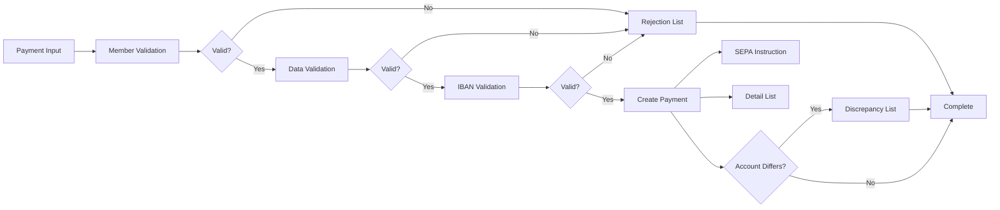

# MYFIN Business Documentation

**System**: GIRBET Manual Payment Processing  
**Module**: MYFIN  
**Last Updated**: 2026-01-28

## Overview

This documentation describes the business view of the MYFIN system, which processes manual payment requests for Belgian mutual insurance members. The system validates payment data, creates bank payment instructions, and generates detailed reporting lists for audit and reconciliation.

## Business Context

MYFIN is a batch processing system that handles manual payment inputs through the GIRBET interface. It serves Belgian mutual insurance organizations (mutualities) by processing payments to members for various reasons including reimbursements, benefits, and administrative payments.

### Key Business Capabilities

- **Manual Payment Processing**: Process individual payment requests with full validation
- **Multi-Language Support**: Handle French, Dutch, and German language requirements
- **SEPA Compliance**: Validate IBANs and generate SEPA-compliant payment instructions
- **Regional Accounting**: Support 6th State Reform regional accounting separation
- **Error Management**: Comprehensive validation with detailed bilingual error reporting
- **Audit Trail**: Generate detailed lists for review, reconciliation, and compliance

### Business Value

- Ensures payment accuracy through comprehensive validation
- Prevents duplicate payments and financial losses
- Supports Belgian legal requirements for multilingual service
- Maintains compliance with SEPA banking standards
- Enables regional accounting per Belgian federalization law
- Provides complete audit trail for financial oversight

## Use Cases

### Primary Use Cases

1. **[UC_MYFIN_001 - Process Manual GIRBET Payment](use-cases/UC_MYFIN_001_process_manual_payment.md)**
   - Process manual payment requests from input to bank instruction
   - Validate member data, bank accounts, and payment details
   - Create payment module records and SEPA instructions
   - Generate payment detail lists
   - Status: Draft

2. **[UC_MYFIN_002 - Validate Payment Data](use-cases/UC_MYFIN_002_validate_payment_data.md)**
   - Comprehensive validation of all payment data elements
   - Member existence and insurance section validation
   - IBAN format and SEPA compliance validation
   - Duplicate payment prevention
   - Payment method eligibility validation
   - Status: Draft

3. **[UC_MYFIN_003 - Generate Payment Lists](use-cases/UC_MYFIN_003_generate_payment_lists.md)**
   - Generate payment detail lists (500001 and regional variants)
   - Generate rejection/error lists (500004 and regional variants)
   - Generate bank account discrepancy lists (500006 and regional variants)
   - Create CSV exports for modern integration (5DET01)
   - Status: Draft

## Business Processes

### Manual Payment Processing Workflow

### Regional Accounting Flow

Payments are routed based on accounting type:
- **Type 1 (General)**: Standard processing, lists 500001/500004/500006
- **Type 2 (AL)**: Alternative accounting, same lists, different bank account code
- **Type 3 (Regional 1)**: Lists 500071/500074/500076, federation 167, forced to Belfius
- **Type 4 (Regional 2)**: Lists 500091/500094/500096, federation 169, forced to Belfius
- **Type 5 (Regional 3)**: Lists 500061/500064/500066, federation 166, forced to Belfius
- **Type 6 (Regional 4)**: Lists 500081/500084/500086, federation 168, forced to Belfius

## Actors and Roles

### Primary Actors

- **GIRBET Batch Processing System**: Automated system that processes payment input files
- **Payment Validation Engine**: Validates all payment data before processing
- **List Generation Engine**: Creates output lists for review and audit

### Secondary Actors

- **Member Database (MUTF08)**: Provides member administrative and insurance data
- **IBAN Validation Service (SEBNKUK9)**: Validates bank account formats and extracts BIC codes
- **Bank Payment System (Belfius/KBC)**: Receives SEPA payment instructions
- **Remote Printing System**: Formats and distributes payment lists

### Stakeholders

- **Mutuality Administrators**: Review payment details and rejection lists, investigate errors
- **Finance Department**: Reconcile payments against lists, track financial transactions
- **Audit Team**: Verify payment processing accuracy and compliance
- **Bank Operations**: Compare transmitted SEPA files against detail lists
- **Compliance Officers**: Ensure SEPA and regulatory compliance
- **Members**: Ultimate beneficiaries of processed payments

## Key Business Rules

### Payment Processing Rules

- **BR_MYFIN_001**: Member Existence Validation - Payment requires existing member with insurance section
- **BR_MYFIN_002**: Language Code Determination - Valid language code (1=NL, 2=FR, 3=DE) required
- **BR_MYFIN_003**: Payment Description Language Selection - Description selected by mutuality and language preference
- **BR_MYFIN_004**: Duplicate Payment Prevention - Same constant and amount combination must be unique
- **BR_MYFIN_005**: SEPA IBAN Validation - IBAN must pass validation with status 0, 1, or 2
- **BR_MYFIN_006**: Circular Check Country Restriction - Circular checks only for Belgian addresses
- **BR_MYFIN_007**: Regional Accounting Bank Routing - Regional types 3-6 always route to Belfius

### Validation and Reporting Rules

- **BR_MYFIN_009**: Validation Fail-Fast Principle - Stop at first failure, report that error
- **BR_MYFIN_010**: Rejection Record Completeness - Sufficient detail to identify payment and error
- **BR_MYFIN_011**: Validation Error Prioritization - Report errors in priority sequence
- **BR_MYFIN_012**: CSV Export for Standard Payments - Dual-format output for compatibility
- **BR_MYFIN_013**: Discrepancy List Non-Blocking - Account differences don't block payment
- **BR_MYFIN_014**: Rejection List Bilingual Diagnostic - Format "DUTCH/FRENCH" within 32 chars
- **BR_MYFIN_015**: Regional List Separation - Regional payments use separate lists per legal requirement

## Event Types

### Incoming Events

- **Manual Payment Input**: Payment record from GIRBET input file (TRBFNCXP structure)
  - Frequency: Batch processing (daily or as needed)
  - Volume: 5,000-50,000 payments per batch
  - Source: Manual payment capture system

### Outgoing Events

- **SEPA Payment Instruction**: Bank payment file record (SEPAAUKU/5N0001)
  - Frequency: Per successfully validated payment
  - Consumer: Belfius or KBC banking systems
  - Purpose: Execute payment to member's bank account

- **Payment Detail List**: Detail record for review (BFN51GZR/500001)
  - Frequency: Per successfully validated payment
  - Consumer: Mutuality administrators, audit team
  - Purpose: Payment verification and reconciliation

- **Rejection List**: Error record for investigation (BFN54GZR/500004)
  - Frequency: Per validation failure
  - Consumer: Mutuality administrators
  - Purpose: Error identification and correction

- **Discrepancy List**: Account difference alert (BFN56CXR/500006)
  - Frequency: When payment account differs from known account
  - Consumer: Mutuality administrators, member data team
  - Purpose: Account change verification

## Data Domains

### Member Domain

- **National Registry Number**: Belgian national identifier (binary and text formats)
- **Member Name**: Last name and first name
- **Member Address**: Street, house number, postal code, municipality, country
- **Language Preference**: 1=Dutch, 2=French, 3=German
- **Insurance Section**: Active or closed insurance type (OT, OP, AT, AP)

### Payment Domain

- **Payment Constant**: 10-digit unique payment identifier
- **Sequence Number**: 4-digit sequential number within batch
- **Payment Amount**: Amount in Euro cents
- **Payment Description Code**: 2-digit type/reason code
- **Accounting Type**: 1=General, 2=AL, 3-6=Regional variants
- **Payment Method**: B=Bank transfer, C/D/E/F=Circular check variants

### Banking Domain

- **IBAN**: International Bank Account Number (34 characters, SEPA-compliant)
- **BIC**: Bank Identification Code (11 characters)
- **Bank Code**: 1=Belfius, 2=KBC
- **Bank Account Code**: 13=AO general, 23=AL, 113/123=KBC variants

### Regional Accounting Domain

- **Regional Tag**: 1, 2, 4, 7 for regional types; 9 for general
- **Federation Code**: 167, 169, 166, 168 for regional; input destination for general
- **List Variants**: Separate lists per regional type (500071, 500091, 500061, 500081)

## Integration Points

### Input Interfaces

- **TRBFNCXP Input Records**: Payment request records from GIRBET system
  - Format: Fixed-length record (186/174 bytes)
  - Interface: Batch file processing
  - Frequency: As needed (typically daily)

### Output Interfaces

- **SEPAAUKU Payment Instructions**: SEPA bank payment file (5N0001)
  - Format: Fixed-length record (475 bytes)
  - Destination: Belfius/KBC banking systems
  - Frequency: Per validated payment

- **BFN51GZR Payment Detail Lists**: Payment detail reports (500001 and variants)
  - Format: Fixed-length record (213 bytes) or CSV (5DET01)
  - Destination: Remote printing system, CSV processing system
  - Frequency: Per validated payment

- **BFN54GZR Rejection Lists**: Error reports (500004 and variants)
  - Format: Fixed-length record (259 bytes)
  - Destination: Remote printing system
  - Frequency: Per validation failure

- **BFN56CXR Discrepancy Lists**: Account difference reports (500006 and variants)
  - Format: Fixed-length record
  - Destination: Remote printing system
  - Frequency: When account discrepancy detected

### External Systems

- **MUTF08 Member Database**: Member administrative and insurance data lookup
- **BBF Payment Module**: Payment recording and duplicate detection
- **SEBNKUK9 IBAN Validation Service**: Bank account format validation
- **CGACVXD9 Date Conversion**: Date format transformation
- **SCHRKCX9 Account Search**: Member bank account lookup

## Compliance and Regulations

### Belgian Legal Requirements

- **Multilingual Service**: French, Dutch, and German support per Belgian language law
- **6th State Reform**: Regional accounting separation per federalization law
- **Data Protection**: Secure handling of national registry numbers and personal data

### SEPA Compliance

- **IBAN Validation**: All bank accounts must pass SEPA IBAN format validation
- **BIC Extraction**: Valid BIC codes required for SEPA credit transfers
- **Payment Instruction Format**: SEPAAUKU structure complies with SEPA XML requirements

## Known Issues and Limitations

### Current Limitations

- CSV export (5DET01) only for standard payments, not regional variants (per JIRA-4224)
- Circular checks restricted to Belgian addresses only
- Regional accounting types 3-6 can only route to Belfius, not KBC
- Payment description codes ≥90 require MUTF08 database access
- Mutuality 141 has special list routing to destination 116

### Planned Enhancements

- JIRA-4224: CSV output format already implemented for standard payments
- JIRA-4311: PAIFIN-Belfius adaptation completed
- Future: Possible extension of CSV export to regional payments
- Future: Enhanced error recovery and retry mechanisms

## Related Documentation

### Discovery Documentation

- [Discovered Components](../discovery/MYFIN/discovered-components.md) - Technical component inventory
- [Discovered Flows](../discovery/MYFIN/discovered-flows.md) - Technical flow details
- [Discovered Domain Concepts](../discovery/MYFIN/discovered-domain-concepts.md) - Data structures and concepts

### Technical Documentation

- Functional Requirements (to be developed in phase 3)
- Data Structure Documentation (to be developed in phase 3)
- Integration Specifications (to be developed in phase 3)

### Planning Documentation

- [Documentation Plan](../planning/MYFIN-documentation-plan.md) - Overall documentation strategy
- [State Tracking](../planning/MYFIN-state.json) - Current progress and status

## Glossary

- **GIRBET**: Manual payment input system name
- **SEPA**: Single Euro Payments Area - European payment integration initiative
- **IBAN**: International Bank Account Number - standardized bank account identifier
- **BIC**: Bank Identifier Code - identifies financial institution
- **Mutuality**: Belgian mutual insurance organization (Dutch: Ziekenfonds, French: Mutualité)
- **National Registry Number**: Belgian national identification number (Rijksregisternummer/Numéro de registre national)
- **6th State Reform**: Belgian constitutional reform establishing regional competencies
- **BBF Module**: Payment module system for recording payments
- **MUTF08**: Member master database
- **Circular Check**: Physical check payment method (Dutch: Cirkeldcheck, French: Chèque circulaire)
- **Regional Accounting**: Separate accounting per Belgian region (Flemish, Walloon, Brussels, German)

## Contacts and Support

### Business Ownership

- **Process Owner**: Finance Department - Manual Payments
- **System Owner**: IT Department - Payment Systems

### Support

- **Functional Support**: Mutuality Administrator Helpdesk
- **Technical Support**: IT Operations - Batch Processing Team

---

*This documentation is maintained as part of the MYFIN modernization and documentation initiative. For questions or corrections, contact the documentation team.*
