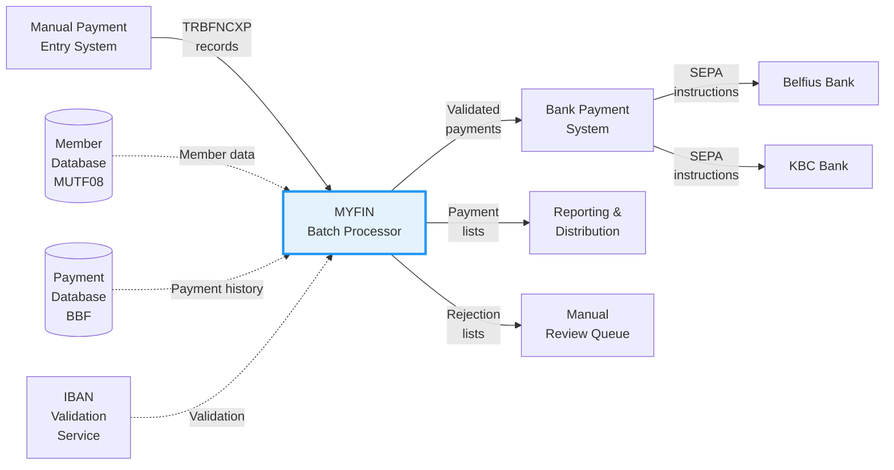

# MYFIN System Overview

**System**: Manual GIRBET Payment Processing  
**Program**: MYFIN  
**Type**: Batch Processing System  
**Last Updated**: 2026-01-28

## Executive Summary

MYFIN is a critical batch processing system within the Belgian mutual insurance ecosystem that handles manual payment requests through the GIRBET system. The system processes payment instructions for members, validates all payment data for SEPA compliance, prevents duplicate payments, routes payments to appropriate banks (Belfius/KBC), and generates comprehensive reporting lists for audit and reconciliation.

## Business Purpose

### What Problem Does This Solve?

Belgian mutual insurance organizations (mutualities) need to process thousands of manual payments to members - including reimbursements, special payments, circular cheques, and transfer orders. These payments must:

- **Ensure Accuracy**: Validate member identity and prevent duplicate payments
- **Comply with SEPA**: Meet European banking standards for electronic payments
- **Support Multilingual Operations**: Provide services in French, Dutch, and German
- **Accommodate Federalization**: Handle Belgium's complex regional accounting requirements
- **Maintain Audit Trails**: Create comprehensive documentation for every payment
- **Prevent Errors**: Block invalid payments before they reach the banking system

### Business Value Delivered

1. **Financial Protection**: Prevents duplicate payments and invalid transactions, protecting the organization from financial loss
2. **Regulatory Compliance**: Ensures SEPA/IBAN compliance and adheres to Belgian federalization laws
3. **Operational Efficiency**: Automates payment processing, reducing manual effort and errors
4. **Transparency**: Generates detailed lists showing all payments and rejections for review
5. **Regional Accountability**: Separates regional accounting as required by 6th State Reform legislation
6. **Member Service**: Ensures members receive correct payments in a timely manner

## System Context

### Position in the Payment Ecosystem

### Integration Points

**Upstream Systems:**
- Manual Payment Entry System (creates TRBFNCXP input records)
- Member Database (MUTF08) - provides member administrative data
- Payment Module (BBF) - stores payment history for duplicate detection

**Downstream Systems:**
- Bank Payment System (Belfius/KBC) - receives SEPA payment instructions
- Remote Printing System - formats and distributes payment/rejection lists
- CSV Export System - provides modern integration format (5DET01)

**External Services:**
- SEBNKUK9 - IBAN validation and BIC extraction service

## Key Business Capabilities

### 1. Payment Validation
- Verifies member existence and active insurance status
- Validates IBAN format and extracts BIC codes
- Checks payment descriptions and language codes
- Prevents duplicate payments through BBF lookup
- Validates payment method eligibility (circular cheques vs. transfers)

### 2. Multi-Language Support
- Supports French, Dutch, and German languages
- Automatically selects language based on mutuality code and member preference
- Handles bilingual mutualities with special rules
- Provides bilingual error messages (FR/NL format)

### 3. Regional Accounting (6th State Reform)
- Routes regional payments to appropriate accounts
- Supports Brussels (Type 3), Wallonia (Type 4), Flanders (Type 5), German Community (Type 6)
- Maintains legal separation between regional accounts
- Uses distinct federation codes and bank routing for each region

### 4. Payment Routing
- Routes payments to Belfius or KBC banks based on IBAN
- Handles different payment methods (transfers, circular cheques)
- Applies bank-specific business rules
- Currently routes all payments to Belfius per KVS002 modification

### 5. Comprehensive Reporting
- Generates payment detail lists (500001 and regional variants)
- Creates rejection lists with diagnostic messages (500004 and regional variants)
- Produces bank account discrepancy lists (500006 and regional variants)
- Exports CSV format for modern systems (5DET01)

## Event Types

### Incoming Events

#### Manual Payment Request Event
- **Source**: Manual Payment Entry System (TRBFNCXB or similar)
- **Format**: TRBFNCXP record structure (record code 42, "GIRBET")
- **Purpose**: Represents a request to pay a member a specific amount
- **Triggers**: UC_MYFIN_002 (Validate Payment Data)
- **Frequency**: Batch processing - hundreds to thousands per day
- **Key Data**:
  - Member national registry number
  - Payment amount (in Euro cents)
  - Bank account (IBAN)
  - Payment description code
  - Payment constant and sequence number
  - Payment method (transfer vs. circular cheque)
- **Business Impact**: Initiates the payment processing workflow

### Outgoing Events

#### Payment Instruction Created
- **Purpose**: SEPA-compliant bank payment instruction ready for transmission
- **Format**: SEPAAUKU user record (500001 or 5N0001)
- **Produced By**: UC_MYFIN_001 (Process Manual GIRBET Payment)
- **Consumers**: Bank Payment System (Belfius/KBC)
- **Frequency**: For each successfully validated payment
- **Business Impact**: Triggers actual money transfer to member's bank account

#### Payment Detail List Entry
- **Purpose**: Documents successful payment for audit and reconciliation
- **Format**: BFN51GZR list record
- **Produced By**: UC_MYFIN_003 (Generate Payment Lists)
- **Consumers**: 
  - Mutuality administrators (review payments)
  - Finance department (reconciliation)
  - Audit team (compliance verification)
- **List Variants**: 500001, 500071, 500091, 500061, 500081, 541001
- **Business Impact**: Provides transparency and audit trail for payments

#### Rejection List Entry
- **Purpose**: Documents payment validation failure with diagnostic message
- **Format**: BFN54GZR list record
- **Produced By**: UC_MYFIN_003 (Generate Payment Lists) via UC_MYFIN_002 validation failure
- **Consumers**: Mutuality administrators (correction and resubmission)
- **List Variants**: 500004, 500074, 500094, 500064, 500084, 541004
- **Business Impact**: Enables correction of payment errors before manual review

#### Bank Account Discrepancy Alert
- **Purpose**: Flags when payment uses different account than member's known account
- **Format**: BFN56CXR list record
- **Produced By**: UC_MYFIN_003 (Generate Payment Lists)
- **Consumers**: Mutuality administrators (data quality verification)
- **List Variants**: 500006, 500076, 500096, 500066, 500086, 541006
- **Business Impact**: Alerts to potential data inconsistencies without blocking payment

#### CSV Export Record
- **Purpose**: Modern integration format for payment data
- **Format**: CSV export record (5DET01)
- **Produced By**: UC_MYFIN_003 (Generate Payment Lists)
- **Consumers**: Modern integration systems, data warehouses
- **Scope**: Standard payments only (not regional)
- **Business Impact**: Enables integration with newer systems (JIRA-4224)

#### BBF Payment Record Stored
- **Purpose**: Permanent record of payment for duplicate detection and history
- **Format**: BBF module database record
- **Produced By**: UC_MYFIN_001 (Process Manual GIRBET Payment)
- **Consumers**: Future payment processing runs (duplicate check), reporting systems
- **Business Impact**: Prevents duplicate payments in future batches

## Processing Statistics

### Typical Batch Volumes

| Metric | Typical Volume | Peak Volume |
|--------|----------------|-------------|
| Input Records | 500-2,000/day | 5,000+/day |
| Successful Payments | 450-1,800/day | 4,500+/day |
| Rejected Payments | 50-200/day | 500+/day |
| Rejection Rate | 10% | 15% |
| Processing Time | 5-15 minutes | 30-60 minutes |

### Common Rejection Reasons

| Rejection Type | Typical % | Business Impact |
|----------------|-----------|-----------------|
| Member not found | 25% | Invalid data entry |
| IBAN validation failure | 30% | Incorrect bank accounts |
| Duplicate payment | 15% | Re-submission of same payment |
| Unknown payment description | 10% | Invalid configuration codes |
| Language code unknown | 5% | Member data quality issue |
| Payment method not allowed | 10% | Business rule violation |
| Other validation errors | 5% | Various data quality issues |

## Regional Accounting Detail

### Standard Accounting (Types 0-2)
- **Federation**: 117 or 166
- **Banks**: Belfius (currently all payments per KVS002) or KBC
- **Payment List**: 500001
- **Rejection List**: 500004
- **Discrepancy List**: 500006
- **CSV Export**: 5DET01
- **Scope**: General national payments

### Brussels Regional (Type 3)
- **Federation**: 167
- **Bank**: Belfius only
- **Payment List**: 500071
- **Rejection List**: 500074
- **Discrepancy List**: 500076
- **Legal Basis**: 6th State Reform - Brussels Capital Region
- **Scope**: Payments under Brussels regional competency

### Wallonia Regional (Type 4)
- **Federation**: 168
- **Bank**: Belfius only
- **Payment List**: 500091
- **Rejection List**: 500094
- **Discrepancy List**: 500096
- **Legal Basis**: 6th State Reform - Walloon Region
- **Scope**: Payments under Walloon regional competency

### Flanders Regional (Type 5)
- **Federation**: 169
- **Bank**: Belfius only
- **Payment List**: 500061
- **Rejection List**: 500064
- **Discrepancy List**: 500066
- **Legal Basis**: 6th State Reform - Flemish Region
- **Scope**: Payments under Flemish regional competency

### German Community Regional (Type 6)
- **Federation**: 166
- **Bank**: Belfius only
- **Payment List**: 500081
- **Rejection List**: 500084
- **Discrepancy List**: 500086
- **Legal Basis**: 6th State Reform - German-speaking Community
- **Scope**: Payments under German Community regional competency

### KBC/Paifin (Special Case)
- **Federation**: 166
- **Bank**: KBC only
- **Payment List**: 541001
- **Rejection List**: 541004
- **Discrepancy List**: 541006
- **Status**: Currently disabled per KVS002 - all payments route to Belfius
- **Scope**: Payments specifically designated for KBC bank

## Mutuality Language Rules

### French Mutualities
- **Codes**: 109, 116, 127-136, 167-168
- **Language**: Always French (ADM-TAAL = 2)
- **Description**: Uses LIBP-LIBELLE-FR from parameter library

### Dutch Mutualities
- **Codes**: 101-102, 104-105, 108, 110-122, 126, 131, 169
- **Language**: Always Dutch (ADM-TAAL = 1)
- **Description**: Uses LIBP-LIBELLE-NL from parameter library

### Bilingual Mutualities
- **Codes**: 106-107, 150, 166
- **Language**: Member preference (ADM-TAAL = 1 or 2)
- **Description**: Uses LIBP-LIBELLE-NL if ADM-TAAL=1, else LIBP-LIBELLE-FR

### German Mutuality (Verviers)
- **Code**: 137
- **Language**: German or French (ADM-TAAL = 3 or 2)
- **Description**: Uses LIBP-LIBELLE-AL if ADM-TAAL=3, else LIBP-LIBELLE-FR

## Key Business Rules Summary

For detailed business rules, see [BP_MYFIN_001](../processes/BP_MYFIN_manual_payment_processing.md)

1. **Member Validation**: Payment only for existing members with active sections
2. **Duplicate Prevention**: No payment with same member, amount, and constant
3. **IBAN Compliance**: All bank accounts must be valid SEPA IBANs
4. **Language Determination**: Based on mutuality code and member preference
5. **Payment Method Eligibility**: Circular cheques only for KBC accounts
6. **Regional Separation**: Regional payments strictly separated by accounting type
7. **Bank Routing**: Regional payments to Belfius only, standard to Belfius/KBC
8. **Bilingual Errors**: All rejection messages in FR/NL format
9. **Discrepancy Reporting**: Flag account mismatches without blocking payment
10. **CSV Export**: Standard payments exported in both traditional and CSV formats

## Historical Modifications

The system has undergone several significant business modifications:

### 6th State Reform (JGO001, CDU001)
- **Date**: ~2014-2016
- **Purpose**: Implement Belgian federalization requirements
- **Changes**: 
  - Added regional accounting types 3-6
  - Created regional list variants
  - Separated regional payment processing
  - Implemented regional federation codes

### IBAN Migration (IBAN10, MTU01, MIS01)
- **Date**: ~2010-2014
- **Purpose**: Comply with SEPA migration requirements
- **Changes**:
  - Added IBAN field to payment records
  - Implemented SEBNKUK9 validation
  - Extracted BIC codes from IBANs
  - Maintained backward compatibility with account numbers

### CSV Export (JIRA-4224)
- **Date**: Recent
- **Purpose**: Support modern system integrations
- **Changes**:
  - Added 5DET01 CSV export format
  - Dual output for standard payments
  - Maintained legacy list format

### Belfius Routing (KVS002)
- **Date**: Recent
- **Purpose**: Simplify bank routing
- **Changes**:
  - Route all payments to Belfius bank
  - Disabled KBC routing temporarily
  - Simplified payment processing logic

### PAIFIN-Belfius Adaptation (JIRA-4311)
- **Date**: Recent
- **Purpose**: Adapt to new banking partner
- **Changes**:
  - Updated bank routing logic
  - Modified list generation for Belfius
  - Adjusted SEPA instruction format

## Related Documentation

### Business Documentation
- **[Business Process](../processes/BP_MYFIN_manual_payment_processing.md)**: BP_MYFIN_001 - Manual GIRBET Payment Processing
- **[Use Cases](../use-cases/)**:
  - UC_MYFIN_001: Process Manual GIRBET Payment
  - UC_MYFIN_002: Validate Payment Data
  - UC_MYFIN_003: Generate Payment Lists
- **[Actors Catalog](../actors/actors-catalog.md)**: All system and human actors
- **[Business Index](../index.md)**: Business documentation index

### Discovery Documentation
- **[Discovered Flows](../../discovery/MYFIN/discovered-flows.md)**: Technical flow analysis
- **[Discovered Domain Concepts](../../discovery/MYFIN/discovered-domain-concepts.md)**: Data structures and domain model
- **[Discovered Components](../../discovery/MYFIN/discovered-components.md)**: System components and architecture

### Planning Documentation
- **[Documentation Plan](../../planning/MYFIN-documentation-plan.md)**: Overall documentation strategy
- **[State Tracking](../../planning/MYFIN-state.json)**: Current documentation progress

## Glossary

| Term | Definition |
|------|------------|
| **GIRBET** | Manual payment system name used for payment record identification |
| **BBF** | Payment module database that stores payment records |
| **MUTF08** | Member database containing administrative and insurance data |
| **SEPA** | Single Euro Payments Area - European payment integration initiative |
| **IBAN** | International Bank Account Number - standardized bank account format |
| **BIC** | Bank Identifier Code - identifies specific banks in SEPA payments |
| **PPR Record** | Pre-Print Record - input payment request record format |
| **Mutuality** | Belgian mutual insurance organization (local health insurance fund) |
| **Federation** | Group of mutualities with shared administration |
| **National Registry Number** | Belgian national identification number (Rijksregisternummer) |
| **Circular Cheque** | Omloopcheck/chèque circulaire - special payment instrument |
| **6th State Reform** | Belgian constitutional reform devolving powers to regions |
| **Regional Accounting** | Separate accounting for Brussels, Wallonia, Flanders, German Community |
| **Bilingual Mutuality** | Mutuality serving both French and Dutch speaking populations |
| **Payment Constant** | Unique identifier for payment (section, cashier, date) |

## Contact & Ownership

| Role | Responsibility |
|------|----------------|
| **Process Owner** | Mutuality Finance Operations |
| **Business Sponsor** | Finance Department Leadership |
| **Technical Owner** | IT Operations - Batch Processing Team |
| **Compliance** | Legal & Regulatory Compliance Team |
| **Support** | IT Service Desk - Batch Processing Support |

---

**Document Version**: 1.0  
**Last Review**: 2026-01-28  
**Next Review**: Quarterly or upon significant process changes
