# Manual GIRBET Payment Processing

**ID**: BP_MYFIN_001  
**Process Owner**: Mutuality Finance Operations  
**Last Updated**: 2026-01-28

## Purpose

This business process handles the end-to-end processing of manual payment requests submitted through the GIRBET system for Belgian mutual insurance members. The process validates payment data, prevents duplicate payments, ensures SEPA compliance, creates payment instructions for banks, and generates comprehensive reporting lists for audit and reconciliation.

## Process Scope

- **Starts When**: Manual payment input file (TRBFNCXP records) is available for batch processing
- **Ends When**: All payment records processed, payment instructions created, and reporting lists generated
- **Involves**: 
  - Batch Processing System (MYFIN program)
  - Member Database (MUTF08)
  - Payment Module Database (BBF, UAREA)
  - IBAN Validation Service (SEBNKUK9)
  - Remote Printing System (for payment and rejection lists)
  - Bank Payment System (Belfius/KBC)

## Business Context

Belgian mutual insurance organizations (mutualities) process thousands of manual payments for members - reimbursements, special payments, circular cheques, and transfer orders. These payments must comply with SEPA banking standards, support multiple languages (French, Dutch, German), and accommodate Belgium's complex federalized structure with regional accounting requirements introduced by the 6th State Reform.

This process ensures that:
- Only valid, authorized payments reach the banking system
- Duplicate payments are prevented
- Bank account information is SEPA-compliant
- Comprehensive audit trails are maintained
- Regional accounting separation is enforced
- Payment errors are clearly documented for correction

## Process Diagram

```mermaid
graph TD
    Start([Manual payment file available]) --> InitBatch[Initialize batch processing]
    InitBatch --> ReadRecord[Read next payment record]
    
    ReadRecord --> UC002_Start{Validate Payment Data<br/>UC_MYFIN_002}
    
    UC002_Start --> V1[Validate member exists]
    V1 --> V1Check{Member<br/>found?}
    V1Check -->|No| Reject1[Create rejection:<br/>Member not found]
    
    V1Check -->|Yes| V2[Determine language<br/>from section & profile]
    V2 --> V2Check{Valid language<br/>code?}
    V2Check -->|No| Reject2[Create rejection:<br/>Language unknown]
    
    V2Check -->|Yes| V3[Resolve payment<br/>description by code]
    V3 --> V3Check{Description<br/>found?}
    V3Check -->|No| Reject3[Create rejection:<br/>Description unknown]
    
    V3Check -->|Yes| V4[Check for<br/>duplicate payments]
    V4 --> V4Check{Duplicate<br/>exists?}
    V4Check -->|Yes| Reject4[Create rejection:<br/>Duplicate payment]
    
    V4Check -->|No| V5[Validate IBAN<br/>via SEBNKUK9]
    V5 --> V5Check{IBAN<br/>valid?}
    V5Check -->|No| Reject5[Create rejection:<br/>IBAN error]
    
    V5Check -->|Yes| V6[Validate payment<br/>method eligibility]
    V6 --> V6Check{Method<br/>allowed?}
    V6Check -->|No| Reject6[Create rejection:<br/>Method not allowed]
    
    V6Check -->|Yes| UC001_Start{Process Payment<br/>UC_MYFIN_001}
    
    UC001_Start --> P1[Determine account<br/>type & routing]
    P1 --> P2{Regional<br/>accounting?}
    
    P2 -->|Type 3-6| Regional[Set regional parameters:<br/>Fed 167/168/169/166<br/>Bank: Belfius only]
    P2 -->|Type 0-2| Standard[Set standard parameters:<br/>Fed 117/166<br/>Bank: Belfius or KBC]
    
    Regional --> P3[Create BBF<br/>payment record]
    Standard --> P3
    
    P3 --> P4[Create SEPAAUKU<br/>bank instruction]
    P4 --> P5{Account differs<br/>from known?}
    
    P5 -->|Yes| CreateDisc[Generate discrepancy<br/>list entry<br/>UC_MYFIN_003]
    P5 -->|No| UC003_Detail
    
    CreateDisc --> UC003_Detail{Generate Lists<br/>UC_MYFIN_003}
    
    UC003_Detail --> L1[Create payment detail<br/>list entry]
    L1 --> L2{Standard<br/>payment?}
    L2 -->|Yes| L3[Also create CSV<br/>export 5DET01]
    L2 -->|No| L4[Select regional<br/>list variant]
    
    L3 --> Success
    L4 --> Success
    
    Success[Payment processed<br/>successfully] --> MoreRecords{More records<br/>to process?}
    
    Reject1 --> UC003_Reject{Generate Lists<br/>UC_MYFIN_003}
    Reject2 --> UC003_Reject
    Reject3 --> UC003_Reject
    Reject4 --> UC003_Reject
    Reject5 --> UC003_Reject
    Reject6 --> UC003_Reject
    
    UC003_Reject --> R1[Create rejection<br/>list entry]
    R1 --> R2[Select rejection list<br/>based on account type]
    R2 --> Failure[Payment rejected<br/>with diagnostic]
    
    Failure --> MoreRecords
    
    MoreRecords -->|Yes| ReadRecord
    MoreRecords -->|No| Finalize[Finalize batch:<br/>Close lists & files]
    
    Finalize --> End([Batch processing complete])
    
    style UC002_Start fill:#fff4e6,stroke:#ff9800,stroke-width:3px
    style UC001_Start fill:#e3f2fd,stroke:#2196f3,stroke-width:3px
    style UC003_Detail fill:#e8f5e9,stroke:#4caf50,stroke-width:3px
    style UC003_Reject fill:#e8f5e9,stroke:#4caf50,stroke-width:3px
    
    style Success fill:#c8e6c9,stroke:#4caf50
    style Failure fill:#ffcdd2,stroke:#f44336
    
    style Regional fill:#fff9c4,stroke:#fbc02d
    style Standard fill:#f3e5f5,stroke:#9c27b0
```

## Process Steps

### 1. Batch Initialization
**Business Activity**: System prepares to process manual payment input file

- Batch job starts with manual payment file (TRBFNCXP records)
- Initialize database connections (MUTF08, BBF, UAREA)
- Connect to IBAN validation service (SEBNKUK9)
- Prepare output list files (500001, 500004, 500006, and regional variants)
- Set processing context and counters

**Involved Use Cases**: Pre-processing setup

### 2. Payment Validation Loop
**Business Activity**: Each payment record undergoes comprehensive validation

For each payment record in the input file:

#### Step 2.1: Member Validation (UC_MYFIN_002)
- Extract national registry number from payment record
- Search member in MUTF08 database
- **Decision Point**: Member found?
  - **No** → Create rejection "ONBEKEND LIDNR/NUMERO INCONNU", proceed to rejection list generation
  - **Yes** → Continue validation

#### Step 2.2: Language & Section Determination (UC_MYFIN_002)
- Search for active insurance section (OT, OP, AT, or AP categories)
- Determine member's language preference (FR=2, NL=1, DE=3)
- Apply mutuality-specific rules for bilingual cases
- **Decision Point**: Valid language code?
  - **No** → Create rejection "TAALCODE ONBEKEND/CODE LANGUE INCONNU", proceed to rejection list
  - **Yes** → Continue validation

#### Step 2.3: Payment Description Resolution (UC_MYFIN_002)
- Lookup payment description using TRBFN-CODE-LIBEL
- For codes ≥90: Access parameter library in MUTF08
- For codes <90: Use internal table TBLIBCXW
- Select language-specific description (FR/NL/DE)
- Retrieve account type from description
- **Decision Point**: Description found?
  - **No** → Create rejection "ONBEK. OMSCHR./LIBELLE INCONNU", proceed to rejection list
  - **Yes** → Continue validation

#### Step 2.4: Duplicate Payment Detection (UC_MYFIN_002)
- Search existing BBF payment records for this member
- Compare payment amount and payment constant
- **Decision Point**: Duplicate exists?
  - **Yes** → Create rejection "DUBBELE BETALING/DOUBLE PAIEMENT", proceed to rejection list
  - **No** → Continue validation

#### Step 2.5: IBAN Validation (UC_MYFIN_002)
- Submit IBAN and payment method to SEBNKUK9 validation service
- Receive validation status and BIC code
- **Decision Point**: IBAN valid? (Status 0, 1, or 2)
  - **No** → Create rejection "IBAN FOUTIEF/IBAN ERRONE", proceed to rejection list
  - **Yes** → Extract BIC code, continue validation

#### Step 2.6: Payment Method Eligibility (UC_MYFIN_002)
- Check if payment method is allowed for this IBAN/bank combination
- Validate against business rules for circular cheques vs. transfers
- **Decision Point**: Method allowed?
  - **No** → Create rejection "BETAALWIJZE ONGEL./MODE PAIEM NON VAL", proceed to rejection list
  - **Yes** → Proceed to payment creation

### 3. Payment Processing
**Business Activity**: Create payment instructions and database records

#### Step 3.1: Account Type & Routing Determination (UC_MYFIN_001)
- Determine accounting type from payment description
- **Decision Point**: Regional accounting (types 3-6)?
  - **Type 3** (Brussels) → Federation 167, Belfius only, lists 500071/500074/500076
  - **Type 4** (Wallonia) → Federation 168, Belfius only, lists 500091/500094/500096
  - **Type 5** (Flanders) → Federation 169, Belfius only, lists 500061/500064/500066
  - **Type 6** (German) → Federation 166, Belfius only, lists 500081/500084/500086
  - **Type 0-2** (Standard) → Federation 117/166, Belfius or KBC, lists 500001/500004/500006

#### Step 3.2: Create Payment Records (UC_MYFIN_001)
- Create BBF database record with payment details
- Create SEPAAUKU user record for bank instruction (500001 or 5N0001)
- Store member info, amount, IBAN, BIC, payment description, constant

#### Step 3.3: Bank Account Discrepancy Check (UC_MYFIN_003)
- Compare IBAN with known member account
- **Decision Point**: Accounts differ?
  - **Yes** → Generate discrepancy list entry (500006 or regional variant)
  - **No** → Proceed to payment detail list

### 4. List Generation
**Business Activity**: Generate reporting lists for audit and operations

#### Step 4.1: Payment Detail List (UC_MYFIN_003)
For successful payments:
- Create payment detail list entry (BFN51GZR format)
- Select appropriate list variant based on accounting type:
  - Standard: 500001
  - Brussels regional: 500071
  - Wallonia regional: 500091
  - Flanders regional: 500061
  - German regional: 500081
  - Paifin (KBC): 541001
- **For standard payments only**: Also create CSV export entry (5DET01)

#### Step 4.2: Rejection List (UC_MYFIN_003)
For rejected payments:
- Create rejection list entry (BFN54GZR format)
- Include bilingual diagnostic message
- Select appropriate rejection list variant:
  - Standard: 500004
  - Brussels regional: 500074
  - Wallonia regional: 500094
  - Flanders regional: 500064
  - German regional: 500084
  - Paifin (KBC): 541004

### 5. Iteration & Completion
**Business Activity**: Process all records and finalize batch

- **Decision Point**: More records to process?
  - **Yes** → Read next payment record, return to Step 2
  - **No** → Proceed to finalization

- Finalize batch processing:
  - Close all output list files
  - Close database connections
  - Generate batch statistics
  - Complete batch job

## Business Rules

### BR_MYFIN_001: Member Validation
- **ID**: BR_MYFIN_001
- **Description**: Payment can only be processed for members who exist in MUTF08 database with a valid national registry number
- **Example**: National registry number 12345678901 must match a record in the member database
- **Enforcement**: Performed at entry point before any other validation
- **Exception Handling**: Rejected with "ONBEKEND LIDNR/NUMERO INCONNU" on error list

### BR_MYFIN_002: Active Section Requirement
- **ID**: BR_MYFIN_002
- **Description**: Member must have at least one insurance section (holder or PAC) in active (OT/OP) or closed (AT/AP) state, excluding product codes 609, 659, 679, 689
- **Example**: Member has OP (open PAC) category with valid insurance dates and section code
- **Enforcement**: Section search checks categories in priority order: OT → OP → AT → AP
- **Exception Handling**: If no section found, processing continues but may fail on language validation

### BR_MYFIN_003: Language Code Determination
- **ID**: BR_MYFIN_003
- **Description**: Language code must be determined from member's administrative data or insurance section. French=2, Dutch=1, German=3. Bilingual mutualities apply special rules based on mutuality code.
- **Example**: Mutuality 107 (bilingual) with member language 1 → Uses Dutch descriptions
- **Enforcement**: Checked after section determination, uses ADM-TAAL or section language
- **Exception Handling**: Rejected with "TAALCODE ONBEKEND/CODE LANGUE INCONNU" if no valid language found

### BR_MYFIN_004: Payment Description Lookup
- **ID**: BR_MYFIN_004
- **Description**: Payment description code must exist either in parameter library (MUTF08, codes ≥90) or internal table (codes <90), and must return a valid description in the member's language
- **Example**: Code 95 in French mutuality → Retrieves LIBP-LIBELLE-FR from parameter library
- **Enforcement**: Two-tier lookup based on code value, language-specific selection
- **Exception Handling**: Rejected with "ONBEK. OMSCHR./LIBELLE INCONNU" if description not found

### BR_MYFIN_005: Duplicate Prevention
- **ID**: BR_MYFIN_005
- **Description**: System must reject any payment that duplicates an existing BBF record with the same member, amount, and payment constant
- **Example**: Member X already has payment of €100.00 with constant "ABC123" → New payment with same values is rejected
- **Enforcement**: BBF database search comparing BEDRAG and KONST fields
- **Exception Handling**: Rejected with "DUBBELE BETALING/DOUBLE PAIEMENT" on error list

### BR_MYFIN_006: IBAN Validation
- **ID**: BR_MYFIN_006
- **Description**: IBAN must pass SEBNKUK9 validation with status 0, 1, or 2. BIC code must be successfully extracted.
- **Example**: BE68539007547034 → Valid IBAN, status 0, BIC GEBABEBB
- **Enforcement**: External validation via SEBNKUK9 program
- **Exception Handling**: Rejected with "IBAN FOUTIEF/IBAN ERRONE" if validation fails

### BR_MYFIN_007: Payment Method Eligibility
- **ID**: BR_MYFIN_007
- **Description**: Circular cheques (TRBFN-BETWYZ = 1) are only allowed for KBC accounts. Transfers (TRBFN-BETWYZ = 0) are allowed for all banks.
- **Example**: Circular cheque requested for Belfius account → Rejected
- **Enforcement**: Checked after IBAN validation and bank determination
- **Exception Handling**: Rejected with "BETAALWIJZE ONGEL./MODE PAIEM NON VAL" on error list

### BR_MYFIN_008: Regional Accounting Routing
- **ID**: BR_MYFIN_008
- **Description**: Regional accounting types (3=Brussels, 4=Wallonia, 5=Flanders, 6=German) must be routed to Belfius bank only and use specific federation codes and list variants introduced by 6th State Reform.
- **Example**: Type 3 payment → Federation 167, Belfius, lists 500071/500074/500076
- **Enforcement**: Account type determines federation, bank, and list routing
- **Exception Handling**: Enforced by business logic, no rejection possible at this stage

### BR_MYFIN_009: Standard Bank Routing
- **ID**: BR_MYFIN_009
- **Description**: Standard payments (types 0-2) can be routed to either Belfius (bank selection 0) or KBC/Paifin (bank selection 1), based on SEBNKUK9 recommendation. Since KVS002 modification, all payments route to Belfius.
- **Example**: Type 2 payment with valid IBAN → Bank selection set to 0 (Belfius)
- **Enforcement**: Bank selection field set after IBAN validation
- **Exception Handling**: N/A - always Belfius per current business rule

### BR_MYFIN_010: Bank Account Discrepancy Reporting
- **ID**: BR_MYFIN_010
- **Description**: When payment uses different bank account than member's known account (TRBFN-COMPTE-MEMBRE = 0), generate discrepancy list entry but allow payment to proceed.
- **Example**: Member's known account is BE11222333444, payment uses BE55666777888 → Discrepancy recorded, payment still processed
- **Enforcement**: Comparison after payment creation
- **Exception Handling**: Non-blocking warning, generates list 500006 entry

### BR_MYFIN_011: CSV Export for Standard Payments
- **ID**: BR_MYFIN_011
- **Description**: Standard non-regional payments must generate both traditional list (500001) and modern CSV export (5DET01) for dual-format reporting per JIRA-4224.
- **Example**: Standard payment → Creates both BFN51GZR list record and CSV export record
- **Enforcement**: Conditional on accounting type being 0, 1, or 2
- **Exception Handling**: N/A - business logic routing

## KPIs and Metrics

### Processing Metrics
- **Total Payments Processed**: Count of all input records processed
- **Success Rate**: Percentage of payments successfully validated and created
- **Rejection Rate**: Percentage of payments rejected during validation
- **Processing Time**: Batch execution duration
- **Records per Second**: Processing throughput

### Quality Metrics
- **Duplicate Detection Rate**: Number of duplicate payments prevented
- **IBAN Validation Failure Rate**: Percentage of payments with invalid IBANs
- **Member Not Found Rate**: Percentage of payments for unknown members
- **Description Lookup Failure Rate**: Percentage of invalid payment description codes

### Business Metrics
- **Total Payment Amount**: Sum of all successful payment amounts
- **Regional vs. Standard Split**: Distribution of payments across accounting types
- **Bank Routing Distribution**: Belfius vs. KBC payment counts
- **Language Distribution**: FR/NL/DE payment counts
- **Discrepancy Count**: Number of bank account mismatches detected

### Compliance Metrics
- **SEPA Compliance Rate**: Percentage of payments meeting SEPA standards
- **Bilingual Error Rate**: Completeness of bilingual error messages
- **Regional Separation Adherence**: Correct routing of regional payments

## Use Cases Involved

### Primary Use Cases

- **[UC_MYFIN_001](../use-cases/UC_MYFIN_001_process_manual_payment.md)**: Process Manual GIRBET Payment
  - **Role**: Creates payment instructions and database records after validation succeeds
  - **Invocation**: After all validation checks pass
  - **Output**: BBF payment record, SEPAAUKU bank instruction

- **[UC_MYFIN_002](../use-cases/UC_MYFIN_002_validate_payment_data.md)**: Validate Payment Data
  - **Role**: Performs comprehensive validation of payment data elements
  - **Invocation**: First step for every payment record
  - **Output**: Validation result (pass/fail with diagnostic)

- **[UC_MYFIN_003](../use-cases/UC_MYFIN_003_generate_payment_lists.md)**: Generate Payment Lists
  - **Role**: Creates reporting lists for both successful and rejected payments
  - **Invocation**: After payment processing (success) or validation failure (rejection)
  - **Output**: Payment detail lists, rejection lists, discrepancy lists

## Exception Handling

### System Unavailability

**Trigger**: Critical external system (MUTF08, SEBNKUK9, BBF) is unavailable

1. System detects connection failure during database access or service call
2. Batch job logs critical error to system log
3. Current payment record is not processed
4. **Business Decision Required**:
   - Option A: Halt batch processing immediately, alert operations team
   - Option B: Continue processing remaining records, retry failed records in subsequent run
5. Operations team investigates and resolves system issue
6. Failed records are reprocessed in next batch run

**Business Impact**: Payment processing delayed until systems are available. Members may experience delayed payments. Mutuality must communicate delays to affected members.

### Data Quality Issues

**Trigger**: Input file contains malformed records or data outside expected ranges

1. System detects parse error or data format violation
2. Record is marked as rejected with technical diagnostic
3. Processing continues with next record
4. Malformed records appear on technical error report
5. Data quality team investigates source of malformed data

**Business Impact**: Affected payments are not processed. Source system or data entry process may need correction.

### List File Write Failures

**Trigger**: Unable to write to output list files (disk full, permissions, etc.)

1. System detects write failure when creating list record
2. Batch job logs critical error
3. Processing halts to prevent data loss
4. Operations team resolves file system issue
5. Batch job is restarted from beginning

**Business Impact**: Batch processing interrupted. Payments may need to be reprocessed. Lists may be incomplete or missing.

### Performance Degradation

**Trigger**: Batch processing exceeds expected time window (e.g., >2 hours for normal volume)

1. System monitoring detects slow processing
2. Alert sent to operations team
3. Investigation determines cause (database performance, high volume, etc.)
4. **Mitigation Options**:
   - Optimize database queries
   - Split batch into smaller runs
   - Allocate additional system resources
5. Business stakeholders informed of potential delay

**Business Impact**: Payment lists and bank instructions delayed. May affect bank transmission deadlines. Mutuality may need to expedite subsequent processing steps.

## Integration Points

### Upstream Systems
- **Manual Payment Input File**: Provides TRBFNCXP payment records
- **Member Database (MUTF08)**: Source of member administrative data, insurance sections, parameter library
- **Payment Module (BBF)**: Storage for existing payment records (duplicate check)

### Downstream Systems
- **Bank Payment System (Belfius/KBC)**: Receives payment instructions via SEPAAUKU records
- **Remote Printing System**: Receives list records for formatting and distribution
- **CSV Export System**: Receives 5DET01 records for modern integrations
- **UAREA Database**: Storage for user/application records

### External Services
- **SEBNKUK9 IBAN Validation**: Validates IBAN format and extracts BIC codes

## Process Variants

### Regional Accounting Variant (6th State Reform)

**Trigger**: Payment has accounting type 3, 4, 5, or 6

- **Special Routing**:
  - Type 3 (Brussels): Federation 167, lists 500071/500074/500076
  - Type 4 (Wallonia): Federation 168, lists 500091/500094/500096
  - Type 5 (Flanders): Federation 169, lists 500061/500064/500066
  - Type 6 (German Community): Federation 166, lists 500081/500084/500086
- **Bank Restriction**: All regional payments must use Belfius bank only
- **List Separation**: Regional payments generate separate lists, never mixed with standard
- **Record Code**: All regional lists use record code 43, destination 151

### KBC/Paifin Variant

**Trigger**: Payment routed to KBC bank (bank selection 1) - Currently disabled per KVS002

- **Bank Selection**: Based on IBAN and SEBNKUK9 recommendation
- **Payment Method**: Only transfers allowed (circular cheques not supported)
- **Lists**: Uses variants 541001 (detail), 541004 (rejection), 541006 (discrepancy)
- **Federation**: Uses federation 166 for KBC payments
- **Note**: Per KVS002 modification, currently all payments route to Belfius regardless of IBAN

### CSV Export Variant (JIRA-4224)

**Trigger**: Successful standard (non-regional) payment processed

- **Dual Output**: Creates both traditional list record (BFN51GZR) and CSV export (5DET01)
- **Format**: CSV record uses same data as list record
- **Purpose**: Support modern system integrations while maintaining legacy compatibility
- **Scope**: Only standard payments (types 0-2), not regional payments

## Related Documentation

- **Use Cases**: 
  - [UC_MYFIN_001: Process Manual GIRBET Payment](../use-cases/UC_MYFIN_001_process_manual_payment.md)
  - [UC_MYFIN_002: Validate Payment Data](../use-cases/UC_MYFIN_002_validate_payment_data.md)
  - [UC_MYFIN_003: Generate Payment Lists](../use-cases/UC_MYFIN_003_generate_payment_lists.md)
- **Discovery Documentation**:
  - [Discovered Flows](../../discovery/MYFIN/discovered-flows.md)
  - [Discovered Domain Concepts](../../discovery/MYFIN/discovered-domain-concepts.md)
  - [Discovered Components](../../discovery/MYFIN/discovered-components.md)
- **Domain Concepts**: See [Domain Catalog](../../discovery/MYFIN/discovered-domain-concepts.md) for:
  - Payment Instruction
  - Member
  - Insurance Section
  - IBAN/BIC
  - Payment Description
  - Regional Accounting

## Process Improvements Identified

### Completed Improvements
- **JIRA-4224**: CSV export format added for modern system integration
- **JIRA-4311**: PAIFIN-Belfius adaptation for KBC routing
- **KVS002**: Simplified bank routing - all payments to Belfius
- **6th State Reform**: Regional accounting separation implemented

### Potential Future Improvements
- **Real-time Validation**: Move validation to input time instead of batch
- **Self-Service Portal**: Allow members to view payment status online
- **Automated Reconciliation**: Match payment lists against bank confirmations automatically
- **Duplicate Detection Enhancement**: Cross-batch duplicate checking
- **Performance Optimization**: Parallel processing for large payment volumes
- **Extended Language Support**: Add English for international members

## Revision History

| Date | Version | Author | Changes |
|------|---------|--------|---------|
| 2026-01-28 | 1.0 | Business Documenter Agent | Initial business process documentation created from discovery and use case analysis |
