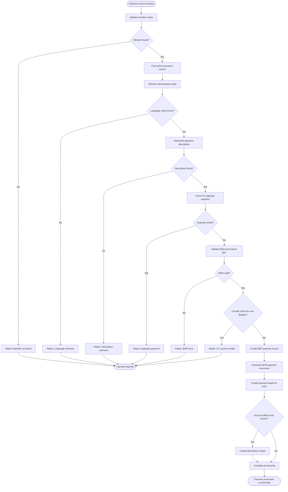

# Process Manual GIRBET Payment

**ID**: UC_MYFIN_001  
**Status**: Draft  
**Last Updated**: 2026-01-28

## Overview

### Purpose
Process manual payment requests for Belgian mutual insurance members through the GIRBET system, validating payment information and generating bank payment instructions.

### Actors
- **Primary Actor**: GIRBET Batch Processing System
- **Secondary Actors**: 
  - Member Database (MUTF08) - provides member administrative data
  - Bank Payment System (Belfius/KBC) - receives payment instructions
  - Payment List System - receives payment detail reports
- **Stakeholders**: 
  - Mutuality administrators - need accurate payment processing
  - Finance department - tracks payment transactions
  - Members - receive payments based on these instructions

### Scope
Processes individual manual payment records from input files, validates member data and bank account information, creates payment instructions for banks, and generates payment detail and rejection lists. Out of scope: automated/calculated payments, payment execution, and bank communication protocols.

## Business Requirements

### BUREQ_MYFIN_001: Member Validation
- **ID**: BUREQ_MYFIN_001
- **Description**: System must validate that the member exists in the database and has an active insurance section before processing any payment.
- **Rationale**: Prevents payments to unknown or inactive members, ensuring compliance and reducing payment errors.
- **Acceptance Criteria**:
  - [ ] Member national registry number must exist in member database
  - [ ] Member must have at least one active or closed insurance section (OT, OP, AT, or AP)
  - [ ] System rejects payments for non-existent members with clear error message

### BUREQ_MYFIN_002: Payment Uniqueness
- **ID**: BUREQ_MYFIN_002
- **Description**: System must prevent duplicate payments by checking if the same payment (same amount and constant) has already been recorded.
- **Rationale**: Prevents double payments to members, protecting the organization from financial loss.
- **Acceptance Criteria**:
  - [ ] System checks existing BBF payment records for matching amount and constant
  - [ ] Duplicate payments are rejected with bilingual error message
  - [ ] Original payment is retained, duplicate is added to rejection list

### BUREQ_MYFIN_003: IBAN Validation
- **ID**: BUREQ_MYFIN_003
- **Description**: All bank account information must be validated for SEPA compliance, including IBAN format and BIC extraction.
- **Rationale**: Ensures payments can be successfully processed through the SEPA banking network, reducing payment failures.
- **Acceptance Criteria**:
  - [ ] IBAN format must pass SEBNKUK9 validation
  - [ ] Valid BIC code must be extracted from IBAN
  - [ ] Invalid IBANs are rejected with clear error message
  - [ ] Validation status codes 0, 1, or 2 are accepted as valid

### BUREQ_MYFIN_004: Multi-Language Support
- **ID**: BUREQ_MYFIN_004
- **Description**: System must support French, Dutch, and German languages, selecting appropriate payment descriptions based on member's mutuality and language preference.
- **Rationale**: Belgian legal requirement for multilingual service in regions with different official languages.
- **Acceptance Criteria**:
  - [ ] Payment descriptions available in FR, NL, and DE
  - [ ] Language selection based on mutuality code and member preference
  - [ ] Bilingual mutualities (106-107, 150, 166) select language by member preference
  - [ ] Unknown language codes are rejected

### BUREQ_MYFIN_005: Regional Accounting
- **ID**: BUREQ_MYFIN_005
- **Description**: System must support regional accounting types introduced by 6th State Reform, routing payments to appropriate regional accounts at Belfius.
- **Rationale**: Compliance with Belgian federalization law requiring separate regional accounting.
- **Acceptance Criteria**:
  - [ ] Regional accounting types 3-6 are routed to Belfius bank only
  - [ ] Appropriate regional tags and federation codes are set (167, 168, 169, 166)
  - [ ] Regional payments generate separate payment lists (500071, 500091, 500061, 500081)

## Preconditions

- Input payment record (TRBFNCXP) is available with complete data
- Member database (MUTF08) is accessible
- Payment module database (BBF) is accessible
- IBAN validation service (SEBNKUK9) is operational
- Language code can be determined from either member administrative data or insurance section data

## Postconditions

### Success Postconditions
- BBF payment record created in payment module database
- SEPA user payment instruction (SEPAAUKU) written to bank payment file (500001/5N0001)
- Payment detail record written to payment list (500001 or regional variant)
- Optional: Bank account discrepancy record written if member's known account differs from provided account
- Processing date recorded in BBF record
- Payment status is confirmed and traceable via constant and sequence number

### Failure Postconditions
- No BBF payment record created
- Rejection record written to error list (500004 or regional variant) with bilingual diagnostic message
- No bank payment instruction generated
- Error is traceable via constant and sequence number in rejection list

## Main Flow

### Business Flow Diagram

### Step-by-Step Description

1. **Receive Payment Record**: Batch system receives manual payment record
   - Input: TRBFNCXP record with member national registry number, payment amount, bank account, payment description code
   - System: Extracts national registry number from input record

2. **Member Validation**: System validates member exists in database
   - System: Searches member database using national registry number
   - Business Rule: BR_MYFIN_001
   - If member not found → Alternative Flow A

3. **Insurance Section Lookup**: System finds active insurance section
   - System: Searches through insurance data in priority order (Open Holder, Open PAC, Closed Holder, Closed PAC)
   - System: Excludes certain product codes (609, 659, 679, 689)
   - System: Captures member section code and language preference

4. **Administrative Data Retrieval**: System retrieves member administrative information
   - Action: Gets member name, address, language code, alternative national registry numbers
   - Result: Complete member profile available for payment processing

5. **Language Determination**: System determines appropriate language for payment
   - Business Rule: BR_MYFIN_002
   - If language code unknown → Alternative Flow B

6. **Payment Description Selection**: System retrieves payment description in appropriate language
   - System: Checks payment code range (≥90 uses database lookup, <90 uses internal table)
   - System: Selects language variant based on mutuality code and member preference
   - Business Rule: BR_MYFIN_003
   - If description not found → Alternative Flow C

7. **Duplicate Detection**: System checks for duplicate payments
   - System: Searches existing BBF payment records for same amount and constant
   - Business Rule: BR_MYFIN_004
   - If duplicate found → Alternative Flow D

8. **IBAN Validation**: System validates bank account IBAN format
   - System: Calls IBAN validation service to check format and extract BIC
   - Business Rule: BR_MYFIN_005
   - If IBAN invalid → Alternative Flow E

9. **Payment Method Validation**: System validates payment method against member country
   - Business Rule: BR_MYFIN_006
   - If circular check for non-Belgian address → Alternative Flow F

10. **Bank Routing Determination**: System determines which bank and account code to use
    - System: Applies regional accounting rules for types 3-6 (force Belfius)
    - System: Determines bank account code (13=AO general, 23=AL, 113/123=KBC variants)
    - Business Rule: BR_MYFIN_007

11. **BBF Record Creation**: System creates payment module record
    - Action: Populates BBF record with payment type, amount, bank details, dates, regional tags
    - Result: Payment is recorded in payment module database with processing date

12. **SEPA Instruction Generation**: System generates bank payment instruction
    - Action: Creates SEPAAUKU record with member details, bank account holder info, payment communication, IBAN/BIC
    - Result: Bank payment file (5N0001) contains instruction for Belfius/KBC

13. **Payment List Generation**: System creates payment detail list entry
    - Action: Determines appropriate list (500001 standard, or 500071/500091/500061/500081 for regional)
    - Action: Populates payment detail with member name, amount, bank info, regional tags
    - Result: Payment detail list available for review and audit

14. **Account Discrepancy Check**: System checks if provided account differs from known account
    - If difference detected → Alternative Flow G (non-blocking)

15. **Completion**: System confirms successful payment processing
    - Output: Payment is ready for bank transmission
    - Notification: Payment appears on detail list for mutuality review

## Alternative Flows

### Alternative Flow A: Member Not Found
**Trigger**: Member national registry number not found in database (Step 2)

1. System identifies member does not exist
2. System performs PPRNVW error handling
3. System terminates processing for this payment record
4. Use case ends

**Business Impact**: Payment cannot be processed; requires manual investigation to verify member identity or correct input data.

### Alternative Flow B: Language Code Unknown
**Trigger**: Member administrative data has no language code and no language found from insurance section (Step 5)

1. System identifies ADM-TAAL = 0 and no section language available
2. System creates rejection record with diagnostic "TAALCODE ONBEKEND/CODE LANGUE INCONNU"
3. System writes rejection to error list (500004 or regional variant)
4. System terminates processing
5. Use case ends

**Business Impact**: Payment delayed until member's language preference is updated in database.

### Alternative Flow C: Payment Description Not Found
**Trigger**: Payment description code cannot be found in parameter library (Step 6)

1. System attempts to retrieve description from MUTF08 parameter library
2. Database lookup returns error status
3. System creates rejection record with diagnostic "ONBEK. OMSCHR./LIBELLE INCONNU"
4. System writes rejection to error list (500004 or regional variant)
5. System terminates processing
6. Use case ends

**Business Impact**: Payment delayed until valid payment description code is provided or description is added to system.

### Alternative Flow D: Duplicate Payment Detected
**Trigger**: Existing BBF record found with same amount and constant (Step 7)

1. System searches BBF payment records for member
2. System finds record with matching amount and constant
3. System creates rejection record with diagnostic "DUBBELE BETALING/DOUBLE PAIEMENT"
4. System writes rejection to error list (500004 or regional variant)
5. System terminates processing (original payment is retained)
6. Use case ends

**Business Impact**: Prevents double payment to member; requires investigation to determine if duplicate input or legitimate second payment with different constant.

### Alternative Flow E: IBAN Validation Failure
**Trigger**: IBAN format is invalid or BIC cannot be extracted (Step 8)

1. System calls SEBNKUK9 validation service
2. Validation returns error status (not 0, 1, or 2)
3. System creates rejection record with diagnostic "IBAN FOUTIEF/IBAN ERRONE"
4. System writes rejection to error list (500004 or regional variant)
5. System terminates processing
6. Use case ends

**Business Impact**: Payment delayed until correct IBAN is provided by member or mutuality.

### Alternative Flow F: Circular Check Country Validation Failure
**Trigger**: Payment method is circular check but member address is not in Belgium (Step 9)

1. System identifies payment method as circular check (C, D, E, or F)
2. System checks member address country code
3. Country is not Belgium (not "B  ")
4. System creates rejection record with diagnostic "CC - PAYS/LAND NOT = B"
5. System writes rejection to error list (500004 or regional variant)
6. System skips SEPA instruction and payment list generation
7. System terminates processing
8. Use case ends

**Business Impact**: Circular checks can only be issued to Belgian addresses; requires payment method change to bank transfer for non-Belgian addresses.

### Alternative Flow G: Bank Account Discrepancy (Non-blocking)
**Trigger**: Provided bank account differs from member's known account (Step 14)

1. System detects TRBFN-COMPTE-MEMBRE = 0 (not member's known account)
2. System creates discrepancy report record (BFN56CXR)
3. System writes to discrepancy list (500006 or regional variant)
4. System continues with normal processing
5. Payment is still processed successfully
6. Use case returns to Step 15 (Completion)

**Business Impact**: Alerts administrators to potential account change; allows payment to proceed while flagging for verification.

## Exception Flows

### Exception E1: Database Unavailable
**Trigger**: MUTF08 member database or BBF payment database is unavailable

1. System detects connection failure or access error
2. System logs incident with technical details
3. System notifies operations team
4. System returns error to batch processing framework
5. Batch job may retry based on configuration
6. Use case ends

**Business Impact**: Payment processing delayed until database connectivity restored; batch job will process record on retry.

### Exception E2: IBAN Validation Service Unavailable
**Trigger**: SEBNKUK9 validation program cannot be called

1. System detects program call failure
2. System logs incident
3. System creates rejection or queues for later validation based on configuration
4. System notifies operations team
5. Use case ends

**Business Impact**: Payments cannot be validated for SEPA compliance; may require manual validation or service restoration.

## Business Rules

### BR_MYFIN_001: Member Existence Validation
- **ID**: BR_MYFIN_001
- **Description**: A payment can only be processed for a member who exists in the member database and has at least one insurance section (active or closed).
- **Example**: Member with national registry number 85091234567 must exist in MUTF08 with at least one of: Open Holder data (OT), Open PAC data (OP), Closed Holder data (AT), or Closed PAC data (AP).
- **Enforcement**: Enforced at Step 2 (Member Validation) before any payment processing occurs.
- **Exception Handling**: Payment is rejected, no BBF record created, no further processing.

### BR_MYFIN_002: Language Code Determination
- **ID**: BR_MYFIN_002
- **Description**: Every payment must have a valid language code (1=NL, 2=FR, 3=DE) determined from either member administrative data or insurance section data. Language code must never be 0 or unknown.
- **Example**: Member in bilingual mutuality 106 with language preference NL (ADM-TAAL=1) receives Dutch descriptions; member with no ADM-TAAL uses language from insurance section.
- **Enforcement**: Enforced at Step 5 (Language Determination).
- **Exception Handling**: If no language code can be determined, payment is rejected with "TAALCODE ONBEKEND/CODE LANGUE INCONNU" error.

### BR_MYFIN_003: Payment Description Language Selection
- **ID**: BR_MYFIN_003
- **Description**: Payment descriptions must be selected based on mutuality code and member language preference. French mutualities (109, 116, 127-136, 167-168) use French; Dutch mutualities (101-102, 104-105, 108, 110-122, 126, 131, 169) use Dutch; bilingual mutualities (106-107, 150, 166) use member preference; Verviers (137) uses German if member preference is German, otherwise French.
- **Example**: Member in mutuality 116 (French) always receives French descriptions regardless of personal preference; member in mutuality 166 (bilingual) receives NL or FR based on ADM-TAAL.
- **Enforcement**: Enforced at Step 6 (Payment Description Selection) when retrieving description from database or table.
- **Exception Handling**: If description not available in required language, payment is rejected.

### BR_MYFIN_004: Duplicate Payment Prevention
- **ID**: BR_MYFIN_004
- **Description**: No two payments with the same payment constant and same amount can exist for a member. Payment constant (10 digits) and amount combination must be unique.
- **Example**: If member already has BBF payment record with constant "1234567890" and amount "15000" (150.00 EUR), a new payment with same constant and amount is rejected.
- **Enforcement**: Enforced at Step 7 (Duplicate Detection) by searching existing BBF records.
- **Exception Handling**: Duplicate payment is rejected with "DUBBELE BETALING/DOUBLE PAIEMENT" error; original payment is retained.

### BR_MYFIN_005: SEPA IBAN Validation
- **ID**: BR_MYFIN_005
- **Description**: All bank account IBANs must pass SEPA validation with status codes 0, 1, or 2. Valid BIC code must be extractable from IBAN.
- **Example**: IBAN "BE68539007547034" passes validation and BIC "GKCCBEBB" is extracted.
- **Enforcement**: Enforced at Step 8 (IBAN Validation) by calling SEBNKUK9 validation service.
- **Exception Handling**: Invalid IBAN is rejected with "IBAN FOUTIEF/IBAN ERRONE" error.

### BR_MYFIN_006: Circular Check Country Restriction
- **ID**: BR_MYFIN_006
- **Description**: Circular checks (payment method C, D, E, or F) can only be issued to members with Belgian addresses (country code "B  "). All other countries require bank transfer.
- **Example**: Member with address in France cannot receive payment via circular check; payment must be rejected or method changed to bank transfer.
- **Enforcement**: Enforced at Step 9 (Payment Method Validation) after IBAN validation.
- **Exception Handling**: Circular check for non-Belgian address is rejected with "CC - PAYS/LAND NOT = B" error; rejection list entry created but no payment instruction generated.

### BR_MYFIN_007: Regional Accounting Bank Routing
- **ID**: BR_MYFIN_007
- **Description**: Regional accounting types 3, 4, 5, and 6 (introduced by 6th State Reform) must always be routed to Belfius bank (WELKEBANK=0) with account code 13 (AO account). These payments cannot go to KBC regardless of other routing rules.
- **Example**: Payment with TYPE-COMPTA=3 is routed to Belfius with TAG-REG-OP=1, VERB=167, U-BAC-KODE=13, regardless of member's preferred bank.
- **Enforcement**: Enforced at Step 10 (Bank Routing Determination) when creating SEPA instruction.
- **Exception Handling**: No exceptions; regional payments always go to Belfius per legal requirement.

### BR_MYFIN_008: Date Range Handling for Specific Payment Codes
- **ID**: BR_MYFIN_008
- **Description**: Payment codes 50 and 60 require date range information extracted from description fields LIBELLE1 and LIBELLE2. Two-digit years must be converted to four-digit years.
- **Example**: Payment code 50 with LIBELLE1 containing date "010123" (01/01/23) and LIBELLE2 containing "311223" (31/12/23) converts to date range 01/01/2023 to 31/12/2023.
- **Enforcement**: Enforced at Step 11 (BBF Record Creation) when populating BBF-DATVAN and BBF-DATTOT fields.
- **Exception Handling**: Date conversion errors may result in invalid date ranges; validation depends on CGACVXD9 date conversion program.

## Data Elements

| Element | Type | Description | Business Constraints |
|---------|------|-------------|---------------------|
| National Registry Number | Binary/Text | Belgian national registry number uniquely identifying member | Required; must exist in member database |
| Payment Constant | 10 digits | Unique payment identifier (section, cashier, session info) | Required; must be unique with amount |
| Sequence Number | 4 digits | Sequential number within payment batch | Required; part of payment reference |
| Payment Amount | Integer (cents) | Amount in Euro cents | Required; must be greater than 0 |
| Payment Code | 2 digits | Payment type/reason code | Required; must have valid description |
| IBAN | 34 characters | International bank account number | Required; must pass SEPA validation |
| Payment Method | 1 character | B=Bank transfer, C/D/E/F=Circular check | Required; C/D/E/F requires Belgian address |
| Language Code | 1 digit | 1=NL, 2=FR, 3=DE | Required; must be determinable |
| Accounting Type | 1 digit | 1=General, 2=AL, 3-6=Regional | Required; affects bank routing and list selection |
| Mutuality Code | 3 digits | Destination mutuality/federation | Required; affects language and list routing |

## Dependencies

### Internal Dependencies
- **Member Lookup Process**: Requires member database search before any payment processing
- **Insurance Section Discovery**: See Domain Catalog - Insurance Section concept
- **Language Determination Process**: Depends on member administrative data retrieval

### External Dependencies
- **MUTF08 Database**: Member master database with administrative and insurance data
- **BBF Payment Module**: Payment recording database
- **SEBNKUK9 Program**: IBAN validation and BIC extraction service
- **CGACVXD9 Program**: Date conversion utility (2-digit to 4-digit year)
- **SEPAKCXD Copybook**: Member account search interface (via SCHRKCX9)

## Non-Functional Considerations

- **Performance**: Process individual payment record within 2 seconds to support batch processing of thousands of records
- **Availability**: Batch processing window typically overnight; system must be available during scheduled batch runs
- **Volume**: Expected to process 5,000-50,000 payment records per batch run depending on mutuality size
- **Security**: Payment data contains sensitive personal information (national registry numbers, bank accounts); access restricted to authorized batch processes
- **Auditability**: All payments must be traceable via constant, sequence number, and processing date; rejection reasons must be clearly logged
- **Data Integrity**: No partial payments; either complete BBF + SEPA instruction + detail list, or complete rejection with error list entry

## Open Questions

- [ ] What is the maximum retry count for database access failures?
- [ ] Are there specific time windows for regional accounting payments?
- [ ] What is the escalation process for unknown payment description codes?
- [ ] Is there a reconciliation process between payment detail lists and actual bank payments?
- [ ] What happens to rejected payments - are they automatically resubmitted after correction?

## Related Documentation

- **Business Processes**: [Manual Payment Processing](../processes/BP_MYFIN_manual_payment_processing.md)
- **Domain Concepts**: 
  - [Payment Constant](../../discovery/MYFIN/discovered-domain-concepts.md#payment-constant)
  - [Insurance Section](../../discovery/MYFIN/discovered-domain-concepts.md#insurance-section)
  - [Regional Accounting](../../discovery/MYFIN/discovered-domain-concepts.md#regional-accounting)
- **Technical Documentation**: 
  - [FLOW_MYFIN_MAIN_001](../../discovery/MYFIN/discovered-flows.md#flow-manual-girbet-payment-processing)
  - [Discovered Components](../../discovery/MYFIN/discovered-components.md)
