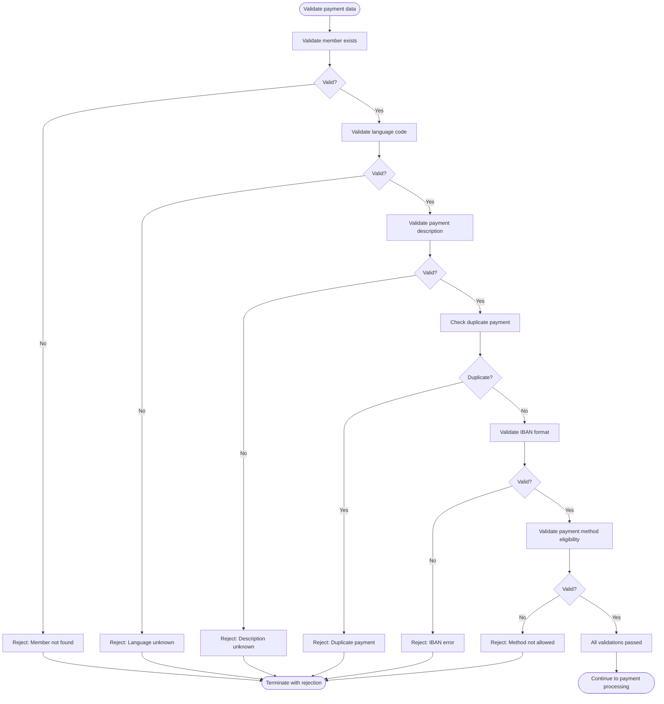

# Validate Payment Data

**ID**: UC_MYFIN_002  
**Status**: Draft  
**Last Updated**: 2026-01-28

## Overview

### Purpose
Validate all payment data elements before processing, ensuring data quality, SEPA compliance, and business rule adherence to prevent payment failures and financial errors.

### Actors
- **Primary Actor**: Payment Validation Engine (part of MYFIN batch process)
- **Secondary Actors**: 
  - IBAN Validation Service (SEBNKUK9) - validates bank account format
  - Member Database (MUTF08) - provides reference data for validation
  - Parameter Library - provides valid payment description codes
- **Stakeholders**: 
  - Finance department - relies on validated payments to prevent losses
  - Compliance officers - ensure SEPA and regulatory compliance
  - Mutuality administrators - need clear validation error reporting

### Scope
Validates member identity, language codes, payment descriptions, duplicate prevention, IBAN format, and payment method eligibility. Generates detailed rejection reports for invalid payments. Out of scope: correction of invalid data, member data updates, bank account management.

## Business Requirements

### BUREQ_MYFIN_006: Comprehensive Validation
- **ID**: BUREQ_MYFIN_006
- **Description**: Every payment must pass all validation checks before being processed. Any validation failure must result in a detailed rejection record with bilingual error message.
- **Rationale**: Prevents invalid payments from entering the banking system, protecting the organization from financial and compliance risks.
- **Acceptance Criteria**:
  - [ ] All validation checks performed in correct sequence
  - [ ] First validation failure stops processing immediately
  - [ ] Rejection record created with clear diagnostic message in FR/NL
  - [ ] Rejected payment appears on error list (500004) for review

### BUREQ_MYFIN_007: Bilingual Error Messages
- **ID**: BUREQ_MYFIN_007
- **Description**: All validation error messages must be provided in both French and Dutch (bilingual format) for clarity across all Belgian regions.
- **Rationale**: Belgian legal requirement for bilingual communication in federal services.
- **Acceptance Criteria**:
  - [ ] Error messages formatted as "DUTCH TEXT/FRENCH TEXT"
  - [ ] Both language variants convey the same error meaning
  - [ ] Error messages fit within 32-character diagnostic field

### BUREQ_MYFIN_008: Validation Sequence
- **ID**: BUREQ_MYFIN_008
- **Description**: Validations must be performed in logical sequence: member existence first, then language, then payment details, then bank account, to provide most relevant error message.
- **Rationale**: Ensures users receive the most actionable error information first (e.g., member not found is more critical than IBAN format).
- **Acceptance Criteria**:
  - [ ] Member validation before any other checks
  - [ ] Language validation before description lookup
  - [ ] Duplicate check before IBAN validation (faster check first)
  - [ ] Payment method validation after IBAN validation

## Preconditions

- Payment record (TRBFNCXP) is available with all required fields populated
- Member database is accessible for lookups
- IBAN validation service is operational
- Parameter library is available for payment description validation

## Postconditions

### Success Postconditions
- All validation checks passed
- Payment data confirmed as valid and compliant
- Processing can proceed to payment creation (UC_MYFIN_001)

### Failure Postconditions
- At least one validation check failed
- Rejection record created with specific error diagnostic
- Rejection record written to error list (500004 or regional variant)
- Payment processing terminated
- Error traceable via constant and sequence number

## Main Flow

### Business Flow Diagram

### Step-by-Step Description

1. **Initiate Validation**: System begins validation sequence for payment record
   - Input: TRBFNCXP payment record with all fields
   - System: Prepares validation context

2. **Member Existence Validation**: System verifies member exists in database
   - System: Searches member database using national registry number
   - Business Rule: BR_MYFIN_001
   - If member not found → Alternative Flow A (reject immediately)

3. **Insurance Section Validation**: System verifies member has active or closed insurance section
   - System: Searches insurance data for valid sections (OT, OP, AT, AP)
   - System: Excludes invalid product codes (609, 659, 679, 689)
   - If no valid section found → Alternative Flow A (member effectively not processable)

4. **Language Code Validation**: System ensures language code is determinable
   - System: Checks administrative language code (ADM-TAAL)
   - System: Falls back to insurance section language if needed
   - Business Rule: BR_MYFIN_002
   - If language unknown (code 0) → Alternative Flow B

5. **Payment Description Validation**: System verifies payment description code is valid
   - System: For code ≥90, searches parameter library in MUTF08
   - System: For code <90, checks internal description table
   - Business Rule: BR_MYFIN_003
   - If description not found → Alternative Flow C

6. **Duplicate Payment Detection**: System checks for existing payment with same identifier
   - System: Searches BBF payment module for matching constant and amount
   - Business Rule: BR_MYFIN_004
   - If duplicate exists → Alternative Flow D

7. **IBAN Format Validation**: System validates bank account IBAN structure
   - System: Calls SEBNKUK9 validation service
   - System: Verifies validation status is 0, 1, or 2 (valid)
   - System: Extracts BIC code from IBAN
   - Business Rule: BR_MYFIN_005
   - If IBAN invalid or BIC extraction fails → Alternative Flow E

8. **Payment Method Eligibility Validation**: System validates payment method is allowed
   - System: Checks if circular check (C, D, E, F) is used for non-Belgian address
   - Business Rule: BR_MYFIN_006
   - If circular check for non-Belgian address → Alternative Flow F

9. **Validation Complete**: All checks passed successfully
   - Output: Validated payment data ready for processing
   - System: Returns control to main payment processing flow

## Alternative Flows

### Alternative Flow A: Member Not Found or No Valid Section
**Trigger**: Member national registry number not in database or no valid insurance section (Steps 2-3)

1. System identifies member validation failure
2. System performs PPRNVW error handling routine
3. System terminates processing without creating rejection record (member data insufficient for rejection)
4. Use case ends

**Business Impact**: Payment cannot be processed; requires data correction at source or member data update in database before resubmission.

### Alternative Flow B: Language Code Unknown
**Trigger**: Language code cannot be determined from any source (Step 4)

1. System identifies ADM-TAAL = 0 and no section language available
2. System creates BFN54GZR rejection record
3. System populates diagnostic field: "TAALCODE ONBEKEND/CODE LANGUE INCONNU"
4. System sets rejection details:
   - Constant and sequence number from input
   - Available member data (may be incomplete)
   - Language code = 0
5. System writes rejection to error list (500004 or regional variant based on accounting type)
6. System terminates processing
7. Use case ends

**Business Impact**: Payment delayed until member's language preference is set in administrative data or insurance section.

### Alternative Flow C: Payment Description Not Found
**Trigger**: Payment description code has no matching description in database or table (Step 5)

1. System attempts description lookup (parameter library or internal table)
2. Lookup returns error or no match
3. System creates BFN54GZR rejection record
4. System populates diagnostic field: "ONBEK. OMSCHR./LIBELLE INCONNU"
5. System sets rejection details:
   - Payment code that failed lookup
   - Member information
   - Language code used for lookup
6. System writes rejection to error list (500004 or regional variant)
7. System terminates processing
8. Use case ends

**Business Impact**: Payment delayed until valid payment description code is provided or new description is added to parameter library.

### Alternative Flow D: Duplicate Payment Detected
**Trigger**: Existing BBF record found with identical constant and amount (Step 6)

1. System searches BBF payment module for member's payments
2. System finds record with matching BBF-BEDRAG = TRBFNCXP-MONTANT AND BBF-KONST = TRBFNCXP-CONSTANTE
3. System creates BFN54GZR rejection record
4. System populates diagnostic field: "DUBBELE BETALING/DOUBLE PAIEMENT"
5. System sets rejection details:
   - Duplicate constant and sequence number
   - Payment amount
   - Member information
6. System writes rejection to error list (500004 or regional variant)
7. System terminates processing (original payment remains valid)
8. Use case ends

**Business Impact**: Prevents double payment; requires investigation to determine if input error or legitimate second payment requiring different constant.

### Alternative Flow E: IBAN Validation Failure
**Trigger**: IBAN format invalid or BIC extraction fails (Step 7)

1. System calls SEBNKUK9 validation service with IBAN and payment method
2. Service returns invalid status (not 0, 1, or 2) or BIC extraction fails
3. System creates BFN54GZR rejection record
4. System populates diagnostic field: "IBAN FOUTIEF/IBAN ERRONE"
5. System sets rejection details:
   - Invalid IBAN value
   - Payment method
   - Member information
6. System writes rejection to error list (500004 or regional variant)
7. System terminates processing
8. Use case ends

**Business Impact**: Payment delayed until valid IBAN is provided; member or mutuality must supply correct bank account information.

### Alternative Flow F: Payment Method Not Eligible
**Trigger**: Circular check requested for non-Belgian address (Step 8)

1. System identifies payment method is circular check (C, D, E, or F)
2. System checks member administrative address country code
3. Country code is not "B  " (Belgium)
4. System creates BFN54GZR rejection record
5. System populates diagnostic field: "CC - PAYS/LAND NOT = B"
6. System sets rejection details:
   - Payment method (circular check variant)
   - Member country code
   - Member address information
7. System writes rejection to error list (500004 or regional variant)
8. System skips normal payment creation (no SEPA instruction, no detail list)
9. System terminates processing
10. Use case ends

**Business Impact**: Circular checks restricted to Belgian addresses per regulations; requires payment method change to bank transfer (B) for international addresses.

## Exception Flows

### Exception E1: IBAN Validation Service Unavailable
**Trigger**: SEBNKUK9 program cannot be called or returns system error

1. System attempts to call IBAN validation service
2. System receives call failure or critical error response
3. System logs technical error details
4. System determines business action based on configuration:
   - Option A: Create rejection with "IBAN validation service unavailable" message
   - Option B: Queue payment for later validation when service restored
5. System notifies operations team of service outage
6. Use case ends

**Business Impact**: Payments blocked until validation service restored; may require batch job retry or manual validation process.

### Exception E2: Parameter Library Unavailable
**Trigger**: MUTF08 parameter library cannot be accessed (for payment codes ≥90)

1. System attempts to access parameter library
2. Database access fails with connection or authorization error
3. System logs technical error
4. System creates rejection record with appropriate diagnostic (may default to description unknown)
5. System notifies operations team
6. Use case ends

**Business Impact**: Payments with codes ≥90 cannot be validated; service restoration required for processing.

## Business Rules

### BR_MYFIN_009: Validation Fail-Fast Principle
- **ID**: BR_MYFIN_009
- **Description**: Validation must stop at the first failure and report that specific error. Do not continue validating after a failure is detected.
- **Example**: If member not found, do not proceed to check language code or IBAN; report member not found immediately.
- **Enforcement**: Enforced throughout validation sequence (Steps 2-8).
- **Exception Handling**: Each validation failure immediately creates rejection record and terminates use case.

### BR_MYFIN_010: Rejection Record Completeness
- **ID**: BR_MYFIN_010
- **Description**: Every rejection record must contain sufficient information to identify the payment (constant, sequence number, mutuality) and understand the error (diagnostic message, payment details).
- **Example**: Rejection must include constant "1234567890", sequence "0001", diagnostic "IBAN FOUTIEF/IBAN ERRONE", amount, invalid IBAN value.
- **Enforcement**: Enforced when creating BFN54GZR rejection record in all alternative flows.
- **Exception Handling**: If member data is insufficient (Alternative Flow A), no rejection record is created; error handled at system level.

### BR_MYFIN_011: Validation Error Prioritization
- **ID**: BR_MYFIN_011
- **Description**: When multiple errors could exist, report the error in this priority: 1) Member not found, 2) Language unknown, 3) Description unknown, 4) Duplicate payment, 5) IBAN invalid, 6) Payment method ineligible.
- **Example**: If member has no language code AND invalid IBAN, report language unknown first (earlier in validation sequence).
- **Enforcement**: Enforced by validation sequence order (Steps 2-8).
- **Exception Handling**: Only one error is reported per payment attempt.

## Data Elements

| Element | Type | Description | Business Constraints |
|---------|------|-------------|---------------------|
| Validation Status | Boolean | Overall validation result (pass/fail) | Determined by completion of all checks |
| Error Diagnostic | Text (32 chars) | Bilingual error message | Format: "DUTCH/FRENCH" |
| National Registry Number | Binary/Text | Member identifier for validation | Required for member lookup |
| Payment Constant | 10 digits | Payment identifier for duplicate check | Required; checked against BBF module |
| IBAN | 34 characters | Bank account for format validation | Required; validated by SEBNKUK9 |
| BIC Code | 11 characters | Bank identification extracted from IBAN | Extracted during IBAN validation |
| Language Code | 1 digit | 1=NL, 2=FR, 3=DE | Must be determinable; 0 is invalid |
| Payment Method | 1 character | B/C/D/E/F | C/D/E/F require Belgian address |
| Country Code | 3 characters | Member address country | "B  " required for circular checks |
| Payment Description Code | 2 digits | Type/reason code | Must exist in parameter library or table |

## Dependencies

### Internal Dependencies
- **Payment Processing (UC_MYFIN_001)**: This use case is invoked as part of the main payment processing flow
- **Rejection List Generation (UC_MYFIN_003)**: Validation failures trigger rejection list entries

### External Dependencies
- **MUTF08 Database**: Member data and parameter library for validation lookups
- **BBF Payment Module**: Payment history for duplicate detection
- **SEBNKUK9 Program**: IBAN format validation and BIC extraction
- **Parameter Library (PAR)**: Payment description codes for codes ≥90
- **TBLIBCXW Table**: Payment description codes for codes <90

## Non-Functional Considerations

- **Performance**: Each validation check should complete in milliseconds; total validation time <500ms per payment to support batch throughput
- **Availability**: Validation must be available during entire batch processing window; failures should degrade gracefully
- **Accuracy**: False positives (rejecting valid payments) are unacceptable; false negatives (accepting invalid payments) create financial risk
- **Security**: Validation logic must not expose sensitive data in error messages beyond what's necessary for diagnosis
- **Auditability**: All validation failures must be logged with timestamp, error type, and payment identifier
- **Reliability**: Validation service dependencies (SEBNKUK9) must have fallback or retry mechanisms

## Open Questions

- [ ] What is acceptable false negative rate for IBAN validation (accepting technically invalid but processable IBANs)?
- [ ] Should validation be configurable to skip certain checks in emergency scenarios?
- [ ] Is there a manual override process for rejected payments that are actually valid?
- [ ] Should validation cache results (e.g., member lookups) within a batch for performance?
- [ ] Are there validation differences for different mutuality types or payment amounts?

## Related Documentation

- **Business Processes**: [Manual Payment Processing](../processes/BP_MYFIN_manual_payment_processing.md)
- **Use Cases**: [UC_MYFIN_001 - Process Manual Payment](UC_MYFIN_001_process_manual_payment.md)
- **Domain Concepts**: 
  - [Payment Validation Rules](../../discovery/MYFIN/discovered-domain-concepts.md#validation-rules)
  - [SEPA Compliance](../../discovery/MYFIN/discovered-domain-concepts.md#sepa-compliance)
- **Technical Documentation**: 
  - [FLOW_MYFIN_REJECT_002](../../discovery/MYFIN/discovered-flows.md#flow-payment-rejection-processing)
  - [SEBNKUK9 Integration](../../discovery/MYFIN/discovered-components.md#sebnkuk9)
