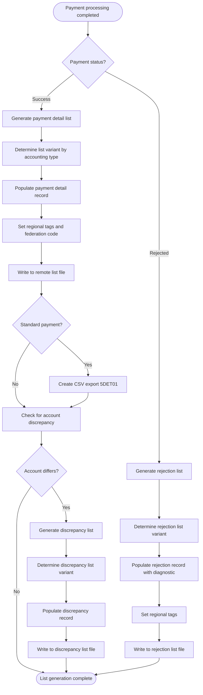

# Generate Payment Lists

**ID**: UC_MYFIN_003  
**Status**: Draft  
**Last Updated**: 2026-01-28

## Overview

### Purpose
Generate payment detail lists, rejection lists, and bank account discrepancy lists for review, audit, and reconciliation purposes after processing manual payments.

### Actors
- **Primary Actor**: List Generation Engine (part of MYFIN batch process)
- **Secondary Actors**: 
  - Remote Printing System - receives list records for formatting and distribution
  - CSV Export System - creates CSV files for modern integration (JIRA-4224)
- **Stakeholders**: 
  - Mutuality administrators - review payment details and rejections
  - Finance department - reconcile payments against lists
  - Audit team - verify payment processing accuracy
  - Bank operations - compare against transmitted SEPA files

### Scope
Generates three types of lists: payment details (500001), rejections (500004), and bank account discrepancies (500006). Supports regional accounting variants and CSV export format. Out of scope: list printing/formatting, distribution, archival, and physical delivery.

## Business Requirements

### BUREQ_MYFIN_009: Payment Detail List Generation
- **ID**: BUREQ_MYFIN_009
- **Description**: Every successfully validated payment must appear on the payment detail list with complete payment information for review and reconciliation.
- **Rationale**: Provides audit trail and allows mutuality administrators to verify payments before bank transmission.
- **Acceptance Criteria**:
  - [ ] Payment detail record created for each successful payment
  - [ ] Record includes member name, amount, bank account, payment description code
  - [ ] Correct list variant selected based on accounting type (500001, 500071, 500091, 500061, 500081, 541001)
  - [ ] CSV export created for standard payments (5DET01 per JIRA-4224)

### BUREQ_MYFIN_010: Rejection List Generation
- **ID**: BUREQ_MYFIN_010
- **Description**: Every rejected payment must appear on the rejection list with clear error diagnostic message in both French and Dutch.
- **Rationale**: Enables mutuality administrators to identify and correct payment errors efficiently.
- **Acceptance Criteria**:
  - [ ] Rejection record created for each validation failure
  - [ ] Diagnostic message clearly describes the error
  - [ ] Record includes enough detail to identify the payment (constant, sequence, amount)
  - [ ] Correct rejection list variant selected based on accounting type (500004, 500074, 500094, 500064, 500084, 541004)

### BUREQ_MYFIN_011: Bank Account Discrepancy List
- **ID**: BUREQ_MYFIN_011
- **Description**: When a payment uses a bank account different from the member's known account, a discrepancy record must be generated for verification without blocking the payment.
- **Rationale**: Alerts administrators to potential account changes or data inconsistencies while allowing payment to proceed.
- **Acceptance Criteria**:
  - [ ] Discrepancy record created when TRBFN-COMPTE-MEMBRE = 0
  - [ ] Record shows both provided account and known account from database
  - [ ] Discrepancy does not prevent payment processing
  - [ ] Correct discrepancy list variant selected based on accounting type (500006, 500076, 500096, 500066, 500086, 541006)

### BUREQ_MYFIN_012: Regional Accounting List Separation
- **ID**: BUREQ_MYFIN_012
- **Description**: Regional accounting payments (types 3-6, introduced by 6th State Reform) must generate separate lists distinct from general accounting payments for legal and organizational separation.
- **Rationale**: Compliance with Belgian federalization law requiring separate regional accounting and reporting.
- **Acceptance Criteria**:
  - [ ] Type 3 payments go to lists 500071 (detail), 500074 (reject), 500076 (discrepancy)
  - [ ] Type 4 payments go to lists 500091, 500094, 500096
  - [ ] Type 5 payments go to lists 500061, 500064, 500066
  - [ ] Type 6 payments go to lists 500081, 500084, 500086
  - [ ] All regional lists use record code 43 and destination 151

### BUREQ_MYFIN_013: CSV Export for Modern Integration
- **ID**: BUREQ_MYFIN_013
- **Description**: Standard payments (non-regional) must also be exported in CSV format (5DET01) for integration with modern systems, in addition to traditional list format.
- **Rationale**: Support integration with newer systems while maintaining legacy list format for existing processes (JIRA-4224).
- **Acceptance Criteria**:
  - [ ] CSV export record created with list name "5DET01"
  - [ ] CSV record uses record code 43 and destination 151
  - [ ] CSV export contains same data as traditional list record
  - [ ] CSV export only created for standard payments, not regional variants

## Preconditions

- Payment has been processed (either successfully or rejected)
- For payment detail list: BBF record and SEPA instruction have been created
- For rejection list: Validation failure has been detected with diagnostic message
- For discrepancy list: Payment processed but bank account differs from member's known account
- Administrative data (member name, address) is available
- Regional accounting type is determined

## Postconditions

### Success Postconditions
- Appropriate list record(s) written to output files
- List record includes all required payment details
- Record is formatted correctly for remote printing or CSV processing
- Regional tag and federation code correctly set
- List is available for administrator review and audit

### Failure Postconditions
- List record creation may fail due to system error
- Payment processing may continue without list (depending on configuration)
- Error logged for operations team investigation

## Main Flow

### Business Flow Diagram

### Step-by-Step Description

1. **Determine List Type**: System identifies which list(s) to generate based on payment status
   - Input: Payment processing result (success or rejection)
   - System: Routes to appropriate list generation flow

2. **Payment Detail List Generation** (Success Path)
   - **Step 2a**: Determine list variant based on accounting type
     * Type 3 → List "500071", code 43, destination 151
     * Type 4 → List "500091", code 43, destination 151
     * Type 5 → List "500061", code 43, destination 151
     * Type 6 → List "500081", code 43, destination 151
     * Destination 141 → List "541001", code 40, destination 116
     * Other → List "500001", code 40, destination from input
   - **Step 2b**: Initialize BFN51GZR record structure (213 bytes)
   - **Step 2c**: Set record header
     * Device output: "C" (console) if destination 153, else "L" (list)
     * Switching: "*"
     * Priority: space
   - **Step 2d**: Populate record key
     * VERB: Federation code based on accounting type (167, 169, 166, 168, or input destination)
     * AFK: Payment source (2=PAIFIN-AO for general/regional, 3=PAIFIN-AL for type 2)
     * KONST: Payment constant from input
     * VOLGNR: Sequence number from input
   - **Step 2e**: Populate payment details
     * RNR: National registry number (resolved value)
     * NAAM/VOORN: Member last name and first name
     * LIBEL: Payment description code
     * BEDRAG: Payment amount
     * DV/DN: Currency indicator (E=Euro, 2)
     * BANK: Bank code (1=Belfius, 2=KBC)
     * IBAN: International bank account
     * BETWY: Payment method
     * TYPE-COMPTE: Account type (for codes 90-99 from parameter library)
   - **Step 2f**: Set regional tag (same logic as VERB)
   - **Step 2g**: Write record to remote list file using ADLOGDBD

3. **CSV Export Generation** (Standard Payments Only)
   - **Step 3a**: Check if standard payment (not regional type 3-6)
   - **Step 3b**: Create duplicate BFN51GZR record with modifications
     * List name: "5DET01"
     * Record code: 43
     * Destination: 151
   - **Step 3c**: Write CSV record to remote file using ADLOGDBD
   - Business Rule: BR_MYFIN_012

4. **Bank Account Discrepancy Check**
   - **Step 4a**: Check if TRBFN-COMPTE-MEMBRE = 0 (not member's known account)
   - **Step 4b**: If discrepancy exists, proceed to generate discrepancy list
   - If no discrepancy, skip to completion

5. **Discrepancy List Generation** (When Account Differs)
   - **Step 5a**: Determine discrepancy list variant based on accounting type
     * Type 3 → List "500076"
     * Type 4 → List "500096"
     * Type 5 → List "500066"
     * Type 6 → List "500086"
     * Destination 141 → List "541006"
     * Other → List "500006"
   - **Step 5b**: Initialize BFN56CXR record structure
   - **Step 5c**: Populate discrepancy record
     * Member details (RNR, name, address)
     * Payment details (amount, constant, sequence, description code)
     * Provided account: IBAN and account number from input
     * Known account: IBAN-MUT and REKNR-MUT from member database
     * Payment method and regional tag
   - **Step 5d**: Write discrepancy record using ADLOGDBD
   - Business Rule: BR_MYFIN_013

6. **Rejection List Generation** (Rejection Path)
   - **Step 6a**: Determine rejection list variant based on accounting type
     * Type 3 → List "500074", code 43, destination 151
     * Type 4 → List "500094", code 43, destination 151
     * Type 5 → List "500064", code 43, destination 151
     * Type 6 → List "500084", code 43, destination 151
     * Destination 141 → List "541004", code 40, destination 116
     * Other → List "500004", code 40, destination from input
   - **Step 6b**: Initialize BFN54GZR record structure (259 bytes)
   - **Step 6c**: Set record header (same as detail list)
   - **Step 6d**: Populate rejection details
     * KONST/KONSTA: Payment constant
     * VOLGNR/VOLGNR-M30: Sequence number
     * TAAL: Language code
     * BETWYZ: Payment method
     * RNR: National registry number
     * BEDRAG: Payment amount
     * DV/DN: Currency indicator
     * BETKOD: Payment description code
     * IBAN: Bank account from input
     * DIAG: Bilingual diagnostic message (e.g., "IBAN FOUTIEF/IBAN ERRONE")
   - **Step 6e**: Set regional tag and federation code
   - **Step 6f**: Write rejection record using ADLOGDBD
   - Business Rule: BR_MYFIN_014

7. **Completion**: List generation complete
   - Output: List records written to appropriate output files
   - System: Returns to main payment processing flow

## Alternative Flows

### Alternative Flow A: Special Destination 141 Routing
**Trigger**: Payment destination is mutuality 141 (Step 2a or 6a)

1. System identifies destination = 141
2. For payment detail list:
   - Use list name "541001"
   - Set destination to 116 (special routing)
   - Use record code 40
3. For rejection list:
   - Use list name "541004"
   - Set destination to 116
   - Use record code 40
4. For discrepancy list:
   - Use list name "541006"
   - Set destination to 116
5. Continue with normal list generation
6. Return to main flow

**Business Impact**: Mutuality 141 has special list routing requirements; lists are routed to destination 116 instead of default.

### Alternative Flow B: Console Output Instead of List
**Trigger**: Payment destination is 153 (Step 2c)

1. System identifies destination = 153
2. Set BBF-N51-DEVICE-OUT = "C" (console) instead of "L" (list)
3. Record is routed to console/terminal output instead of list printer
4. Continue with normal list generation
5. Return to main flow

**Business Impact**: Testing or debugging scenario; payments display on console instead of generating printed lists.

## Exception Flows

### Exception E1: ADLOGDBD Write Failure
**Trigger**: Remote list write operation fails

1. System attempts to write list record using ADLOGDBD
2. Write operation returns error status
3. System logs error with record type and payment identifier
4. System determines action based on configuration:
   - Option A: Retry write operation (limited retries)
   - Option B: Continue processing and flag for manual review
   - Option C: Terminate batch job with error
5. System notifies operations team
6. Use case ends or continues based on configuration

**Business Impact**: List records may be missing; requires manual verification and possible record recreation.

### Exception E2: Regional Tag Calculation Error
**Trigger**: Accounting type is invalid or cannot be mapped to regional tag

1. System attempts to calculate regional tag from accounting type
2. Type value is unexpected or corrupted
3. System logs error with payment identifier
4. System either:
   - Uses default tag (9) and destination from input
   - Creates rejection record with diagnostic about invalid accounting type
5. Use case continues with default values or ends with rejection

**Business Impact**: Payments may be routed incorrectly; requires investigation of data quality at input source.

## Business Rules

### BR_MYFIN_012: CSV Export for Standard Payments
- **ID**: BR_MYFIN_012
- **Description**: Standard payments (accounting types other than 3-6) must generate both traditional list record (500001) and CSV export record (5DET01) for dual-format compatibility.
- **Example**: Payment with accounting type 1 creates two records: BFN51GZR with list "500001" code 40, and BFN51GZR with list "5DET01" code 43.
- **Enforcement**: Enforced at Step 3 (CSV Export Generation) after payment detail list is created.
- **Exception Handling**: Regional payments (types 3-6) do not create CSV export; only one list record generated.

### BR_MYFIN_013: Discrepancy List Non-Blocking
- **ID**: BR_MYFIN_013
- **Description**: Bank account discrepancy list generation is informational only; it must not block payment processing. Payment detail list and SEPA instruction are created regardless of discrepancy.
- **Example**: Member has known IBAN "BE68539007547034" but payment provides "BE12345678901234"; both payment detail and discrepancy records are created.
- **Enforcement**: Enforced at Step 4 (discrepancy check occurs after payment detail list creation).
- **Exception Handling**: If discrepancy list write fails, payment processing continues; error logged for investigation.

### BR_MYFIN_014: Rejection List Bilingual Diagnostic
- **ID**: BR_MYFIN_014
- **Description**: Every rejection list record must include a bilingual diagnostic message in the format "DUTCH TEXT/FRENCH TEXT" within 32 characters to serve all Belgian language communities.
- **Example**: "IBAN FOUTIEF/IBAN ERRONE" (13+13=26 characters plus separator fits in 32-character field).
- **Enforcement**: Enforced at Step 6d when populating rejection record DIAG field.
- **Exception Handling**: If diagnostic message exceeds 32 characters, truncate intelligently while preserving meaning in both languages.

### BR_MYFIN_015: Regional List Separation
- **ID**: BR_MYFIN_015
- **Description**: Regional accounting payments (types 3-6) must always use separate regional list names (500071, 500091, 500061, 500081) and record code 43 to maintain legal and organizational separation from general accounting.
- **Example**: Type 3 payment always goes to list "500071" regardless of destination mutuality; never goes to "500001".
- **Enforcement**: Enforced at Step 2a (list variant determination) based on accounting type.
- **Exception Handling**: No exceptions; regional accounting separation is legally required per 6th State Reform.

### BR_MYFIN_016: List Record Key Uniqueness
- **ID**: BR_MYFIN_016
- **Description**: Each list record must have a unique key composed of federation code (VERB), payment source (AFK), constant (KONST), and sequence number (VOLGNR) to enable traceability and reconciliation.
- **Example**: Record with VERB=167, AFK=2, KONST=1234567890, VOLGNR=0001 uniquely identifies one payment on the list.
- **Enforcement**: Enforced at Step 2d when populating record key fields.
- **Exception Handling**: Duplicate keys indicate duplicate payment processing; should be prevented by duplicate detection in validation use case.

## Data Elements

| Element | Type | Description | Business Constraints |
|---------|------|-------------|---------------------|
| List Name | 6 characters | Identifies which list (500001, 500004, 500006, regional variants, 5DET01) | Determined by accounting type and payment status |
| Record Code | Integer | 40 (standard) or 43 (regional/CSV) | Regional and CSV use 43 |
| Device Output | 1 character | C=Console, L=List | C for destination 153, else L |
| Destination | 3 digits | Routing destination mutuality | 151 for regional, 116 for mutual 141 |
| Federation Code (VERB) | 3 digits | Mutuality federation (167, 168, 169, 166, or input) | Based on accounting type |
| Payment Source (AFK) | 1 digit | 2=PAIFIN-AO, 3=PAIFIN-AL | 2 for general/regional, 3 for AL accounting |
| Constant (KONST) | 10 digits | Payment identifier | From input record |
| Sequence (VOLGNR) | 4 digits | Sequential number | From input record |
| Diagnostic (DIAG) | 32 characters | Bilingual error message | Required for rejections; format "NL/FR" |
| Regional Tag | 2 digits | Regional accounting indicator | 1, 2, 4, 7 for regional types; 9 for other |

## Dependencies

### Internal Dependencies
- **Payment Processing (UC_MYFIN_001)**: Lists generated as part of main payment flow
- **Payment Validation (UC_MYFIN_002)**: Rejection list triggered by validation failures

### External Dependencies
- **ADLOGDBD Program**: Remote list write service
- **Remote Printing System**: Formats and prints list records
- **CSV Processing System**: Processes 5DET01 CSV export files
- **BFN51GZR Copybook**: Payment detail list structure
- **BFN54GZR Copybook**: Rejection list structure
- **BFN56CXR Copybook**: Discrepancy list structure

## Non-Functional Considerations

- **Performance**: List record creation should add <100ms per payment; batch of 10,000 payments generates lists in <15 minutes
- **Availability**: List generation must complete successfully even if remote printing system is temporarily unavailable (queue records)
- **Volume**: Support generation of 50,000+ list records per batch run across all list types
- **Data Integrity**: List records must accurately reflect payment processing results; no omissions or data corruption
- **Auditability**: All list records must be traceable to source payment via constant and sequence number
- **Format Stability**: List record formats must remain stable for legacy printing systems; changes require coordination with operations
- **CSV Compatibility**: 5DET01 CSV export must be parseable by standard CSV libraries

## Open Questions

- [ ] What is the retention period for list output files?
- [ ] Are lists archived for long-term audit purposes?
- [ ] What is the process for reprinting lists if original output is lost?
- [ ] Should CSV export format be enhanced with additional fields for modern systems?
- [ ] Are there specific sorting requirements within each list (by constant, by member name, etc.)?
- [ ] What happens if list record exceeds maximum length due to data overflow?

## Related Documentation

- **Business Processes**: [Manual Payment Processing](../processes/BP_MYFIN_manual_payment_processing.md)
- **Use Cases**: 
  - [UC_MYFIN_001 - Process Manual Payment](UC_MYFIN_001_process_manual_payment.md)
  - [UC_MYFIN_002 - Validate Payment Data](UC_MYFIN_002_validate_payment_data.md)
- **Domain Concepts**: 
  - [Regional Accounting](../../discovery/MYFIN/discovered-domain-concepts.md#regional-accounting)
  - [Payment Lists](../../discovery/MYFIN/discovered-domain-concepts.md#payment-lists)
- **Technical Documentation**: 
  - [BFN51GZR List Structure](../../discovery/MYFIN/discovered-domain-concepts.md#bfn51gzr)
  - [BFN54GZR List Structure](../../discovery/MYFIN/discovered-domain-concepts.md#bfn54gzr)
  - [BFN56CXR List Structure](../../discovery/MYFIN/discovered-domain-concepts.md#bfn56cxr)
