# Functional Flow: MYFIN Main Payment Processing

**ID**: FF_MYFIN_001  
**Related Use Case**: UC_MYFIN_001  
**Last Updated**: 2026-01-29

## Overview

This flow implements the technical realization of processing manual GIRBET payment records. The batch program validates member data, checks for duplicate payments, validates bank account information (IBAN/SEPA), creates BBF payment records, and generates payment lists for banks and payment detail reports.

## Sequence Diagram

```mermaid
sequenceDiagram
    participant Batch as Batch Job
    participant MYFIN as MYFIN Program
    participant MUTF08 as MUTF08 DB
    participant SEBNKUK9 as SEBNKUK9 Validator
    participant BBF as BBF Database
    participant Lists as Payment Lists
    
    Batch->>MYFIN: GIRBETPP(USAREA1, PPR-RECORD)
    
    Note over MYFIN: 1. Member Lookup
    MYFIN->>MUTF08: SCH-LID(TRBFN-PPR-RNR)
    MUTF08-->>MYFIN: Member data or STAT1 error
    
    alt Member not found
        MYFIN->>MYFIN: PPRNVW (error handling)
        MYFIN-->>Batch: EXIT PROGRAM
    end
    
    Note over MYFIN: 2. Section Search
    MYFIN->>MYFIN: RECHERCHE-SECTION
    MYFIN->>MYFIN: Check OT→OP→AT→AP sections
    MYFIN->>MYFIN: Store SECTION-TROUVEE, language
    
    Note over MYFIN: 3. Administrative Data
    MYFIN->>MUTF08: GET-ADM(GETTP=1)
    MUTF08-->>MYFIN: Administrative data
    
    alt ADM-TAAL = 0
        MYFIN->>MYFIN: Use section language
        alt No language found
            MYFIN->>Lists: CREER-REMOTE-500004("TAALCODE ONBEKEND")
            MYFIN-->>Batch: FIN-BTM (EXIT)
        end
    end
    
    Note over MYFIN: 4. National Registry Resolution
    MYFIN->>MYFIN: ZOEK-RIJKSNUMMER
    MYFIN->>MYFIN: Select ADM-RNR2 or ADM-NRNR2 or TRBFN-RNR
    MYFIN->>MYFIN: Store in WS-RIJKSNUMMER
    
    Note over MYFIN: 5. Payment Description
    alt TRBFN-CODE-LIBEL >= 90
        MYFIN->>MUTF08: SCH-LID08(6000000+TRBFN-DEST)
        MYFIN->>MUTF08: GET-PAR until LIBP-NRLIB match
        MUTF08-->>MYFIN: LIBP-TYPE-COMPTE, LIBP-LIBELLE-xx
        MYFIN->>MYFIN: Select language-specific description
        alt Description not found
            MYFIN->>Lists: CREER-REMOTE-500004("ONBEK. OMSCHR.")
            MYFIN-->>Batch: FIN-BTM (EXIT)
        end
    else TRBFN-CODE-LIBEL < 90
        MYFIN->>MYFIN: Use TBLIBCXW table lookup
        MYFIN->>MYFIN: SAV-LIBELLE ← TBLIB-LIBELLE
    end
    
    Note over MYFIN: 6. Duplicate Detection
    MYFIN->>BBF: VOIR-DOUBLES (GET-BBF GETTP=1)
    BBF-->>MYFIN: Existing BBF records
    MYFIN->>MYFIN: Check if same amount & constant
    
    alt Duplicate found
        MYFIN->>Lists: CREER-REMOTE-500004("DUBBELE BETALING")
        MYFIN-->>Batch: FIN-BTM (EXIT)
    end
    
    Note over MYFIN: 7. Bank Account Validation
    MYFIN->>MYFIN: VOIR-BANQUE-DEBIT
    MYFIN->>SEBNKUK9: WELKE-BANK (validate IBAN)
    SEBNKUK9-->>MYFIN: WS-SEBNK-STAT-OUT, WS-SEBNK-BIC-OUT
    
    alt Invalid IBAN
        MYFIN->>Lists: CREER-REMOTE-500004("IBAN FOUTIEF")
        MYFIN-->>Batch: FIN-BTM (EXIT)
    else Valid IBAN
        MYFIN->>MYFIN: Store WS-SEBNK-BIC-OUT → WS-BIC
        MYFIN->>MYFIN: Determine SAV-WELKEBANK (0=Belfius, 1=KBC)
    end
    
    Note over MYFIN: 8. BBF Record Creation
    MYFIN->>MYFIN: CREER-BBF
    MYFIN->>MYFIN: Initialize BBF-REC
    MYFIN->>MYFIN: Map TRBFNCXP fields to BBF fields
    MYFIN->>MYFIN: Handle regional accounting (TAGREG-OP)
    MYFIN->>BBF: ADD-BBF
    BBF-->>MYFIN: STAT1 (success=0)
    
    alt ADD-BBF error
        MYFIN->>MYFIN: PPRNVW error handling
        MYFIN-->>Batch: EXIT PROGRAM
    end
    
    Note over MYFIN: 9. Circular Check Validation
    alt TRBFN-BETWYZ = "C/D/E/F" AND ADM-LND ≠ "B  "
        MYFIN->>Lists: CREER-REMOTE-500004("CC - PAYS/LAND NOT = B")
        MYFIN-->>Batch: FIN-BTM (EXIT)
    end
    
    Note over MYFIN: 10. Account Discrepancy Check
    alt TRBFN-COMPTE-MEMBRE = 0 (different account)
        MYFIN->>MYFIN: VOIR-TROP-JEUNE-POUR-COMPTE
        MYFIN->>MUTF08: RECHERCHE-RECKNR (find member's bank account)
        MUTF08-->>MYFIN: SAV-IBAN (member's known IBAN)
        
        alt Known IBAN differs from input
            MYFIN->>Lists: CREER-REMOTE-500006 (discrepancy report)
            Note over Lists: BFN56CXR - 500006 list
        end
    end
    
    Note over MYFIN: 11. User Record & Payment List
    MYFIN->>MYFIN: CREER-USER-500001
    MYFIN->>MYFIN: Initialize SEPAAUKU structure
    MYFIN->>MYFIN: Determine bank & account code
    MYFIN->>Lists: Write SEPAAUKU (5N0001 user record)
    
    MYFIN->>MYFIN: CREER-REMOTE-500001
    MYFIN->>MYFIN: Initialize BFN51GZR structure
    MYFIN->>MYFIN: Map payment details to list record
    MYFIN->>Lists: Write BFN51GZR (500001 or regional variant)
    
    alt Regional accounting & list 5DET01
        MYFIN->>Lists: Write BFN51GZR (5DET01, code 43)
    end
    
    MYFIN-->>Batch: Return (success)
```



## Detailed Flow Steps

### 1. Program Entry & Member Lookup
- **Program**: MYFIN
- **Entry Point**: `GIRBETPP` (LINKAGE SECTION)
- **Code**: [cbl/MYFIN.cbl#L177](../../../cbl/MYFIN.cbl#L177)
- **Action**: Receive payment record, initialize language tracking, search member database
- **Input**: 
  - USAREA1 - Database access area
  - PPR-RECORD - TRBFNCXP payment record structure
- **Processing**:
  ```cobol
  ENTRY "GIRBETPP" USING USAREA1 PPR-RECORD.
  MOVE 0 TO WS-LIDVZ-OP-TAAL.
  MOVE 0 TO WS-LIDVZ-AP-TAAL.
  MOVE ZEROES TO STAT1
  MOVE TRBFN-PPR-RNR TO RNRBIN
  PERFORM SCH-LID
  ```
- **Validation**: Check STAT1 after SCH-LID
- **On Failure**: If STAT1 ≠ 0, PERFORM PPRNVW (error handling) and exit program

### 2. Section Search & Language Determination
- **Program**: MYFIN - RECHERCHE-SECTION paragraph
- **Code**: [cbl/MYFIN.cbl#L641-L708](../../../cbl/MYFIN.cbl#L641)
- **Action**: Search for active member insurance section, determine language preference
- **Steps**:
  1. Check open holder data (OT): LIDVZ-OT-DATOND, LIDVZ-OT-KOD1
  2. Check open PAC data (OP): LIDVZ-OP-DATINS, LIDVZ-OP-KOD1, LIDVZ-OP-TAAL
  3. Check closed holder data (AT): LIDVZ-AT-DATOND, LIDVZ-AT-KOD1
  4. Check closed PAC data (AP): LIDVZ-AP-DATINS, LIDVZ-AP-KOD1, LIDVZ-AP-TAAL
  5. Exclude product codes: 609, 659, 679, 689
- **Output**: 
  - SECTION-TROUVEE - Active section mutuality code
  - WS-LIDVZ-OP-TAAL or WS-LIDVZ-AP-TAAL - Language preference

### 3. Administrative Data Retrieval & Language Validation
- **Program**: MYFIN - PAR-TRAITEMENT-BTM
- **Code**: [cbl/MYFIN.cbl#L198-L217](../../../cbl/MYFIN.cbl#L198)
- **Action**: Retrieve administrative member data, validate language code
- **Processing**:
  ```cobol
  MOVE 1 TO GETTP
  PERFORM GET-ADM
  IF ADM-TAAL = 0
      IF WS-LIDVZ-AP-TAAL NOT = 0
          MOVE WS-LIDVZ-AP-TAAL TO ADM-TAAL
      ELSE
          IF WS-LIDVZ-OP-TAAL NOT = 0
              MOVE WS-LIDVZ-OP-TAAL TO ADM-TAAL
          ELSE
              MOVE "TAALCODE ONBEKEND/CODE LANGUE INCONNU" TO BBF-N54-DIAG
              PERFORM CREER-REMOTE-500004
              PERFORM FIN-BTM
  ```
- **Critical Error**: No language code available → rejection with bilingual error message

### 4. National Registry Number Resolution
- **Program**: MYFIN - ZOEK-RIJKSNUMMER
- **Code**: [cbl/MYFIN.cbl#L1263-L1275](../../../cbl/MYFIN.cbl#L1263)
- **Action**: Determine which national registry number to use for identification
- **Logic**:
  ```cobol
  MOVE ALL " " TO WS-RIJKSNUMMER.
  IF ADM-RNR2-MUT = " "
      MOVE ADM-RNR2 TO WS-RIJKSNUMMER
  ELSE
      IF ADM-NRNR2-MUT = " " AND ADM-NRNR2G NOT = ALL " "
          MOVE ADM-NRNR2 TO WS-RIJKSNUMMER
      ELSE
          MOVE TRBFN-RNR TO WS-RIJKSNUMMER
  ```
- **Priority**: ADM-RNR2 > ADM-NRNR2 > TRBFN-RNR

### 5. Payment Description Retrieval
- **Program**: MYFIN - Code libel handling
- **Code**: [cbl/MYFIN.cbl#L219-L290](../../../cbl/MYFIN.cbl#L219)
- **Action**: Retrieve payment description based on payment code and language

#### For TRBFN-CODE-LIBEL >= 90 (Database lookup):
```cobol
MOVE TRBFN-DEST TO TEST-MUTUALITE
MOVE RNRBIN TO SAV-RNRBIN
ADD 6000000 TRBFN-DEST GIVING RNRBIN
PERFORM SCH-LID08
IF STAT1 = ZEROES OR = 4
    MOVE 1 TO GETTP
    PERFORM GET-PAR
    PERFORM WITH TEST BEFORE UNTIL
    STAT1 NOT = ZEROES OR LIBP-NRLIB = TRBFN-CODE-LIBEL
        MOVE 2 TO GETTP
        PERFORM GET-PAR
    END-PERFORM
END-IF
```

**Language-specific selection**:
- **MUT-FR** (109, 116, 127-136, 167-168): LIBP-LIBELLE-FR → SAV-LIBELLE
- **MUT-NL** (101-102, 104-105, 108, 110-122, 126, 131, 169): LIBP-LIBELLE-NL → SAV-LIBELLE
- **MUT-BILINGUE** (106-107, 150, 166): LIBP-LIBELLE-NL if ADM-TAAL=1, else LIBP-LIBELLE-FR
- **MUT-VERVIERS** (137): LIBP-LIBELLE-AL if ADM-TAAL=3, else LIBP-LIBELLE-FR

**Error**: If STAT1 ≠ 0, reject with "ONBEK. OMSCHR./LIBELLE INCONNU"

#### For TRBFN-CODE-LIBEL < 90 (Table lookup):
```cobol
MOVE TBLIB-LIBELLE(TRBFN-CODE-LIBEL, ADM-TAAL) TO SAV-LIBELLE
MOVE TBLIB-TYPE(TRBFN-CODE-LIBEL) TO SAV-TYPE-COMPTE
```

### 6. Duplicate Payment Detection
- **Program**: MYFIN - VOIR-DOUBLES
- **Code**: [cbl/MYFIN.cbl#L292](../../../cbl/MYFIN.cbl#L292)
- **Action**: Check if identical payment already exists in BBF database
- **Logic**: 
  ```cobol
  MOVE 1 TO GETTP
  PERFORM GET-BBF
  PERFORM WITH TEST BEFORE UNTIL STAT1 NOT = ZEROES
      IF (TRBFN-MONTANT = BBF-BEDRAG) AND
         (TRBFN-CONSTANTE = BBF-KONST)
          MOVE "DUBBELE BETALING/DOUBLE PAIEMENT" TO BBF-N54-DIAG
          PERFORM CREER-REMOTE-500004
          PERFORM FIN-BTM
      END-IF
      MOVE 2 TO GETTP
      PERFORM GET-BBF
  END-PERFORM
  ```
- **Rejection Criteria**: Same amount (TRBFN-MONTANT = BBF-BEDRAG) AND same constant (TRBFN-CONSTANTE = BBF-KONST)
- **Related Requirement**: FUREQ_MYFIN_002

### 7. Bank Account Validation (IBAN/SEPA)
- **Program**: MYFIN - VOIR-BANQUE-DEBIT
- **Code**: [cbl/MYFIN.cbl#L293](../../../cbl/MYFIN.cbl#L293)
- **Action**: Validate IBAN format, extract BIC code, determine bank routing
- **Processing**:
  ```cobol
  MOVE SPACES TO WS-BIC
  MOVE TRBFN-IBAN TO WS-SEBNK-IBAN-IN
  MOVE TRBFN-BETWYZ TO WS-SEBNK-BETWYZ-IN
  PERFORM WELKE-BANK
  
  IF (WS-SEBNK-WELKEBANK = 0 AND WS-SEBNK-STAT-OUT = (0 OR 1 OR 2))
      MOVE WS-SEBNK-BIC-OUT TO WS-BIC
  ELSE
      MOVE "IBAN FOUTIEF/IBAN ERRONE" TO BBF-N54-DIAG
      PERFORM CREER-REMOTE-500004
  END-IF
  ```
- **External Call**: SEBNKUK9 (IBAN validation routine)
- **Bank Selection**: Based on payment code (TRBFN-CODE-LIBEL):
  - Codes 1-49, 52-57, 71, 73, 74, 76, 78: If WS-SEBNK-WELKEBANK=0, SAV-WELKEBANK=1
  - Codes 50, 51, 60, 80: SAV-WELKEBANK=1
  - All others: SAV-WELKEBANK=1
- **Related Requirement**: FUREQ_MYFIN_003

### 8. BBF Payment Record Creation
- **Program**: MYFIN - CREER-BBF
- **Code**: [cbl/MYFIN.cbl#L386-L456](../../../cbl/MYFIN.cbl#L386)
- **Action**: Create BBF database record with payment information
- **Data Mapping**:
  ```cobol
  INITIALIZE BBF-REC
  MOVE 9 TO BBF-TYPE
  MOVE TRBFN-CODE-LIBEL TO BBF-LIBEL
  MOVE TRBFN-MONTANT TO BBF-BEDRAG
  MOVE TRBFN-MONTANT-DV TO BBF-BEDRAG-DV
  MOVE TRBFN-NO-SUITE TO BBF-VOLGNR
  MOVE TRBFN-CONSTANTE TO BBF-KONST
  MOVE SP-ACTDAT TO BBF-DATINB
  MOVE TRBFN-IBAN TO BBF-IBAN
  MOVE TRBFN-BETWYZ TO BBF-BETWY
  ```
- **Regional Accounting Handling**:
  ```cobol
  EVALUATE TRBFN-TYPE-COMPTA
      WHEN 3  MOVE 1 TO BBF-TAGREG-OP
              MOVE 167 TO BBF-VERB
      WHEN 4  MOVE 2 TO BBF-TAGREG-OP
              MOVE 169 TO BBF-VERB
      WHEN 5  MOVE 4 TO BBF-TAGREG-OP
              MOVE 166 TO BBF-VERB
      WHEN 6  MOVE 7 TO BBF-TAGREG-OP
              MOVE 168 TO BBF-VERB
      WHEN OTHER  MOVE 9 TO BBF-TAGREG-OP
                  MOVE TRBFN-DEST TO BBF-VERB
  END-EVALUATE
  ```
- **Date Handling**: For payment codes 50 and 60, parse date ranges from TRBFN-LIBELLE1/2
- **Database Write**: PERFORM ADD-BBF
- **Related Requirement**: FUREQ_MYFIN_005

### 9. Circular Check Country Validation
- **Program**: MYFIN - Post-BBF validation
- **Code**: [cbl/MYFIN.cbl#L295-L301](../../../cbl/MYFIN.cbl#L295)
- **Action**: Validate that circular checks are only issued to Belgian addresses
- **Logic**:
  ```cobol
  IF (TRBFN-BETWYZ = "C" OR "D" OR "E" OR "F") AND (ADM-LND <> "B  ")
      MOVE "CC - PAYS/LAND NOT = B        " TO BBF-N54-DIAG
      PERFORM CREER-REMOTE-500004
      PERFORM FIN-BTM
  END-IF
  ```
- **Business Rule**: Circular checks (BETWYZ = C/D/E/F) require Belgian country code (ADM-LND = "B  ")

### 10. Bank Account Discrepancy Detection
- **Program**: MYFIN - VOIR-TROP-JEUNE-POUR-COMPTE
- **Code**: [cbl/MYFIN.cbl#L302-L310](../../../cbl/MYFIN.cbl#L302)
- **Action**: Compare input IBAN with member's known bank account
- **Condition**: Only when TRBFN-COMPTE-MEMBRE = 0 (different account flag)
- **Processing**:
  ```cobol
  MOVE 1 TO SW-TROP-JEUNE
  IF TRBFN-COMPTE-MEMBRE = 0
      PERFORM RECHERCHE-RECKNR
      IF SW-TROP-JEUNE = 1
          PERFORM CREER-REMOTE-500006
      END-IF
  END-IF
  ```
- **RECHERCHE-RECKNR**: Calls SCHRKCX9 to retrieve member's known IBAN
  ```cobol
  MOVE TRBFN-PPR-RNR TO SCHRK-NR-MUT
  MOVE SP-ACTDAT TO SCHRK-DAT-VAL
  MOVE TRBFN-DEST TO SCHRK-FED
  COPY SEPAKCXD.
  IF SCHRK-STATUS = ZEROES
      MOVE SCHRK-IBAN TO SAV-IBAN
  ELSE
      MOVE SPACES TO SAV-IBAN
  END-IF
  ```
- **Output**: BFN56CXR discrepancy report (list 500006) if IBANs differ
- **Related Requirement**: FUREQ_MYFIN_003

### 11. User Record Creation (SEPA Payment Instruction)
- **Program**: MYFIN - CREER-USER-500001
- **Code**: [cbl/MYFIN.cbl#L458-L542](../../../cbl/MYFIN.cbl#L458)
- **Action**: Create SEPAAUKU user record for bank payment processing
- **Structure Initialization**:
  ```cobol
  INITIALIZE SEPAAUKU
  MOVE 475 TO REC-LENGTE
  MOVE 41 TO REC-CODE
  MOVE "5N0001" TO USERCOD
  MOVE TRBFN-PPR-RNR TO USERRNR
  MOVE SECTION-TROUVEE TO USERMY
  ```
- **Bank & Account Code Determination**:
  ```cobol
  EVALUATE SAV-WELKEBANK
  WHEN 1
      MOVE 0 TO WELKEBANK  (Belfius)
      IF TRBFN-TYPE-COMPTA = 1 OR 3 OR 4 OR 5 OR 6
          MOVE 13 TO U-BAC-KODE  (AO - General account)
      ELSE
          MOVE 23 TO U-BAC-KODE  (AL - Regional account)
      END-IF
  WHEN 2
      For regional accounting (TYPE-COMPTA 3/4/5/6), force Belfius
      MOVE 0 TO WELKEBANK
      ...
  END-EVALUATE
  ```
- **Related Requirement**: FUREQ_MYFIN_005

### 12. Payment Detail List Generation (500001)
- **Program**: MYFIN - CREER-REMOTE-500001
- **Code**: [cbl/MYFIN.cbl#L710-L809](../../../cbl/MYFIN.cbl#L710)
- **Action**: Create payment detail list record (BFN51GZR structure)
- **List Routing by Accounting Type**:
  ```cobol
  EVALUATE TRBFN-TYPE-COMPTA
      WHEN 03  MOVE "500071" TO BBF-N51-NAME
               MOVE 43 TO BBF-N51-CODE
               MOVE 151 TO BBF-N51-DESTINATION
      WHEN 04  MOVE "500091" TO BBF-N51-NAME
               MOVE 151 TO BBF-N51-DESTINATION
               MOVE 43 TO BBF-N51-CODE
      WHEN 05  MOVE "500061" TO BBF-N51-NAME
               MOVE 43 TO BBF-N51-CODE
               MOVE 151 TO BBF-N51-DESTINATION
      WHEN 06  MOVE "500081" TO BBF-N51-NAME
               MOVE 151 TO BBF-N51-DESTINATION
               MOVE 43 TO BBF-N51-CODE
      WHEN OTHER  MOVE 40 TO BBF-N51-CODE
                  IF TRBFN-DEST = 141
                      MOVE 116 TO BBF-N51-DESTINATION
                      MOVE "541001" TO BBF-N51-NAME
                  ELSE
                      MOVE TRBFN-DEST TO BBF-N51-DESTINATION
                      MOVE "500001" TO BBF-N51-NAME
                  END-IF
  END-EVALUATE
  ```
- **Data Population**:
  ```cobol
  MOVE TRBFN-CONSTANTE TO BBF-N51-KONST
  MOVE TRBFN-NO-SUITE TO BBF-N51-VOLGNR
  MOVE WS-RIJKSNUMMER TO BBF-N51-RNR
  MOVE ADM-NAAM TO BBF-N51-NAAM
  MOVE ADM-VOORN TO BBF-N51-VOORN
  MOVE TRBFN-CODE-LIBEL TO BBF-N51-LIBEL
  MOVE TRBFN-MONTANT TO BBF-N51-BEDRAG
  MOVE SAV-WELKEBANK TO BBF-N51-BANK
  MOVE TRBFN-IBAN TO BBF-N51-IBAN
  MOVE TRBFN-BETWYZ TO BBF-N51-BETWY
  ```
- **CSV Detail List** (JIRA-4224): For general accounting, also create code 43 list "5DET01"
  ```cobol
  IF SW-CREA-CODE-43
      MOVE "5DET01" TO BBF-N51-NAME
      MOVE 43 TO BBF-N51-CODE
      MOVE 151 TO BBF-N51-DESTINATION
      COPY ADLOGDBD REPLACING LOGT1-REC BY BFN51GZR.
  END-IF
  ```
- **Related Requirement**: FUREQ_MYFIN_004

## Data Transformations

### Input Record (TRBFNCXP) → Working Storage

**Input** (from PPR-RECORD):
```cobol
01  TRBFNCXP.
    05  TRBFN-PPR-RNR       PIC S9(08) COMP.    * Binary national registry
    05  TRBFN-RNR           PIC X(13).          * National registry (alphanumeric)
    05  TRBFN-DEST          PIC 9(03).          * Destination mutuality
    05  TRBFN-CONSTANTE     PIC 9(10).          * Payment constant
    05  TRBFN-NO-SUITE      PIC 9(04).          * Sequence number
    05  TRBFN-MONTANT       PIC S9(08).         * Amount (cents)
    05  TRBFN-CODE-LIBEL    PIC 9(02).          * Payment description code
    05  TRBFN-IBAN          PIC X(34).          * IBAN
    05  TRBFN-BETWYZ        PIC X(01).          * Payment method (blank=SEPA, C=check)
    05  TRBFN-TYPE-COMPTA   PIC 9(01).          * Accounting type (1=general, 3-6=regional)
    05  TRBFN-COMPTE-MEMBRE PIC 9(01).          * Known account flag
```

**Transformation Logic** (main processing):
```cobol
* Member lookup
MOVE TRBFN-PPR-RNR TO RNRBIN.
PERFORM SCH-LID

* National registry resolution
PERFORM ZOEK-RIJKSNUMMER
* Result: WS-RIJKSNUMMER contains selected RNR

* Bank validation
MOVE TRBFN-IBAN TO WS-SEBNK-IBAN-IN.
MOVE TRBFN-BETWYZ TO WS-SEBNK-BETWYZ-IN.
PERFORM WELKE-BANK
* Result: WS-BIC contains BIC code, SAV-WELKEBANK contains bank routing
```

**Output** (Working Storage variables):
```cobol
01  WS-RIJKSNUMMER          PIC X(13).          * Selected national registry
01  SAV-WELKEBANK           PIC 9.              * Bank routing (0=Belfius, 1=KBC)
01  SAV-IBAN                PIC X(34).          * Member's known IBAN
01  WS-BIC                  PIC X(11).          * BIC code
01  SAV-LIBELLE             PIC X(53).          * Payment description
01  SAV-TYPE-COMPTE         PIC X(01).          * Account type
01  SECTION-TROUVEE         PIC 999.            * Active section
```

### Working Storage → BBF Database Record

**EXEC SQL equivalent** (conceptual - actual uses COPY statements):
```cobol
INITIALIZE BBF-REC.
MOVE 9                TO BBF-TYPE.
MOVE TRBFN-CODE-LIBEL TO BBF-LIBEL.
MOVE TRBFN-MONTANT    TO BBF-BEDRAG.
MOVE TRBFN-MONTANT-DV TO BBF-BEDRAG-DV.
MOVE TRBFN-NO-SUITE   TO BBF-VOLGNR.
MOVE TRBFN-CONSTANTE  TO BBF-KONST.
MOVE SP-ACTDAT        TO BBF-DATINB.
MOVE TRBFN-IBAN       TO BBF-IBAN.
MOVE TRBFN-BETWYZ     TO BBF-BETWY.

* Regional accounting handling
EVALUATE TRBFN-TYPE-COMPTA
    WHEN 3  MOVE 1 TO BBF-TAGREG-OP
            MOVE 167 TO BBF-VERB
    WHEN 4  MOVE 2 TO BBF-TAGREG-OP
            MOVE 169 TO BBF-VERB
    WHEN 5  MOVE 4 TO BBF-TAGREG-OP
            MOVE 166 TO BBF-VERB
    WHEN 6  MOVE 7 TO BBF-TAGREG-OP
            MOVE 168 TO BBF-VERB
    WHEN OTHER  MOVE 9 TO BBF-TAGREG-OP
                MOVE TRBFN-DEST TO BBF-VERB
END-EVALUATE.

* IBAN to account number conversion (Belgian IBAN)
IF TRBFN-IBAN NOT = SPACES
    MOVE TRBFN-IBAN TO WS-IBAN
    IF WS-IBAN(1:2) = "BE"
        MOVE WS-IBAN(5:12) TO BBF-REKNR
    ELSE
        MOVE ZEROES TO BBF-REKNR
    END-IF
ELSE
    MOVE ZEROES TO BBF-REKNR
END-IF.

PERFORM ADD-BBF.
```

### Working Storage → Payment List Record (BFN51GZR)

**List Record Structure**:
```cobol
MOVE 213 TO BBF-N51-LENGTH.
MOVE TRBFN-CONSTANTE TO BBF-N51-KONST.
MOVE TRBFN-NO-SUITE TO BBF-N51-VOLGNR.
MOVE WS-RIJKSNUMMER TO BBF-N51-RNR.
MOVE ADM-NAAM TO BBF-N51-NAAM.
MOVE ADM-VOORN TO BBF-N51-VOORN.
MOVE TRBFN-CODE-LIBEL TO BBF-N51-LIBEL.
MOVE ZEROES TO BBF-N51-REKNR.
MOVE TRBFN-MONTANT TO BBF-N51-BEDRAG.
MOVE TRBFN-MONTANT-DV TO BBF-N51-DV.
MOVE SAV-WELKEBANK TO BBF-N51-BANK.
MOVE TRBFN-IBAN TO BBF-N51-IBAN.
MOVE TRBFN-BETWYZ TO BBF-N51-BETWY.

* Regional accounting
EVALUATE TRBFN-TYPE-COMPTA
    WHEN 3  MOVE 1 TO BBF-N51-TAGREG-OP
            MOVE 167 TO BBF-N51-VERB
    WHEN 4  MOVE 2 TO BBF-N51-TAGREG-OP
            MOVE 169 TO BBF-N51-VERB
    WHEN 5  MOVE 4 TO BBF-N51-TAGREG-OP
            MOVE 166 TO BBF-N51-VERB
    WHEN 6  MOVE 7 TO BBF-N51-TAGREG-OP
            MOVE 168 TO BBF-N51-VERB
    WHEN OTHER  MOVE 9 TO BBF-N51-TAGREG-OP
                MOVE TRBFN-DEST TO BBF-N51-VERB
END-EVALUATE.

COPY ADLOGDBD REPLACING LOGT1-REC BY BFN51GZR.
```

## Configuration Requirements

**Input Files:**
- TRBFNCXP input file - contains manual payment request records

**Database Access:**
- MUTF08 - Member database (via USAREA1)
- UAREA - Database access control area

**Called Programs:**
- SEBNKUK9 - IBAN/bank validation
- SCHRKCX9 - Bank account retrieval
- CGACVXD9 - Date conversion (Y2K)

**System Constants (WORKING-STORAGE):**
```cobol
01  TEST-MUTUALITE PIC 9(3).
    88 MUT-FR        VALUE 109, 116, 127-136, 167-168.
    88 MUT-NL        VALUE 101-102, 104-105, 108, 110-122, 126, 131, 169.
    88 MUT-BILINGUE  VALUE 106-107, 150, 166.
    88 MUT-VERVIERS  VALUE 137.
```

## Dependencies and Components

- **COBOL Compiler**: Enterprise COBOL for z/OS
- **Copybooks**:
  - TRBFNCXP: Input payment record structure
  - TRBFNCXK: Working storage constants
  - BBFPRGZP: BBF payment record layout
  - SEPAAUKU: SEPA user record layout (500001/5N0001)
  - BFN51GZR: Payment list 500001 structure
  - BFN54GZR: Rejection list 500004 structure
  - BFN56CXR: Discrepancy list 500006 structure
  - INFPRGZP: Alternative input record structure
  - LIDVZASW: Member section data
  - VBONDASW: Bond data
  - TBLIBCXW: Payment description table
  - LIBPNCXW: Parameter library
  - SEPAKCXW: SEPA account check
  - SEBNKUKW: SEPA bank validation
- **Called Programs**:
  - SEBNKUK9: IBAN validation and BIC extraction
  - SCHRKCX9: Retrieve member's known bank account
  - CGACVXD9: Date conversion utility (Y2K)
- **Database Operations**:
  - SCH-LID: Search member by national registry number
  - SCH-LID08: Search MUTF08 extended data
  - GET-ADM: Retrieve administrative data
  - GET-PAR: Retrieve parameter/description library
  - GET-BBF: Retrieve existing BBF payment records
  - ADD-BBF: Add new BBF payment record
  - ADLOGDBD: Write log/list records

## Performance Considerations

- **Processing Pattern**: Record-by-record batch processing
- **Database Access**: Multiple read operations per payment (SCH-LID, GET-ADM, GET-PAR, GET-BBF)
- **Optimization**: Table lookup (TBLIBCXW) preferred over database access for common payment codes (<90)
- **Expected Volume**: Variable - manual payment batch size depends on data entry volume
- **Database Commits**: Not explicitly shown - likely controlled by batch framework
- **Critical Path**: Member lookup → Section search → Administrative data → Validation → BBF creation

## Security Considerations

- **Authorization**: Access to MUTF08 database requires appropriate credentials
- **Data Protection**: National registry numbers (RNR) are sensitive personal data
- **IBAN/Bank Data**: Financial information must be protected
- **Audit Trail**: All payments logged in BBF database with creation date (SP-ACTDAT)
- **Sensitive Data**: WS-RIJKSNUMMER, TRBFN-IBAN, TRBFN-MONTANT - should not be displayed in logs

## Monitoring and Logging

### Database Operation Error Handling

**SCH-LID Error:**
```cobol
IF STAT1 NOT = ZEROES AND NOT = 4
    MOVE SPACES TO BTMMSG
    STRING "ERREUR SCHLDDBD STAT1 = " DELIMITED BY SIZE
           STAT1 DELIMITED BY SIZE INTO BTMMSG
    END-STRING
    PERFORM PPRNVW
END-IF
```

**GET-ADM Error:**
```cobol
IF STAT1 NOT = ZEROES AND NOT = 3
    MOVE SPACES TO BTMMSG
    STRING "ERREUR GET ADM STAT1 = " DELIMITED BY SIZE
           STAT1 DELIMITED BY SIZE INTO BTMMSG
    END-STRING
    PERFORM PPRNVW
END-IF
```

**ADD-BBF Error:**
```cobol
IF STAT1 NOT = ZEROES
    MOVE SPACES TO BTMMSG
    STRING "ERREUR ADD BBF STAT1 = " DELIMITED BY SIZE
           STAT1 DELIMITED BY SIZE INTO BTMMSG
    END-STRING
    PERFORM PPRNVW
END-IF
```

### Success Metrics

- Records successfully processed → BBF database records created
- Payment lists generated → BFN51GZR records written
- Rejection lists generated → BFN54GZR records written
- Discrepancy reports → BFN56CXR records written

## Testing Strategy

### Unit Testing

- Test member lookup with valid and invalid RNR
- Test section search with various insurance product combinations
- Test language determination for each mutuality type
- Test payment description retrieval for codes <90 and >=90
- Test duplicate detection with matching and non-matching payments
- Test IBAN validation with valid/invalid formats
- Test bank routing for all payment code categories
- Test regional accounting type handling (1, 3, 4, 5, 6)

### Integration Testing

- Test full flow with MUTF08 database
- Test SEBNKUK9 integration for IBAN validation
- Test SCHRKCX9 integration for bank account retrieval
- Test BBF database write operations
- Test payment list generation (500001, 500004, 500006)
- Test bilingual error message generation

### System Testing

- Run batch with production-like data volumes
- Verify all payment types (SEPA, circular checks)
- Verify all accounting types (general, regional)
- Verify all mutuality types (FR, NL, bilingual, Verviers)
- Test payment code range coverage (1-99)
- Verify 6th State Reform modifications (JGO001, CDU001)
- Verify JIRA-4224 CSV output enhancement
- Verify JIRA-4311 PAIFIN-Belfius adaptation

### Performance Testing

- Volume testing with expected batch sizes
- Verify database access efficiency
- Monitor STAT1 error rates
- Verify list output performance

## Related Documentation

- **Business Use Case**: [UC_MYFIN_001](../../business/use-cases/UC_MYFIN_001_process_manual_payment.md)
- **Business Requirements**: 
  - [BUREQ_MYFIN_001](../../business/use-cases/UC_MYFIN_001_process_manual_payment.md#bureq_MYFIN_001-member-validation)
  - [BUREQ_MYFIN_002](../../business/use-cases/UC_MYFIN_001_process_manual_payment.md#bureq_MYFIN_002-payment-uniqueness)
  - [BUREQ_MYFIN_003](../../business/use-cases/UC_MYFIN_001_process_manual_payment.md#bureq_MYFIN_003-iban-validation)
- **Functional Requirements**:
  - [FUREQ_MYFIN_001](../requirements/FUREQ_MYFIN_001_input_validation.md) - Input Validation
  - [FUREQ_MYFIN_002](../requirements/FUREQ_MYFIN_002_duplicate_detection.md) - Duplicate Detection
  - [FUREQ_MYFIN_003](../requirements/FUREQ_MYFIN_003_bank_account_validation.md) - Bank Account Validation
  - [FUREQ_MYFIN_004](../requirements/FUREQ_MYFIN_004_payment_list_generation.md) - Payment List Generation
  - [FUREQ_MYFIN_005](../requirements/FUREQ_MYFIN_005_payment_record_creation.md) - Payment Record Creation
- **Data Structures**: [Data Structures Overview](../integration/data-structures.md)
- **Discovery Flows**: [Discovered Flows](../../discovery/MYFIN/discovered-flows.md)
