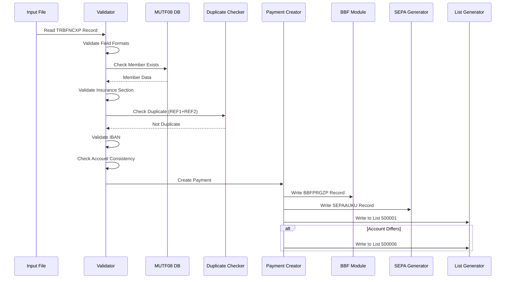
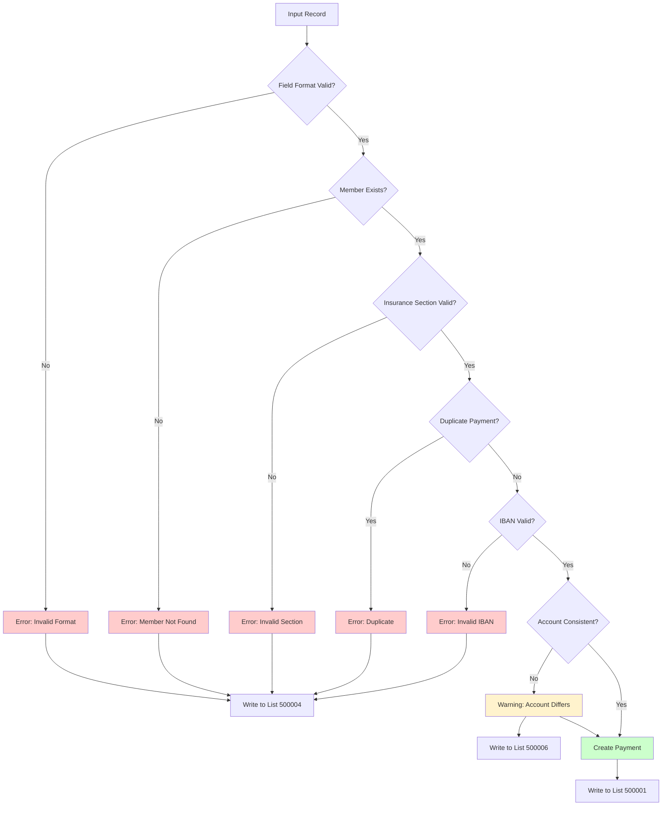
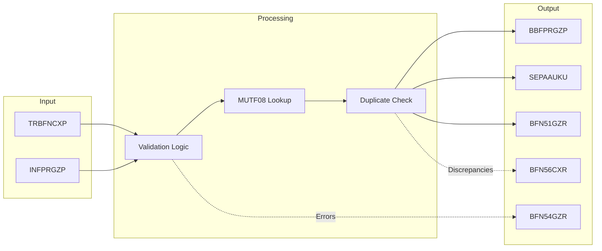

# MYFIN Functional Documentation

**Module**: MYFIN  
**Last Updated**: 2026-01-29

## Purpose

Technical documentation for developers, analysts, and architects implementing, maintaining, or modernizing the MYFIN manual payment processing system. This documentation describes the functional requirements, technical flows, data structures, and integration points.

## Functional Requirements

### Overview

The MYFIN system has 5 core functional requirement areas covering input validation, duplicate detection, bank account validation, payment list generation, and payment record creation.

### By Priority

#### High Priority (Critical for Payment Processing)

| ID | Title | Status | Related UC | Complexity |
|----|-------|--------|------------|------------|
| [FUREQ_MYFIN_001](requirements/FUREQ_MYFIN_001_input_validation.md) | Input Validation | Approved | UC_MYFIN_002 | High |
| [FUREQ_MYFIN_005](requirements/FUREQ_MYFIN_005_payment_record_creation.md) | Payment Record Creation | Approved | UC_MYFIN_001 | High |

#### Medium Priority (Business Rule Enforcement)

| ID | Title | Status | Related UC | Complexity |
|----|-------|--------|------------|------------|
| [FUREQ_MYFIN_002](requirements/FUREQ_MYFIN_002_duplicate_detection.md) | Duplicate Detection | Approved | UC_MYFIN_002 | Medium |
| [FUREQ_MYFIN_003](requirements/FUREQ_MYFIN_003_bank_account_validation.md) | Bank Account Validation | Approved | UC_MYFIN_002 | Medium |
| [FUREQ_MYFIN_004](requirements/FUREQ_MYFIN_004_payment_list_generation.md) | Payment List Generation | Approved | UC_MYFIN_003 | Medium |

### By Functional Area

#### Input Processing & Validation

**[FUREQ_MYFIN_001 - Input Validation](requirements/FUREQ_MYFIN_001_input_validation.md)**

Comprehensive validation of input payment records including:
- Field format validation (numeric fields, dates, codes)
- Member existence validation (MUTF08 database lookup)
- Insurance section validation
- Required field validation
- Payment type validation
- Accounting type validation (1-6 for regional support)

**Key Validations**:
- Member number must exist in MUTF08
- Payment amount must be positive
- Payment type must be valid (10, 11, etc.)
- Accounting type must be 1-6
- Bank account number format validation
- Date field validation

**Error Handling**: Bilingual error messages (FR/NL/DE), rejection to list 500004

---

#### Duplicate Prevention

**[FUREQ_MYFIN_002 - Duplicate Detection](requirements/FUREQ_MYFIN_002_duplicate_detection.md)**

Prevent duplicate payments through reference tracking:
- Check payment reference (TRBFNCXP-REF1 + REF2)
- Compare against previously processed payments
- Detect duplicates within same batch
- Detect duplicates across batches (if tracking enabled)

**Duplicate Criteria**:
- Same payment reference (REF1 + REF2)
- Same member number
- Same mutuality code
- Within configurable time window

**Error Handling**: Duplicate payments rejected to list 500004 with specific error code

---

#### Bank Account Validation

**[FUREQ_MYFIN_003 - Bank Account Validation](requirements/FUREQ_MYFIN_003_bank_account_validation.md)**

IBAN and SEPA compliance validation:
- IBAN format validation (length, check digits)
- SEPA payment eligibility validation
- Bank account consistency check (input vs. member database)
- BIC code validation (optional)
- Country code validation

**Validation Rules**:
- IBAN format must comply with ISO 13616
- Check digit validation algorithm
- Belgian IBAN: BE + 2 check digits + 12 account digits
- Account number in input must match MUTF08 database (or flagged as discrepancy)

**Special Handling**:
- Account discrepancies generate list 500006 (BFN56CXR)
- Regional payments (types 3-6) forced to Belfius bank
- IBAN10 modification tracking for SEPA compliance

---

#### Payment Record Creation

**[FUREQ_MYFIN_005 - Payment Record Creation](requirements/FUREQ_MYFIN_005_payment_record_creation.md)**

Create BBF payment module records and SEPA instructions:
- Create BBFPRGZP payment records
- Create SEPAAUKU SEPA instruction records
- Map input data to output structures
- Apply accounting type routing (1-6)
- Set payment method codes
- Generate sequential payment numbers

**Output Records**:
- **BBFPRGZP**: Payment module record with member, amount, bank details
- **SEPAAUKU**: SEPA XML instruction with IBAN, BIC, remittance info

**Regional Routing**:
- Type 1 (General): Standard bank account code
- Type 2 (AL): Alternative bank account code
- Types 3-6 (Regional): Federation-specific codes (166-169), forced to Belfius

---

#### Payment List Generation

**[FUREQ_MYFIN_004 - Payment List Generation](requirements/FUREQ_MYFIN_004_payment_list_generation.md)**

Generate audit and reporting lists:

**List 500001 (and regional variants)**: Payment Detail List
- All successfully processed payments
- Includes member info, amount, bank details, payment reference
- Variants: 500071, 500091, 500061, 500081 for regional accounting

**List 500004 (and regional variants)**: Rejection/Error List
- All rejected payments with error codes and descriptions
- Bilingual error messages (FR/NL or NL/FR based on member language)
- Variants: 500074, 500094, 500064, 500084 for regional accounting

**List 500006 (and regional variants)**: Bank Account Discrepancy List
- Payments where input bank account differs from MUTF08 database
- Shows both accounts for reconciliation
- Variants: 500076, 500096, 500066, 500086 for regional accounting

**CSV Export (5DET01)**:
- Modern CSV format for integration
- JIRA-4224: CSV output instead of Papyrus format

---

## Functional Flows

### Main Processing Flow

**[FF_MYFIN_main_processing](flows/FF_MYFIN_main_processing.md)**

Technical sequence for processing payment records:

**Key Steps**:
1. Read input record (TRBFNCXP or INFPRGZP)
2. Validate field formats
3. Lookup member in MUTF08
4. Check for duplicates
5. Validate IBAN
6. Check account consistency
7. Create payment records (BBFPRGZP, SEPAAUKU)
8. Generate output lists

**Complexity**: Medium-High (multiple database interactions, validation rules)

---

### Error Handling Flow

**[FF_MYFIN_error_handling](flows/FF_MYFIN_error_handling.md)**

Comprehensive error handling and validation:

**Error Categories**:
- **Critical**: Payment rejected, written to list 500004
- **Warning**: Payment processed, flagged on list 500006
- **Info**: Payment processed normally, on list 500001

**Error Message Requirements**:
- Bilingual (FR/NL or NL/FR based on member language preference)
- German support where applicable
- Clear error codes and descriptions
- Traceable to source record

---

## Data Structures

### Overview Document

**[data-structures.md](integration/data-structures.md)** - Comprehensive overview of all data structures with transformation mappings

### Input Structures

| Structure | Purpose | Document | Fields |
|-----------|---------|----------|--------|
| **TRBFNCXP** | Primary input record | [DS_TRBFNCXP](integration/DS_TRBFNCXP.md) | 50+ fields including member number, payment details, bank account, references |
| **INFPRGZP** | Alternative input format | [DS_INFPRGZP](integration/DS_INFPRGZP.md) | Similar to TRBFNCXP with different layout |

### Processing Structures

| Structure | Purpose | Document | Fields |
|-----------|---------|----------|--------|
| **BBFPRGZP** | BBF payment module record | [DS_BBFPRGZP](integration/DS_BBFPRGZP.md) | Payment record for BBF system with member, amount, bank details |
| **SEPAAUKU** | SEPA instruction record | [DS_SEPAAUKU](integration/DS_SEPAAUKU.md) | SEPA XML generation data with IBAN, BIC, remittance |
| **Working Storage** | Internal processing variables | [DS_working_storage](integration/DS_working_storage.md) | Counters, flags, temporary fields |

### Output Structures

| Structure | Purpose | Document | List Numbers |
|-----------|---------|----------|--------------|
| **BFN51GZR** | Payment detail list | [DS_BFN51GZR](integration/DS_BFN51GZR.md) | 500001, 500071, 500091, 500061, 500081 |
| **BFN54GZR** | Rejection/error list | [DS_BFN54GZR](integration/DS_BFN54GZR.md) | 500004, 500074, 500094, 500064, 500084 |
| **BFN56CXR** | Account discrepancy list | [DS_BFN56CXR](integration/DS_BFN56CXR.md) | 500006, 500076, 500096, 500066, 500086 |

### Data Transformation Map

**Key Mappings**:
- TRBFNCXP.MEMBER-NUMBER → BBFPRGZP.MEMBER-NUMBER
- TRBFNCXP.AMOUNT → BBFPRGZP.PAYMENT-AMOUNT
- TRBFNCXP.BANK-ACCOUNT → SEPAAUKU.IBAN
- TRBFNCXP.REFERENCE1/2 → BBFPRGZP.PAYMENT-REFERENCE

---

## Integration Specifications

### Input Integration

**[INT_input_records](integration/INT_input_records.md)** - Input record specifications

**Source**: GIRBET interface files  
**Formats**: TRBFNCXP (primary), INFPRGZP (alternative)  
**Volume**: Variable, manual payment entry driven  
**Frequency**: Daily batch processing

**Record Layout**: Fixed-width COBOL copybook format  
**Encoding**: EBCDIC (mainframe)  
**Validation**: Comprehensive field-level validation before processing

---

### Output Integration

**[INT_output_lists](integration/INT_output_lists.md)** - Output list specifications

**Targets**:
- BBF Payment Module (BBFPRGZP records)
- SEPA Payment System (SEPAAUKU records)
- Report Lists (BFN51GZR, BFN54GZR, BFN56CXR)
- CSV Export (5DET01)

**List Specifications**:

| List ID | Purpose | Format | Routing |
|---------|---------|--------|---------|
| 500001 | Payment Details | Fixed-width report | General accounting |
| 500004 | Rejections/Errors | Fixed-width report | General accounting |
| 500006 | Account Discrepancies | Fixed-width report | General accounting |
| 500071/74/76 | Regional 1 Lists | Fixed-width report | Federation 167 |
| 500091/94/96 | Regional 2 Lists | Fixed-width report | Federation 169 |
| 500061/64/66 | Regional 3 Lists | Fixed-width report | Federation 166 |
| 500081/84/86 | Regional 4 Lists | Fixed-width report | Federation 168 |
| 5DET01 | CSV Export | CSV | Modern integration |

---

## Testing Requirements

### Unit Testing

- Field validation logic for all input fields
- IBAN validation algorithm
- Duplicate detection logic
- Accounting type routing (1-6)
- Error message generation (bilingual)

### Integration Testing

- MUTF08 database integration
- BBF payment module record creation
- SEPA instruction generation
- List generation and formatting

### End-to-End Testing

- Complete payment processing flow
- Regional accounting scenarios (types 3-6)
- Error handling and rejection scenarios
- Bilingual output validation
- Account discrepancy detection

### Test Data Requirements

- Valid members in MUTF08
- Various payment types (10, 11, etc.)
- Valid and invalid IBANs
- Duplicate payment scenarios
- Account discrepancy scenarios
- All 6 accounting types

---

## Performance Characteristics

**Processing Volume**: Designed for batch processing of manual payments  
**Database Access**: MUTF08 member lookup per payment (optimize with caching if needed)  
**File I/O**: Sequential read of input, sequential write of output lists  
**Memory**: Working storage for record processing, duplicate tracking

**Expected Throughput**: Typical batch processing performance (thousands of records per run)  
**Critical Path**: MUTF08 database lookup is primary performance bottleneck

---

## Implementation Guidelines

### Development Setup

1. Access to COBOL development environment
2. DB2 access for MUTF08 database
3. Test data setup (sample members, payment records)
4. Copybook library access (copy/)

### Build Process

1. Compile COBOL program (MYFIN.cbl)
2. Include copybooks from copy/ directory
3. Link with DB2 libraries
4. Deploy to batch processing environment

### Deployment Considerations

- Coordinate with BBF payment module team
- Ensure SEPA generation system is ready
- Validate list routing for regional accounting
- Test bilingual output thoroughly
- Verify CSV export integration (JIRA-4224)

---

## Compliance & Standards

### Banking Standards
- **SEPA Compliance**: ISO 20022 SEPA Credit Transfer
- **IBAN Validation**: ISO 13616
- **BIC Codes**: ISO 9362

### Belgian Requirements
- **Multilingual Support**: FR/NL/DE (Bilingue handling)
- **6th State Reform**: Regional accounting separation (types 3-6)
- **Federations**: Support for codes 166-169

### Internal Standards
- BBF payment module compatibility
- GIRBET interface specifications
- List formatting standards
- Error code conventions

---

## Related Documentation

- [Business Documentation](../business/index.md) - Use cases and business processes
- [Main Documentation Index](../index.md) - Complete documentation overview
- [Requirements Traceability](../traceability/requirements-map.md) - Requirement relationships
- [Discovery Documents](../discovery/MYFIN/) - Original analysis artifacts

---

## Maintenance & Support

**Module**: MYFIN  
**System**: GIRBET  
**Language**: COBOL  
**Environment**: Batch Processing

**Key Modifications Tracked**:
- MTU01: Mutuality changes
- MIS01: Member information system updates
- IBAN10: SEPA/IBAN validation updates
- JGO001: 6th State Reform regional accounting
- CDU001: Additional 6th State Reform changes
- JIRA-4224: CSV output instead of Papyrus
- JIRA-4311: PAIFIN-Belfius adaptation

---

*This functional documentation was derived from systematic analysis of MYFIN COBOL source code, copybook structures, and business requirements. For questions or updates, refer to docs/planning/MYFIN-documentation-plan.md.*
