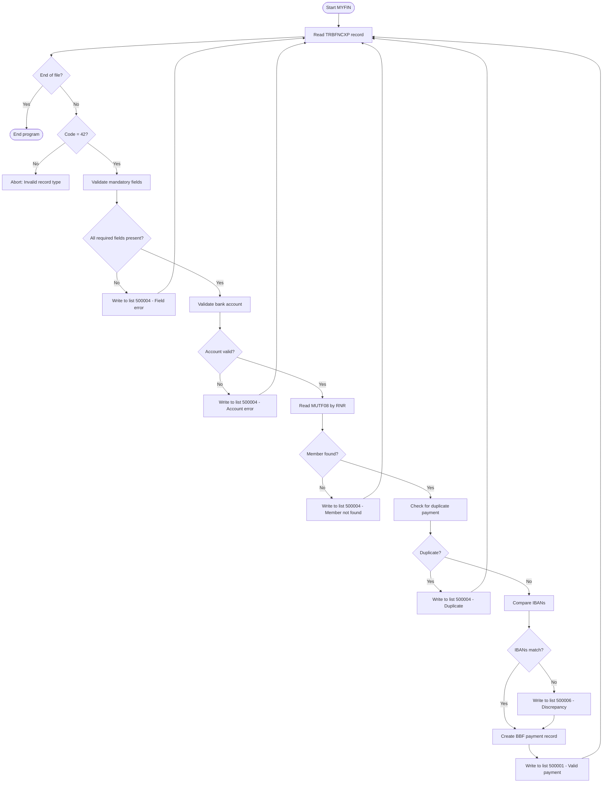

# Integration Specification: Input Records

**ID**: INT_MYFIN_INPUT  
**Type**: Input Interface Specification  
**Program**: MYFIN  
**Last Updated**: 2026-01-29

## Overview

This document specifies the input interface for the MYFIN batch program, which processes manual GIRBET payment records. The program receives payment requests created by the TRBFNCXB program (online GIRBET entry system) and validates them for payment processing.

### Interface Type

**Batch Sequential File Input**
- **Access Method**: Sequential read
- **Record Format**: Fixed-length (EBCDIC)
- **Processing Mode**: Single-pass sequential processing
- **Volume**: Variable (typically 100-1000 records per batch)

### Business Context

The input interface receives manual payment requests from mutuality administrators who:
- Enter payment information through the online GIRBET system (TRBFNCXB)
- Specify member identification, payment amount, bank account details
- Include payment descriptions and classification codes
- Request payments for various reasons (refunds, corrections, benefits)

## Input File Specification

### JCL DD Statement

```jcl
//INPUT    DD DSN=BTM.GIRBET.PAYMENT.INPUT,DISP=SHR
```

### File Characteristics

| Attribute | Value | Notes |
|-----------|-------|-------|
| **Organization** | Sequential | PS (Physical Sequential) |
| **Record Format** | Fixed Block (FB) | EBCDIC encoding |
| **Logical Record Length** | Variable | 140, 152, 174, or 186 bytes (depends on variant) |
| **Block Size** | TBD | Typically 27,920 bytes (standard batch) |
| **Character Set** | EBCDIC | Mainframe native encoding |
| **End-of-File** | Standard EOF marker | No trailer record |

### Record Types

The input file contains a **single record type**: GIRBET payment records (code 42).

| Record Type | Record Code | Structure | Frequency |
|-------------|-------------|-----------|-----------|
| GIRBET Payment | 42 | TRBFNCXP | 100% of records |

**Note**: Although INFPRGZP copybook exists in the workspace, it is **NOT** used by MYFIN. The sole input structure is TRBFNCXP.

## Primary Input Structure: TRBFNCXP

### Record Identification

**Copybook**: [copy/trbfncxp.cpy](../../../copy/trbfncxp.cpy)  
**Record Code**: 42 (constant)  
**Record Name**: "GIRBET"  
**Detailed Documentation**: [DS_TRBFNCXP.md](DS_TRBFNCXP.md)

### Record Layout Overview

```cobol
01  TRBFNCXP.
    *> Record Header (12 bytes)
    05  TRBFN-LENGTH        PIC S9(04) COMP.     *> Record length
    05  TRBFN-CODE          PIC S9(04) COMP.     *> = 42
    05  TRBFN-NUMBER        PIC 9(08).           *> Sequence number
    
    *> PPR Identification (17 bytes)
    05  TRBFN-PPR-NAME      PIC X(06).           *> "GIRBET"
    05  TRBFN-PPR-FED       PIC 9(03).           *> Mutuality code
    05  TRBFN-PPR-RNR       PIC S9(08) COMP.     *> National registry number
    
    *> Payment Data (46 bytes base)
    05  TRBFN-DEST          PIC 9(03).           *> Destination mutuality
    05  TRBFN-CONSTANTE     PIC 9(10).           *> Constant (session ID)
    05  TRBFN-NO-SUITE      PIC 9(04).           *> Sequence within session
    05  TRBFN-CODE-LIBEL    PIC 9(02).           *> Payment label code
    05  TRBFN-MONTANT       PIC 9(06).           *> Amount (integer)
    05  TRBFN-MONTANT-DV    PIC X(01).           *> Currency: E=Euro, B=BEF
    05  TRBFN-LIBEL         PIC X(20).           *> Payment description
    
    *> Bank Account Data (14 bytes legacy, +34 IBAN)
    05  TRBFN-REKNR         PIC X(14).           *> Legacy bank account
    05  TRBFN-IBAN          PIC X(34).           *> IBAN (SEPA modification)
    05  TRBFN-BETWYZ        PIC X(01).           *> Payment method
    
    *> Additional fields (varies by record variant)
    05  TRBFN-TAGREG-OP     PIC 9(02).           *> Regional tag
    [... additional fields per variant ...]
```

### Input Validation Rules

The MYFIN program performs the following validations on input records:

#### 1. Record Structure Validation

**Program Section**: [cbl/MYFIN.cbl#L1100-L1150](../../../cbl/MYFIN.cbl#L1100-L1150) (GIRBETPP entry point)

| Field | Validation Rule | Error Action |
|-------|----------------|--------------|
| TRBFN-CODE | Must equal 42 | Program termination (invalid record type) |
| TRBFN-LENGTH | Must match expected length (140/152/174/186) | Record skip or error |
| TRBFN-PPR-NAME | Expected "GIRBET" | Informational (not enforced) |

#### 2. Mandatory Field Validation

**Program Section**: [cbl/MYFIN.cbl](../../../cbl/MYFIN.cbl) - CONTROLE-BASE paragraph

| Field | Validation | Error Code | Error Message (NL) | Error Message (FR) |
|-------|-----------|------------|-------------------|-------------------|
| TRBFN-PPR-RNR | Must be > 0 | VAL001 | "Rijksnummer ontbreekt" | "Numéro national manquant" |
| TRBFN-DEST | Must be 101-169 | VAL002 | "Bestemming ongeldig" | "Destination invalide" |
| TRBFN-MONTANT | Must be > 0 | VAL003 | "Bedrag ontbreekt" | "Montant manquant" |
| TRBFN-CODE-LIBEL | Must exist in TBLIBCXW table | VAL004 | "Code libellé ongeldig" | "Code libellé invalide" |

#### 3. Bank Account Validation

**Program Section**: [cbl/MYFIN.cbl](../../../cbl/MYFIN.cbl) - CONTROLE-COMPTE paragraph  
**Related Copybook**: [copy/sepaauku.cpy](../../../copy/sepaauku.cpy) (SEPA validation module)

**IBAN Validation** (if TRBFN-IBAN provided):
- IBAN format check (country code, check digits, length)
- IBAN checksum validation
- BIC code extraction from IBAN
- Belgian IBAN verification (starts with "BE")

**Legacy Account Validation** (if TRBFN-REKNR provided):
- Account number format check (NNN-NNNNNNN-NN)
- Modulo 97 check digit validation
- Bank code extraction (first 3 digits)

**Error Handling**:
- Invalid IBAN → Reject to list 500004 with diagnostic message
- Invalid legacy account → Reject to list 500004
- Missing both IBAN and legacy account → Reject with "No account number" message

#### 4. Member Database Validation

**Program Section**: [cbl/MYFIN.cbl](../../../cbl/MYFIN.cbl) - LIRE-MUTF08 paragraph  
**Database**: MUTF08 (Member master file)  
**Key**: TRBFN-PPR-RNR (National registry number)

**Validation Steps**:
1. Convert binary RNR to decimal format
2. READ MUTF08 with key = formatted RNR
3. Check for record-not-found condition
4. Verify at least one insurance section exists (OT, OP, AT, AP)

**Error Conditions**:
- Member not found → Reject to list 500004 ("Lid niet gekend"/"Membre inconnu")
- No active sections → Reject to list 500004
- File I/O error → Abort with file status code

#### 5. Duplicate Detection

**Program Section**: [cbl/MYFIN.cbl](../../../cbl/MYFIN.cbl) - CONTROLE-DOUBLON paragraph  
**Database**: BBF payment records  
**Search Key**: TRBFN-CONSTANTE + TRBFN-MONTANT

**Logic**:
```cobol
READ BBF-FILE WITH KEY = (TRBFN-CONSTANTE, TRBFN-MONTANT)
IF RECORD-FOUND
    Move bilingual message to diagnostic:
        "dubbel / double"
    Write to rejection list 500004
    Skip record
END-IF
```

**Rejection Message**:
- NL: "Betaling reeds uitgevoerd - dubbel"
- FR: "Paiement déjà effectué - double"

#### 6. IBAN Discrepancy Detection

**Program Section**: [cbl/MYFIN.cbl](../../../cbl/MYFIN.cbl) - CONTROLE-IBAN-DISCORDANCE paragraph  
**Purpose**: Compare input IBAN vs. member database IBAN

**Logic**:
1. Retrieve member's IBAN from MUTF08 (field ADM-IBAN)
2. Compare with input TRBFN-IBAN
3. If different AND both non-blank:
   - Continue processing with input IBAN (accept payment)
   - Create informational record in list 500006 (discrepancy report)

**Output**: List 500006 (BFN56CXR) - see [INT_output_lists.md](INT_output_lists.md#list-500006-iban-discrepancy-report)

## Data Flow Diagram



## Input Processing Logic

### Program Entry Point: GIRBETPP

**Code Reference**: [cbl/MYFIN.cbl#L1100-L1150](../../../cbl/MYFIN.cbl#L1100-L1150)

```cobol
GIRBETPP.
    *> Entry point called by BTM framework
    MOVE TRBFNCXP TO WS-INPUT-RECORD.
    PERFORM TRAITEMENT-RECORD.
    GOBACK.

TRAITEMENT-RECORD.
    *> Main processing paragraph
    PERFORM CONTROLE-BASE.
    IF NO-ERROR
        PERFORM CONTROLE-COMPTE
    END-IF.
    IF NO-ERROR
        PERFORM LIRE-MUTF08
    END-IF.
    IF NO-ERROR
        PERFORM CONTROLE-DOUBLON
    END-IF.
    IF NO-ERROR
        PERFORM CONTROLE-IBAN-DISCORDANCE
        PERFORM CREER-BBF-RECORD
        PERFORM CREER-REMOTE-500001
    ELSE
        PERFORM CREER-REMOTE-500004
    END-IF.
```

### Field Transformations

#### National Registry Number (RNR)

**Input Format**: Binary PIC S9(08) COMP (4 bytes)
```cobol
05  TRBFN-PPR-RNR       PIC S9(08) COMP.
```

**Transformation**:
```cobol
COMPUTE WS-RNR-NUMERIC = TRBFN-PPR-RNR.
MOVE WS-RNR-NUMERIC TO WS-RIJKSNUMMER.
*> Format: YYMMDD-NNN-CC (13 characters with dashes)
*> Or:     YYMMDDNNNCC (11 characters without dashes)
```

**Output Format**: Alphanumeric PIC X(13)
```cobol
05  WS-RIJKSNUMMER      PIC X(13).
*> Example: "950315-123-45" or "95031512345"
```

#### Currency and Amount

**Input Fields**:
```cobol
05  TRBFN-MONTANT       PIC 9(06).     *> Amount (e.g., 123456 = 1234.56 EUR)
05  TRBFN-MONTANT-DV    PIC X(01).     *> 'E' = Euro, 'B' = BEF
```

**Processing**:
- Euro amounts: Divide by 100 for decimal representation (123456 → 1234.56)
- BEF amounts: Use as-is (no decimal places)
- Maximum amount: 999,999 (input field limit)

**Output to Lists**:
```cobol
05  BBF-N51-BEDRAG      PIC 9(06).     *> Amount (same format)
05  BBF-N51-DV          PIC X(01).     *> Currency code
05  BBF-N51-DN          PIC 9(01).     *> Decimal places: 0=BEF, 2=Euro
```

#### Bank Account

**Input Fields** (both optional, at least one required):
```cobol
05  TRBFN-REKNR         PIC X(14).     *> Legacy format: 012-3456789-12
05  TRBFN-IBAN          PIC X(34).     *> SEPA format: BE68539007547034
```

**IBAN Validation** (SEPAAUKU copybook):
```cobol
CALL 'SEPAVALID' USING TRBFN-IBAN, WS-IBAN-RESULT.
IF WS-IBAN-RESULT = 'OK'
    MOVE TRBFN-IBAN TO BBF-N51-IBAN
    PERFORM EXTRACT-BIC FROM IBAN
ELSE
    MOVE ERROR-MSG TO DIAG-MESSAGE
    PERFORM CREER-REMOTE-500004
END-IF.
```

**Legacy Account Validation**:
```cobol
*> Extract parts: XXX-YYYYYYY-ZZ
MOVE TRBFN-REKNR(1:3)   TO BANK-CODE.
MOVE TRBFN-REKNR(5:7)   TO ACCOUNT-BASE.
MOVE TRBFN-REKNR(13:2)  TO CHECK-DIGIT.

*> Verify modulo 97
COMPUTE CHECK-CALC = FUNCTION MOD((BANK-CODE * 10000000 + ACCOUNT-BASE), 97).
IF CHECK-CALC NOT = CHECK-DIGIT
    MOVE 'Rekeningnummer ongeldig' TO DIAG-MESSAGE
    PERFORM CREER-REMOTE-500004
END-IF.
```

#### Mutuality Code (Language Selection)

**Input**: TRBFN-DEST (PIC 9(03))

**Language Determination**:
```cobol
01  TEST-MUTUALITE PIC 9(3).
    88 MUT-FR        VALUE 109, 116, 127-136, 167-168.
    88 MUT-NL        VALUE 101, 102, 104, 105, 108, 110-115,
                           117-126, 131.
    88 MUT-BILINGUE  VALUE 106, 107, 150, 166.
    88 VERVIERS      VALUE 137.

MOVE TRBFN-DEST TO TEST-MUTUALITE.
IF MUT-FR
    MOVE 'F' TO WS-LANGUAGE
ELSE IF MUT-NL
    MOVE 'N' TO WS-LANGUAGE
ELSE IF MUT-BILINGUE
    *> Use member's language from MUTF08
    MOVE ADM-TAAL TO WS-LANGUAGE
ELSE
    MOVE 'N' TO WS-LANGUAGE  *> Default Dutch
END-IF.
```

## Error Handling

### Input Record Errors

**Category 1: Fatal Errors (Program Termination)**
- File open failure (file status != '00')
- Invalid record code (not 42)
- Unexpected record length
- File I/O errors (read failure)

**Action**: ABEND with file status code or error dump

**Category 2: Validation Errors (Record Rejection)**
- Missing mandatory fields
- Invalid bank account format
- Member not found in MUTF08
- Duplicate payment detected
- Invalid label code

**Action**: Write to rejection list 500004 with diagnostic message

**Category 3: Informational (Processing Continues)**
- IBAN discrepancy (input vs. database)

**Action**: Write to discrepancy list 500006, continue with input IBAN

### Error Messages

All rejection messages are **bilingual** (Dutch/French):

| Error Condition | Dutch Message | French Message |
|----------------|---------------|----------------|
| Missing RNR | "Rijksnummer ontbreekt" | "Numéro national manquant" |
| Member not found | "Lid niet gekend in MUTF08" | "Membre inconnu dans MUTF08" |
| Duplicate payment | "Betaling reeds uitgevoerd - dubbel" | "Paiement déjà effectué - double" |
| Invalid IBAN | "IBAN ongeldig" | "IBAN invalide" |
| Invalid account | "Rekeningnummer ongeldig (modulo 97)" | "Numéro de compte invalide (modulo 97)" |
| No account number | "Geen rekeningnummer" | "Pas de numéro de compte" |
| Invalid amount | "Bedrag ontbreekt of ongeldig" | "Montant manquant ou invalide" |

**Message Construction**:
```cobol
IF MUT-FR
    STRING 'Membre inconnu dans MUTF08' DELIMITED BY SIZE
        INTO BBF-N54-DIAG
ELSE
    STRING 'Lid niet gekend in MUTF08' DELIMITED BY SIZE
        INTO BBF-N54-DIAG
END-IF.
```

## Performance Considerations

### File Access Patterns

**Sequential Input Processing**:
- Single-pass sequential read (no repositioning)
- Read-ahead buffering (system-managed)
- Block size optimized for tape/disk performance

**Database Access** (MUTF08):
- Random access by key (RNR)
- Index-based retrieval
- One read per input record (no caching)

### Processing Metrics

| Metric | Target | Notes |
|--------|--------|-------|
| **Records/second** | 50-100 | Depends on database access time |
| **CPU time** | < 5 seconds per 1000 records | Typical batch performance |
| **Elapsed time** | < 2 minutes per 1000 records | Including I/O wait |
| **Memory** | < 10 MB | Working storage only |

### Volume Handling

**Typical Volumes**:
- Small batch: 100-500 records
- Medium batch: 500-2000 records
- Large batch: 2000-5000 records
- Maximum: No hard limit (system resources)

**Scaling Considerations**:
- Database response time impacts throughput
- MUTF08 index performance critical
- No in-memory caching (each record reads database)
- Commit frequency: Per record (no batch commits)

## Security and Authorization

### File Access Control

**RACF/ACF2 Requirements**:
- READ access to input file (BTM.GIRBET.PAYMENT.INPUT)
- READ access to MUTF08 database
- UPDATE access to BBF payment file
- WRITE access to output lists (500001, 500004, 500006)

**Program Authorization**:
- Must run under authorized library
- Requires database connection credentials
- CICS/Batch region authorization

### Data Protection

**Sensitive Fields** (PII - Personal Identifiable Information):
- National registry number (TRBFN-PPR-RNR)
- Member name (from MUTF08)
- Bank account numbers (TRBFN-REKNR, TRBFN-IBAN)

**Protection Measures**:
- No logging of sensitive data to SYSOUT
- Output lists protected by RACF
- No clear-text display in dumps
- Audit trail in BBF payment records

## Monitoring and Logging

### Log Events

**SYSOUT Messages**:
```cobol
DISPLAY 'MYFIN: Processing started - ' WS-CURRENT-DATE.
DISPLAY 'MYFIN: Records read: ' WS-READ-COUNT.
DISPLAY 'MYFIN: Valid payments: ' WS-VALID-COUNT.
DISPLAY 'MYFIN: Rejections: ' WS-REJECT-COUNT.
DISPLAY 'MYFIN: IBAN discrepancies: ' WS-DISCREP-COUNT.
DISPLAY 'MYFIN: Processing complete.'.
```

### Statistics Tracking

**Record Counts**:
- Total input records read
- Valid payments created (list 500001)
- Rejected payments (list 500004)
- IBAN discrepancies (list 500006)

**Error Counts by Type**:
- Member not found
- Duplicate payments
- Invalid bank accounts
- Validation failures

## Related Documentation

- **Data Structure**: [DS_TRBFNCXP.md](DS_TRBFNCXP.md) - Detailed field documentation
- **Output Interface**: [INT_output_lists.md](INT_output_lists.md) - Output lists specification
- **Business Use Case**: [UC_MYFIN_001_process_manual_payment.md](../../business/use-cases/UC_MYFIN_001_process_manual_payment.md)
- **Functional Requirements**:
  - [FUREQ_MYFIN_001_input_validation.md](../requirements/FUREQ_MYFIN_001_input_validation.md)
  - [FUREQ_MYFIN_002_duplicate_detection.md](../requirements/FUREQ_MYFIN_002_duplicate_detection.md)
  - [FUREQ_MYFIN_003_bank_account_validation.md](../requirements/FUREQ_MYFIN_003_bank_account_validation.md)
- **Technical Flows**:
  - [FF_MYFIN_main_processing.md](../flows/FF_MYFIN_main_processing.md)
  - [FF_MYFIN_error_handling.md](../flows/FF_MYFIN_error_handling.md)
