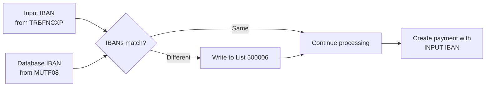

# Integration Specification: Output Lists

**ID**: INT_MYFIN_OUTPUT  
**Type**: Output Interface Specification  
**Program**: MYFIN  
**Last Updated**: 2026-01-29

## Overview

This document specifies the output interface for the MYFIN batch program, which generates three remote printing lists for payment processing and reporting. The program creates separate lists for valid payments (500001), rejected payments (500004), and IBAN discrepancies (500006).

### Interface Type

**Remote Printing Lists (Batch Sequential Output)**
- **Access Method**: Sequential write
- **Record Format**: Fixed-length (EBCDIC)
- **Processing Mode**: Create new lists per batch run
- **Distribution**: Remote printing to mutuality locations

### Business Context

The output interface provides:
1. **Payment Instructions** (List 500001) - Valid payments ready for bank processing
2. **Rejection Report** (List 500004) - Failed payments requiring correction
3. **Discrepancy Report** (List 500006) - IBAN mismatches for review

These lists enable:
- **Bank payment processing**: List 500001 feeds into SEPA payment systems
- **Error correction**: Administrators review and fix rejected payments
- **Data quality**: IBAN discrepancies trigger member data updates

## Output Files Specification

### JCL DD Statements

```jcl
//LIST01   DD DSN=BTM.REMOTE.500001,DISP=(NEW,CATLG,DELETE),
//            DCB=(RECFM=FB,LRECL=219,BLKSIZE=27920)
//LIST04   DD DSN=BTM.REMOTE.500004,DISP=(NEW,CATLG,DELETE),
//            DCB=(RECFM=FB,LRECL=193,BLKSIZE=27895)
//LIST06   DD DSN=BTM.REMOTE.500006,DISP=(NEW,CATLG,DELETE),
//            DCB=(RECFM=FB,LRECL=TBD,BLKSIZE=TBD)
```

### File Characteristics Summary

| List | Purpose | Record Structure | LRECL | Destination |
|------|---------|-----------------|-------|-------------|
| 500001 | Valid payments | BFN51GZR | 219 bytes | Target mutuality (109-169) |
| 500004 | Rejected payments | BFN54GZR | 193 bytes | Brussels (106) centralized |
| 500006 | IBAN discrepancies | BFN56CXR | TBD | Brussels (106) or target mutuality |

## List 500001: Valid Payment Instructions

### Overview

**List Name**: 500001 (GBBF1/GR5001)  
**Copybook**: [copy/bfn51gzr.cpy](../../../copy/bfn51gzr.cpy)  
**Detailed Documentation**: [DS_BFN51GZR.md](DS_BFN51GZR.md)  
**Program Section**: [cbl/MYFIN.cbl#L820-L915](../../../cbl/MYFIN.cbl#L820-L915) (CREER-REMOTE-500001)

### Purpose

Contains all successfully validated manual GIRBET payments ready for bank processing. Each record represents a payment instruction that:
- Passed all validation checks (mandatory fields, bank account, member existence)
- No duplicate detected
- Contains complete IBAN or legacy bank account information
- Ready for SEPA payment file generation

### Record Layout Summary

```cobol
01  BFN51GZR.
    *> Metadata (not in length - 16 bytes)
    05  BBF-N51-LENGTH      PIC S9(04) COMP.    *> Record length
    05  BBF-N51-CODE        PIC S9(04) COMP.    *> = 40
    05  BBF-N51-NUMBER      PIC 9(08).          *> Sequential number
    
    *> Remote Printing Header (12 bytes)
    05  BBF-N51-DEVICE-OUT  PIC X(01).          *> 'L' or 'C'
    05  BBF-N51-DESTINATION PIC 9(03).          *> Target mutuality
    05  BBF-N51-SWITCHING   PIC X(01).          *> SPACE
    05  BBF-N51-PRIORITY    PIC X(01).          *> 'Z'
    05  BBF-N51-NAME        PIC X(06).          *> "500001"
    
    *> Record Key (80 bytes)
    05  BBF-N51-KEY.
        10  BBF-N51-VERB    PIC 9(03).          *> Mutuality code
        10  BBF-N51-AFK     PIC 9(01).          *> Account type
        10  BBF-N51-KONST   PIC 9(10).          *> Constant
        10  BBF-N51-VOLGNR  PIC 9(04).          *> Sequence
        10  BBF-N51-INFOREK PIC 9(01).          *> Inforek flag
        10  FILLER          PIC X(61).          *> Reserved
    
    *> Payment Data (111 bytes)
    05  BBF-N51-DATA.
        10  BBF-N51-RNR     PIC X(13).          *> National registry number
        10  BBF-N51-NAAM    PIC X(18).          *> Last name
        10  BBF-N51-VOORN   PIC X(12).          *> First name
        10  BBF-N51-LIBEL   PIC 9(02).          *> Payment label
        10  BBF-N51-REKNR   PIC X(14).          *> Legacy account
        10  BBF-N51-BEDRAG  PIC 9(06).          *> Amount
        10  BBF-N51-BANK    PIC 9(01).          *> Bank code
        10  BBF-N51-DV      PIC X(01).          *> Currency
        10  BBF-N51-DN      PIC 9(01).          *> Decimals
        10  BBF-N51-TYPE-COMPTE PIC X(04).      *> Account type
        10  BBF-N51-IBAN    PIC X(34).          *> IBAN
        10  BBF-N51-BETWY   PIC X(01).          *> Payment method
        10  BBF-N51-TAGREG-OP PIC 9(02).        *> Regional tag
```

**Total Record Length**: 219 bytes (16 metadata + 203 data)

### Generation Logic

**Program Code**: [cbl/MYFIN.cbl#L820-L915](../../../cbl/MYFIN.cbl#L820-L915)

```cobol
CREER-REMOTE-500001.
    *> Initialize record
    MOVE SPACES TO BFN51GZR.
    MOVE 40 TO BBF-N51-CODE.
    
    *> Remote header
    IF TRBFN-DEST = 153
        MOVE 'C' TO BBF-N51-DEVICE-OUT      *> Console for destination 153
    ELSE
        MOVE 'L' TO BBF-N51-DEVICE-OUT      *> List for others
    END-IF.
    MOVE TRBFN-DEST TO BBF-N51-DESTINATION.
    MOVE 'Z' TO BBF-N51-PRIORITY.
    MOVE '500001' TO BBF-N51-NAME.
    
    *> Record key
    MOVE TRBFN-DEST TO BBF-N51-VERB.
    MOVE WS-ACCOUNT-TYPE TO BBF-N51-AFK.    *> 1-7 (see table below)
    MOVE TRBFN-CONSTANTE TO BBF-N51-KONST.
    MOVE TRBFN-NO-SUITE TO BBF-N51-VOLGNR.
    
    *> Payment data from member database
    MOVE WS-RIJKSNUMMER TO BBF-N51-RNR.
    MOVE ADM-NAAM TO BBF-N51-NAAM.
    MOVE ADM-VOORN TO BBF-N51-VOORN.
    
    *> Payment data from input
    MOVE TRBFN-CODE-LIBEL TO BBF-N51-LIBEL.
    MOVE TRBFN-MONTANT TO BBF-N51-BEDRAG.
    MOVE TRBFN-MONTANT-DV TO BBF-N51-DV.
    IF BBF-N51-DV = 'E'
        MOVE 2 TO BBF-N51-DN                *> Euro: 2 decimals
    ELSE
        MOVE 0 TO BBF-N51-DN                *> BEF: 0 decimals
    END-IF.
    
    *> Bank account information
    MOVE TRBFN-REKNR TO BBF-N51-REKNR.
    MOVE TRBFN-IBAN TO BBF-N51-IBAN.
    MOVE TRBFN-BETWYZ TO BBF-N51-BETWY.
    
    *> Regional tagging (6th State Reform)
    MOVE TRBFN-TAGREG-OP TO BBF-N51-TAGREG-OP.
    
    *> Write to remote list
    CALL 'ADD-LOG' USING BFN51GZR.
```

### Account Type Values

The BBF-N51-AFK field indicates payment context:

| Value | Constant | Description | Usage |
|-------|----------|-------------|-------|
| 1 | LOKET | Counter/window payment | Physical location payment |
| 2 | PAIFIN-AO | PAIFIN old account | Legacy PAIFIN system |
| 3 | PAIFIN-AL | PAIFIN other account | Alternative account |
| 4 | FRANCHISE | Franchise payment | Franchise transactions |
| 5 | EATTEST | E-attestation | Electronic attestation (EATT modification) |
| 6 | CORREG | Correction | Correction entry (MSA001 modification JIRA-4837) |
| 7 | BULK-INPUT | Bulk input | Bulk processing (MSA002 modification) |

**MYFIN Usage**: Typically sets to 1 (LOKET) for manual GIRBET payments.

### Destination Routing

**Destination Logic**:
```cobol
*> Route to target mutuality from input
MOVE TRBFN-DEST TO BBF-N51-DESTINATION.
*> Valid range: 109-169 (mutuality codes)
```

**Special Handling**:
- Destination 153 → Console output (BBF-N51-DEVICE-OUT = 'C')
- All other destinations → List output (BBF-N51-DEVICE-OUT = 'L')

### CSV Output (JIRA-4224)

**Modification KVS001** (02/05/2023): List 500001 detail lines now output in CSV format instead of Papyrus format.

**Impact**: 
- Same record structure (BFN51GZR)
- Different post-processing formatter
- CSV fields: RNR, Name, First Name, Amount, IBAN, etc.
- Enables easier import into Excel/spreadsheets

### Validation Before Output

**Prerequisites** (all must pass):
- ✅ Member exists in MUTF08
- ✅ No duplicate payment detected
- ✅ Valid bank account (IBAN or legacy format)
- ✅ All mandatory fields present
- ✅ Amount > 0
- ✅ Valid mutuality destination code

**If any fails**: Record goes to List 500004 (rejections) instead.

## List 500004: Rejected Payment Report

### Overview

**List Name**: 500004 (GRBBFN54/G8GR5004)  
**Copybook**: [copy/bfn54gzr.cpy](../../../copy/bfn54gzr.cpy)  
**Detailed Documentation**: [DS_BFN54GZR.md](DS_BFN54GZR.md)  
**Program Section**: [cbl/MYFIN.cbl#L920-L978](../../../cbl/MYFIN.cbl#L920-L978) (CREER-REMOTE-500004)

### Purpose

Contains all rejected manual GIRBET payments that failed validation. Each record includes a **32-character diagnostic message** explaining the rejection reason. This list is critical for:
- Identifying data entry errors
- Detecting duplicate payments
- Tracking member database issues
- Audit trail for rejected transactions

### Record Layout Summary

```cobol
01  BFN54GZR.
    *> Metadata (not in length - 16 bytes)
    05  BBF-N54-LENGTH      PIC S9(04) COMP.    *> Record length
    05  BBF-N54-CODE        PIC S9(04) COMP.    *> = 40
    05  BBF-N54-NUMBER      PIC 9(08).          *> Sequential number
    
    *> Remote Printing Header (12 bytes)
    05  BBF-N54-DEVICE-OUT  PIC X(01).          *> 'L'
    05  BBF-N54-DESTINATION PIC 9(03).          *> 106 (Brussels)
    05  BBF-N54-SWITCHING   PIC X(01).          *> SPACE
    05  BBF-N54-PRIORITY    PIC X(01).          *> 'Z'
    05  BBF-N54-NAME        PIC X(06).          *> "500004"
    
    *> Record Key (80 bytes)
    05  BBF-N54-KEY.
        10  BBF-N54-VERB    PIC 9(03).          *> 106
        10  BBF-N54-KONSTA  PIC 9(10).          *> Constant
        10  BBF-N54-VOLGNR  PIC 9(04).          *> Sequence
        10  BBF-N54-TAAL    PIC 9(01).          *> Language
        10  BBF-N54-INF     PIC 9(01).          *> Inforek flag
        10  BBF-N54-INF-VOL PIC 9(02).          *> Inforek volume
        10  FILLER          PIC X(59).          *> Reserved
    
    *> Rejection Data (85 bytes)
    05  BBF-N54-DATA.
        10  BBF-N54-VBOND   PIC 9(02).          *> Federation (2 digits)
        10  BBF-N54-KONST.                      *> Constant breakdown
            15  BBF-N54-AFDEL       PIC 9(03).  *> Department
            15  BBF-N54-KASSIER     PIC 9(03).  *> Cashier
            15  BBF-N54-DATZIT-DM   PIC 9(04).  *> Date DDMM
        10  BBF-N54-BETWYZ  PIC X(01).          *> Payment method
        10  BBF-N54-RNR     PIC X(13).          *> National registry
        10  BBF-N54-BETKOD  PIC 9(02).          *> Payment code
        10  BBF-N54-BEDRAG  PIC 9(08).          *> Amount
        10  BBF-N54-REKNUM  PIC 9(12).          *> Account number
        10  BBF-N54-VOLGNR-M30 PIC 9(03).       *> M30 sequence
        10  BBF-N54-DIAG    PIC X(32).          *> **DIAGNOSTIC MESSAGE**
```

**Total Record Length**: 193 bytes (16 metadata + 177 data)

### Generation Logic

**Program Code**: [cbl/MYFIN.cbl#L920-L978](../../../cbl/MYFIN.cbl#L920-L978)

```cobol
CREER-REMOTE-500004.
    *> Initialize record
    MOVE SPACES TO BFN54GZR.
    MOVE 40 TO BBF-N54-CODE.
    
    *> Remote header - ALL go to Brussels (106)
    MOVE 'L' TO BBF-N54-DEVICE-OUT.
    MOVE 106 TO BBF-N54-DESTINATION.    *> Centralized to Brussels
    MOVE 'Z' TO BBF-N54-PRIORITY.       *> Low priority (rejection)
    MOVE '500004' TO BBF-N54-NAME.
    
    *> Record key
    MOVE 106 TO BBF-N54-VERB.           *> Brussels
    MOVE TRBFN-CONSTANTE TO BBF-N54-KONSTA.
    MOVE TRBFN-NO-SUITE TO BBF-N54-VOLGNR.
    MOVE WS-LANGUAGE TO BBF-N54-TAAL.   *> Member's language
    
    *> Payment data
    MOVE TRBFN-DEST TO BBF-N54-VBOND.   *> Original destination
    MOVE TRBFN-CONSTANTE(1:3) TO BBF-N54-AFDEL.
    MOVE TRBFN-CONSTANTE(4:3) TO BBF-N54-KASSIER.
    MOVE TRBFN-CONSTANTE(7:4) TO BBF-N54-DATZIT-DM.
    MOVE 'C' TO BBF-N54-BETWYZ.         *> Circular check for Brussels
    MOVE WS-RIJKSNUMMER TO BBF-N54-RNR.
    MOVE TRBFN-CODE-LIBEL TO BBF-N54-BETKOD.
    MOVE TRBFN-MONTANT TO BBF-N54-BEDRAG.
    MOVE TRBFN-REKNR TO BBF-N54-REKNUM.
    MOVE TRBFN-NO-SUITE TO BBF-N54-VOLGNR-M30.
    
    *> Diagnostic message (32 chars max)
    MOVE WS-ERROR-MESSAGE TO BBF-N54-DIAG.
    
    *> Write to remote list
    CALL 'ADD-LOG' USING BFN54GZR.
```

### Centralized Routing

**All rejections go to Brussels (Destination 106)**:
- Centralized error handling
- Single point of review
- Mutuality-wide oversight
- Consistent error processing

**Why Brussels?**:
- Bilingual capability (can handle FR/NL messages)
- Central IT support location
- Historical central processing location

### Diagnostic Messages

The BBF-N54-DIAG field (32 characters) contains **bilingual error messages**:

#### Common Rejection Messages

| Error Condition | Dutch Message | French Message | Code Reference |
|----------------|---------------|----------------|----------------|
| **Member not found** | "Lid niet gekend in MUTF08" | "Membre inconnu dans MUTF08" | LIRE-MUTF08 |
| **Duplicate payment** | "Betaling reeds uitgevoerd - dubbel" | "Paiement déjà effectué - double" | CONTROLE-DOUBLON |
| **Invalid IBAN** | "IBAN ongeldig" | "IBAN invalide" | CONTROLE-COMPTE |
| **Invalid account** | "Rekeningnummer ongeldig (mod97)" | "Numéro compte invalide (mod97)" | CONTROLE-COMPTE |
| **No account** | "Geen rekeningnummer" | "Pas de numéro de compte" | CONTROLE-COMPTE |
| **Missing RNR** | "Rijksnummer ontbreekt" | "Numéro national manquant" | CONTROLE-BASE |
| **Invalid amount** | "Bedrag ontbreekt of ongeldig" | "Montant manquant ou invalide" | CONTROLE-BASE |
| **Invalid destination** | "Bestemming ongeldig" | "Destination invalide" | CONTROLE-BASE |
| **Invalid label code** | "Code libellé ongeldig" | "Code libellé invalide" | CONTROLE-BASE |

#### Message Construction Logic

```cobol
*> Select message based on member's language
IF MUT-FR OR (MUT-BILINGUE AND ADM-TAAL = 'F')
    MOVE 'Membre inconnu dans MUTF08' TO WS-ERROR-MESSAGE
ELSE
    MOVE 'Lid niet gekend in MUTF08' TO WS-ERROR-MESSAGE
END-IF.

*> Bilingual messages (both languages in one string)
STRING 'dubbel / double' DELIMITED BY SIZE
    INTO WS-ERROR-MESSAGE.
```

**Message Length**: Maximum 32 characters (truncated if longer)

### Rejection Statistics

**Typical Rejection Rates**:
- Member not found: 5-10%
- Duplicate payments: 2-5%
- Invalid bank accounts: 3-7%
- Validation errors: 1-3%

**Target**: < 10% total rejection rate (90%+ success)

## List 500006: IBAN Discrepancy Report

### Overview

**List Name**: 500006  
**Copybook**: [copy/bfn56cxr.cpy](../../../copy/bfn56cxr.cpy)  
**Detailed Documentation**: [DS_BFN56CXR.md](DS_BFN56CXR.md)  
**Program Section**: [cbl/MYFIN.cbl](../../../cbl/MYFIN.cbl) (CREER-REMOTE-500006)

### Purpose

Reports discrepancies between:
- **Input IBAN** (from TRBFNCXP - manually entered)
- **Database IBAN** (from MUTF08 - member's registered IBAN)

**Business Value**:
- Identifies potential data entry errors
- Triggers member data updates
- Helps maintain IBAN data quality
- **Does NOT reject payment** - informational only

### Generation Logic

**Trigger Condition**:
```cobol
CONTROLE-IBAN-DISCORDANCE.
    *> Get member's IBAN from database
    MOVE ADM-IBAN TO WS-DB-IBAN.
    
    *> Compare with input IBAN
    IF TRBFN-IBAN NOT = SPACES
       AND WS-DB-IBAN NOT = SPACES
       AND TRBFN-IBAN NOT = WS-DB-IBAN
        *> Discrepancy found!
        PERFORM CREER-REMOTE-500006
    END-IF.
```

**Key Point**: Payment continues processing with **input IBAN** (TRBFN-IBAN), not database IBAN.

### Record Content (Conceptual)

Expected fields in BFN56CXR:
- National registry number
- Member name
- Input IBAN (from manual entry)
- Database IBAN (from MUTF08)
- Destination mutuality
- Transaction date/time
- Operator ID (from constant)

**Routing**: Likely to Brussels (106) or target mutuality for review.

### Processing Flow



**Important**: Discrepancy is **informational**, not a rejection. Payment proceeds.

## Output Processing Sequence

### Sequential Generation

For each successfully validated input record:

```cobol
TRAITEMENT-RECORD.
    *> ... validation steps ...
    
    IF NO-ERROR
        *> Check for IBAN discrepancy (informational)
        PERFORM CONTROLE-IBAN-DISCORDANCE.
        
        *> Create payment record in database
        PERFORM CREER-BBF-RECORD.
        
        *> Create valid payment list record
        PERFORM CREER-REMOTE-500001.
        
        *> Update statistics
        ADD 1 TO WS-VALID-COUNT.
    ELSE
        *> Create rejection list record
        PERFORM CREER-REMOTE-500004.
        
        *> Update statistics
        ADD 1 TO WS-REJECT-COUNT.
    END-IF.
```

### List Generation Summary

| Validation Result | List 500001 | List 500004 | List 500006 |
|-------------------|-------------|-------------|-------------|
| ✅ All validations pass, IBANs match | ✅ Created | ❌ Not created | ❌ Not created |
| ✅ All validations pass, IBAN mismatch | ✅ Created | ❌ Not created | ✅ Created |
| ❌ Any validation fails | ❌ Not created | ✅ Created | ❌ Not created |

**One input record** produces:
- **Either** List 500001 (valid) **OR** List 500004 (rejected)
- **Plus optionally** List 500006 (if IBAN discrepancy)

## Data Transformations

### Input → List 500001 (Valid Payment)

| Source (TRBFNCXP) | Transformation | Target (BFN51GZR) | Notes |
|-------------------|----------------|-------------------|-------|
| TRBFN-PPR-RNR | Binary → Decimal → Formatted | BBF-N51-RNR | "YYMMDD-NNN-CC" format |
| TRBFN-DEST | Direct copy | BBF-N51-DESTINATION | Routing destination |
| TRBFN-DEST | Direct copy | BBF-N51-VERB | Mutuality in key |
| TRBFN-CONSTANTE | Direct copy | BBF-N51-KONST | Session identifier |
| TRBFN-NO-SUITE | Direct copy | BBF-N51-VOLGNR | Sequence number |
| TRBFN-CODE-LIBEL | Direct copy | BBF-N51-LIBEL | Payment label |
| TRBFN-MONTANT | Direct copy | BBF-N51-BEDRAG | Amount (cents) |
| TRBFN-MONTANT-DV | Direct copy | BBF-N51-DV | 'E' or 'B' |
| TRBFN-MONTANT-DV | Map to decimals | BBF-N51-DN | 'E'→2, 'B'→0 |
| TRBFN-REKNR | Direct copy | BBF-N51-REKNR | Legacy account |
| TRBFN-IBAN | Direct copy | BBF-N51-IBAN | SEPA IBAN |
| TRBFN-BETWYZ | Direct copy | BBF-N51-BETWY | Payment method |
| TRBFN-TAGREG-OP | Direct copy | BBF-N51-TAGREG-OP | Regional tag |
| ADM-NAAM (MUTF08) | Database lookup | BBF-N51-NAAM | Member last name |
| ADM-VOORN (MUTF08) | Database lookup | BBF-N51-VOORN | Member first name |

### Input → List 500004 (Rejection)

| Source (TRBFNCXP) | Transformation | Target (BFN54GZR) | Notes |
|-------------------|----------------|-------------------|-------|
| TRBFN-PPR-RNR | Binary → Decimal → Formatted | BBF-N54-RNR | National registry |
| TRBFN-DEST | Direct copy | BBF-N54-VBOND | Original destination (2 digits) |
| TRBFN-CONSTANTE | Direct copy | BBF-N54-KONSTA | Full constant |
| TRBFN-CONSTANTE(1:3) | Substring | BBF-N54-AFDEL | Department |
| TRBFN-CONSTANTE(4:3) | Substring | BBF-N54-KASSIER | Cashier |
| TRBFN-CONSTANTE(7:4) | Substring | BBF-N54-DATZIT-DM | Date DDMM |
| TRBFN-NO-SUITE | Direct copy | BBF-N54-VOLGNR | Sequence |
| TRBFN-NO-SUITE | Direct copy | BBF-N54-VOLGNR-M30 | M30 sequence |
| TRBFN-CODE-LIBEL | Direct copy | BBF-N54-BETKOD | Payment code |
| TRBFN-MONTANT | Direct copy | BBF-N54-BEDRAG | Amount |
| TRBFN-REKNR | Direct copy | BBF-N54-REKNUM | Account number |
| WS-ERROR-MESSAGE | Context-specific | BBF-N54-DIAG | 32-char diagnostic |
| 'C' | Constant | BBF-N54-BETWYZ | Circular check |
| 106 | Constant | BBF-N54-DESTINATION | Brussels |
| 106 | Constant | BBF-N54-VERB | Brussels |

## Remote Printing Framework

### ADD-LOG Subroutine

All lists use the **ADD-LOG** subroutine for output:

```cobol
CALL 'ADD-LOG' USING BFN51GZR.
CALL 'ADD-LOG' USING BFN54GZR.
CALL 'ADD-LOG' USING BFN56CXR.
```

**ADD-LOG Functionality**:
- Assigns sequential record number (BBF-Nxx-NUMBER)
- Calculates record length (BBF-Nxx-LENGTH)
- Writes record to remote print queue
- Handles routing based on DESTINATION field
- Manages priority and switching

### Remote Printing Destinations

**Destination Codes** (BBF-Nxx-DESTINATION):

| Code | Location | Description |
|------|----------|-------------|
| 106 | Brussels | Central processing (bilingual) |
| 109 | Mutualité Chrétienne (FR) | French mutuality |
| 116 | Mutualité Libérale (FR) | French mutuality |
| 117-126, 131 | Various Dutch mutualities | Flemish mutualities |
| 127-136 | Various French mutualities | French mutualities |
| 150 | Brussels Free University | Bilingual mutuality |
| 153 | Console destination | Console output |
| 166-169 | Other mutualities | 6th State Reform additions |

### Priority Codes

| Priority | Description | Usage |
|----------|-------------|-------|
| 'Z' | Low/Normal | Lists 500001, 500004 (standard reports) |
| 'H' | High | Urgent notifications (not used in MYFIN) |
| 'M' | Medium | Priority reports (not used in MYFIN) |

**MYFIN Usage**: All lists use 'Z' (normal priority).

## Output Validation and Quality Checks

### Pre-Output Validation

**List 500001** (before CREER-REMOTE-500001):
- ✅ Member data retrieved from MUTF08
- ✅ National registry number formatted
- ✅ Bank account present (IBAN or legacy)
- ✅ Amount > 0
- ✅ Valid destination code

**List 500004** (before CREER-REMOTE-500004):
- ✅ Error message constructed (max 32 chars)
- ✅ Language determined (for bilingual message)
- ✅ Input data preserved (for correction)

### Post-Output Statistics

**SYSOUT Summary**:
```cobol
DISPLAY 'MYFIN: Output Statistics'.
DISPLAY '  List 500001 (Valid payments):     ' WS-COUNT-500001.
DISPLAY '  List 500004 (Rejections):          ' WS-COUNT-500004.
DISPLAY '  List 500006 (IBAN discrepancies):  ' WS-COUNT-500006.
DISPLAY '  Total input records:               ' WS-TOTAL-INPUT.
DISPLAY '  Success rate: ' WS-SUCCESS-PERCENT '%'.
```

**Success Rate Calculation**:
```cobol
COMPUTE WS-SUCCESS-PERCENT = 
    (WS-COUNT-500001 / WS-TOTAL-INPUT) * 100.
```

**Target Metrics**:
- Success rate (500001): > 90%
- Rejection rate (500004): < 10%
- IBAN discrepancy rate (500006): < 5%

## Error Handling

### Output File Errors

**File Open Failures**:
```cobol
OPEN OUTPUT LIST-500001.
IF FILE-STATUS-500001 NOT = '00'
    DISPLAY 'MYFIN: ERROR opening list 500001'
    DISPLAY 'File status: ' FILE-STATUS-500001
    CALL 'ABEND' USING ABEND-CODE-FILE-ERROR
END-IF.
```

**File Write Failures**:
```cobol
CALL 'ADD-LOG' USING BFN51GZR.
IF RETURN-CODE NOT = 0
    DISPLAY 'MYFIN: ERROR writing to list 500001'
    DISPLAY 'Return code: ' RETURN-CODE
    ADD 1 TO WS-WRITE-ERROR-COUNT
    *> Continue processing (resilient)
END-IF.
```

**Recovery Strategy**:
- File open errors → ABEND (critical)
- File write errors → Log and continue (resilient)
- Missing ADD-LOG → ABEND (framework error)

### Data Truncation

**Long Field Truncation**:
- BBF-N54-DIAG (32 chars) - error messages truncated if > 32
- Names truncated to fit field sizes
- IBAN always 34 characters (no truncation)

**Handling**:
```cobol
*> Ensure message fits in diagnostic field
IF LENGTH OF WS-ERROR-MESSAGE > 32
    MOVE WS-ERROR-MESSAGE(1:32) TO BBF-N54-DIAG
ELSE
    MOVE WS-ERROR-MESSAGE TO BBF-N54-DIAG
END-IF.
```

## Performance Considerations

### Output Volume Estimates

**Typical Batch**:
- Input: 1000 records
- List 500001: ~900 records (90% success)
- List 500004: ~100 records (10% rejection)
- List 500006: ~50 records (5% IBAN discrepancy)

**Large Batch**:
- Input: 5000 records
- List 500001: ~4500 records
- List 500004: ~500 records
- List 500006: ~250 records

### I/O Optimization

**Block Sizing**:
- List 500001: BLKSIZE=27920 (127 records/block @ 219 LRECL)
- List 500004: BLKSIZE=27895 (144 records/block @ 193 LRECL)
- Optimized for 3390 DASD track size

**Buffering**:
- System-managed buffering
- Sequential write optimization
- No explicit COMMIT points (batch mode)

### Remote Printing Performance

**ADD-LOG Overhead**:
- ~0.001 seconds per call (minimal)
- Sequential numbering
- No database writes at this stage

**Network Distribution**:
- Remote lists queued locally
- Distributed to destinations asynchronously
- No network delay during program execution

## Security and Authorization

### Output File Protection

**RACF/ACF2 Requirements**:
- WRITE access to remote list datasets
- UPDATE access to ADD-LOG library
- READ access for downstream consumers

**File Protection Attributes**:
- Confidential data: YES (PII in all lists)
- Retention: Per organizational policy
- Encryption: Per data classification

### Data Sensitivity

**PII Fields** (Personal Identifiable Information):
- National registry number (BBF-Nxx-RNR)
- Member name (BBF-N51-NAAM, BBF-N51-VOORN)
- Bank account/IBAN (BBF-N51-IBAN, BBF-N51-REKNR, BBF-N54-REKNUM)

**Protection Measures**:
- Lists protected by RACF
- Access limited to authorized personnel
- Audit trail for list access
- No clear-text transmission

### Compliance

**GDPR Considerations**:
- Personal data processing documented
- Lawful basis: Contract execution (payment processing)
- Data minimization: Only necessary fields
- Retention period: Per legal requirements

**SEPA Compliance**:
- IBAN format validation before output
- BIC code extraction and validation
- SEPA payment message format adherence

## Post-Processing

### Downstream Consumers

**List 500001** → SEPA Payment File Generator:
- Reads BFN51GZR records
- Generates XML SEPA payment files
- Submits to Belfius/KBC banking systems

**List 500004** → Error Correction System:
- Manual review by administrators
- Data correction in GIRBET system
- Resubmission after correction

**List 500006** → Member Data Update:
- Trigger IBAN update in MUTF08
- Notification to member (confirm IBAN)
- Data quality improvement process

### Archival and Retention

**Retention Policy**:
- Active: 90 days online
- Archive: 7 years (legal requirement)
- Backup: Daily incremental

**Archive Format**:
- Original remote print format (EBCDIC)
- Compressed for storage
- Indexed by date and destination

## Monitoring and Reporting

### List Generation Metrics

**Real-Time Monitoring**:
```cobol
DISPLAY 'MYFIN: List 500001 - Record ' WS-COUNT-500001 ' created'.
DISPLAY 'MYFIN: List 500004 - Record ' WS-COUNT-500004 ' created'.
DISPLAY 'MYFIN: List 500006 - Record ' WS-COUNT-500006 ' created'.
```

**Summary Report** (end of job):
```
MYFIN: Processing Summary
=============================
Total input records:              1000
Valid payments (500001):           920
Rejected payments (500004):         80
IBAN discrepancies (500006):        45
Success rate:                    92.0%
```

### Quality Metrics

**Tracked Metrics**:
- Success rate (target > 90%)
- Rejection rate by type
- IBAN discrepancy rate
- Processing time per record
- File I/O errors

**Alerting Thresholds**:
- Success rate < 80% → Alert
- File write errors > 0 → Alert
- IBAN discrepancy rate > 10% → Warning

## Related Documentation

- **Input Interface**: [INT_input_records.md](INT_input_records.md) - Input record specification
- **Data Structures**:
  - [DS_BFN51GZR.md](DS_BFN51GZR.md) - List 500001 structure
  - [DS_BFN54GZR.md](DS_BFN54GZR.md) - List 500004 structure
  - [DS_BFN56CXR.md](DS_BFN56CXR.md) - List 500006 structure
  - [DS_TRBFNCXP.md](DS_TRBFNCXP.md) - Input record structure
- **Business Use Cases**:
  - [UC_MYFIN_001_process_manual_payment.md](../../business/use-cases/UC_MYFIN_001_process_manual_payment.md)
  - [UC_MYFIN_003_generate_payment_lists.md](../../business/use-cases/UC_MYFIN_003_generate_payment_lists.md)
- **Functional Requirements**:
  - [FUREQ_MYFIN_004_payment_list_generation.md](../requirements/FUREQ_MYFIN_004_payment_list_generation.md)
  - [FUREQ_MYFIN_005_payment_record_creation.md](../requirements/FUREQ_MYFIN_005_payment_record_creation.md)
- **Technical Flows**:
  - [FF_MYFIN_main_processing.md](../flows/FF_MYFIN_main_processing.md)
  - [FF_MYFIN_error_handling.md](../flows/FF_MYFIN_error_handling.md)
