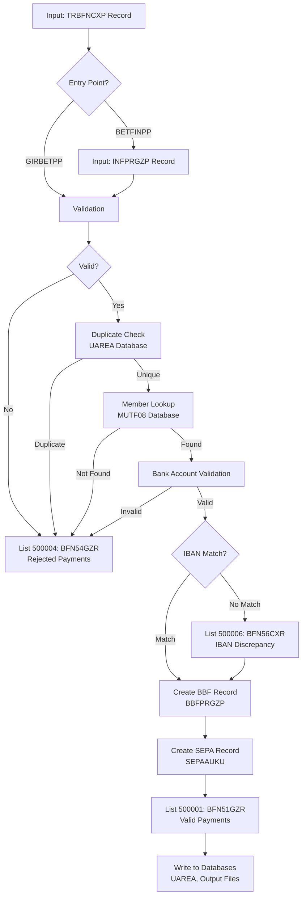

# Data Structures Overview - MYFIN

**Program**: MYFIN - Manual GIRBET Payment Processing  
**Last Updated**: 2026-01-29

## Purpose

This document provides a comprehensive overview of all data structures used by the MYFIN batch program, including input records, output lists, working storage, and database records. It includes detailed transformation mappings showing how data flows from input through processing to output.

## Data Structure Catalog

### Input Structures

| Structure ID | Name | Purpose | Document |
|--------------|------|---------|----------|
| DS_TRBFNCXP | TRBFNCXP | Primary input: Manual GIRBET payment records | [DS_TRBFNCXP.md](DS_TRBFNCXP.md) |
| DS_INFPRGZP | INFPRGZP | Alternative input: INFOREK payment records | [DS_INFPRGZP.md](DS_INFPRGZP.md) |

### Output Structures (Lists)

| Structure ID | Name | List Number | Purpose | Document |
|--------------|------|-------------|---------|----------|
| DS_BFN51GZR | BFN51GZR | 500001 | Valid payments ready for processing | [DS_BFN51GZR.md](DS_BFN51GZR.md) |
| DS_BFN54GZR | BFN54GZR | 500004 | Rejected payments with diagnostics | [DS_BFN54GZR.md](DS_BFN54GZR.md) |
| DS_BFN56CXR | BFN56CXR | 500006, 500076, 500096, 500066, 500086, 541006 | IBAN discrepancy reports | [DS_BFN56CXR.md](DS_BFN56CXR.md) |

### Processing Structures

| Structure ID | Name | Purpose | Document |
|--------------|------|---------|----------|
| DS_BBFPRGZP | BBFPRGZP | BBF payment records for magnetic tape | [DS_BBFPRGZP.md](DS_BBFPRGZP.md) |
| DS_SEPAAUKU | SEPAAUKU | SEPA/IBAN validation records | [DS_SEPAAUKU.md](DS_SEPAAUKU.md) |
| DS_working_storage | Working Storage | Program variables and counters | [DS_working_storage.md](DS_working_storage.md) |

## Data Flow Overview



## Transformation Mappings

### Input → Working Storage

#### From TRBFNCXP to Working Storage

| Source Field | Target Field | Transformation | Notes |
|--------------|--------------|----------------|-------|
| TRBFN-PPR-RNR | WS-RIJKSNUMMER | Direct move | Binary to numeric conversion |
| TRBFN-DEST | WS-VERBOND | Direct move | Federation code |
| TRBFN-CONSTANTE | WS-CONSTANTE | Direct move | 10-digit constant |
| TRBFN-NO-SUITE | WS-VOLGNUMMER | Direct move | Sequence number |
| TRBFN-MONTANT | WS-BEDRAG | Direct move | Payment amount |
| TRBFN-MONTANT-DV | WS-MUNT | Direct move | Currency code (E/B) |
| TRBFN-IBAN | WS-IBAN-INPUT | Direct move | Input IBAN |
| TRBFN-NO-BANCAIRE | WS-REKENING | Conditional | If no IBAN |
| TRBFN-CODE-LIBEL | WS-LIBEL-CODE | Direct move | Payment label |
| TRBFN-BETWYZ | WS-BETAALWIJZE | Direct move | Payment method |
| TRBFN-TYPE-COMPTA | WS-ACCOUNT-TYPE | Direct move | Account type (1-6) |

#### Currency Conversion Logic

```cobol
**** Determine decimal places based on currency
IF TRBFN-MONTANT-DV = "E"
   MOVE 2 TO WS-DECIMAL-PLACES    * Euro: 2 decimals
ELSE
   MOVE 0 TO WS-DECIMAL-PLACES    * BEF: 0 decimals
END-IF
```

### Working Storage → Output Lists

#### To BFN51GZR (List 500001 - Valid Payments)

| Source | Target Field | Transformation | Condition |
|--------|--------------|----------------|-----------|
| WS-RIJKSNUMMER | BBF-N51-RNR | Direct move | All valid payments |
| ADM-NAAM | BBF-N51-NAAM | Direct move | From MUTF08 lookup |
| ADM-VOORN | BBF-N51-VOORN | Direct move | From MUTF08 lookup |
| WS-LIBEL-CODE | BBF-N51-LIBEL | Direct move | Payment label |
| WS-BEDRAG | BBF-N51-BEDRAG | Direct move | Amount |
| WS-IBAN-INPUT | BBF-N51-IBAN | Conditional move | If IBAN present |
| WS-REKENING | BBF-N51-REKNR | Conditional move | If no IBAN |
| WS-MUNT | BBF-N51-DV | Direct move | Currency code |
| WS-DECIMAL-PLACES | BBF-N51-DN | Direct move | Decimal precision |
| WS-VERBOND | BBF-N51-VERB | Direct move | Federation |
| WS-CONSTANTE | BBF-N51-KONST | Direct move | Constant |
| WS-VOLGNUMMER | BBF-N51-VOLGNR | Direct move | Sequence |
| WS-BETAALWIJZE | BBF-N51-BETWY | Direct move | Payment method |

**Account Type Logic** (BBF-N51-AFK):
```cobol
IF WS-ACCOUNT-TYPE = 1
   MOVE 2 TO BBF-N51-AFK    * PAIFIN-AO
ELSE
   MOVE 3 TO BBF-N51-AFK    * PAIFIN-AL
END-IF
```

#### To BFN54GZR (List 500004 - Rejections)

| Source | Target Field | Transformation | Condition |
|--------|--------------|----------------|-----------|
| WS-RIJKSNUMMER | BBF-N54-RNR | Direct move | All rejections |
| WS-BEDRAG | BBF-N54-BEDRAG | Direct move | Amount |
| WS-IBAN-INPUT | BBF-N54-IBAN | Conditional | If IBAN present |
| WS-REKENING | BBF-N54-REKNUM | Conditional | If no IBAN |
| WS-ERROR-CODE | BBF-N54-DIAG | Formatted message | Error diagnostic |
| 106 (constant) | BBF-N54-DESTINATION | Fixed value | Always Brussels |
| 106 (constant) | BBF-N54-VERB | Fixed value | Always Brussels |
| "Z" (constant) | BBF-N54-PRIORITY | Fixed value | Low priority |
| WS-CONSTANTE | BBF-N54-KONSTA | Direct move | Constant |
| WS-VOLGNUMMER | BBF-N54-VOLGNR | Direct move | Sequence |

**Common Diagnostic Messages**:
- Duplicate: "DUBBEL"
- Invalid account: "ONGELDIG REKENING NUMMER"
- Invalid IBAN: "ONGELDIG IBAN"
- Member not found: "LID NIET GEVONDEN"

#### To BFN56CXR (List 500006 - IBAN Discrepancies)

| Source | Target Field | Transformation | Condition |
|--------|--------------|----------------|-----------|
| WS-RIJKSNUMMER | BBF-N56-RNR | Direct move | IBAN mismatch detected |
| ADM-NAAM | BBF-N56-NAAM | Direct move | From MUTF08 |
| ADM-VOORN | BBF-N56-VOORN | Direct move | From MUTF08 |
| WS-IBAN-INPUT | BBF-N56-IBAN | Direct move | Input IBAN |
| SAV-IBAN | BBF-N56-IBAN-MUT | Direct move | Member IBAN from DB |
| WS-BEDRAG | BBF-N56-BEDRAG | Direct move | Amount |
| WS-LIBEL-CODE | BBF-N56-LIBEL | Direct move | Payment label |
| WS-BETAALWIJZE | BBF-N56-BETWY | Direct move | Payment method |

**List Routing by Account Type**:
```cobol
EVALUATE WS-ACCOUNT-TYPE
   WHEN 03 
      MOVE "500076" TO BBF-N56-NAME
      MOVE 167      TO BBF-N56-VERB
      MOVE 1        TO BBF-N56-TAGREG-OP
   WHEN 04 
      MOVE "500096" TO BBF-N56-NAME
      MOVE 169      TO BBF-N56-VERB
      MOVE 2        TO BBF-N56-TAGREG-OP
   WHEN 05 
      MOVE "500066" TO BBF-N56-NAME
      MOVE 166      TO BBF-N56-VERB
      MOVE 4        TO BBF-N56-TAGREG-OP
   WHEN 06 
      MOVE "500086" TO BBF-N56-NAME
      MOVE 168      TO BBF-N56-VERB
      MOVE 7        TO BBF-N56-TAGREG-OP
   WHEN OTHER 
      IF WS-VERBOND = 141
         MOVE "541006" TO BBF-N56-NAME
         MOVE 116      TO BBF-N56-DESTINATION
      ELSE
         MOVE "500006" TO BBF-N56-NAME
         MOVE WS-VERBOND TO BBF-N56-DESTINATION
      END-IF
END-EVALUATE
```

### Working Storage → Processing Records

#### To BBFPRGZP (BBF Payment Record)

| Source | Target Field | Transformation | Notes |
|--------|--------------|----------------|-------|
| "PPRBBF" | BF-PPR-NAME | Fixed value | PPR identifier |
| WS-VERBOND | BF-PPR-FED | Direct move | Federation |
| WS-RIJKSNUMMER | BF-PPR-RNR | Direct move | Binary format |
| WS-VERBOND | BF-VBOND | Direct move | 2-digit federation |
| WS-CONSTANTE (subset) | BF-AFDEL | Extraction | Department (3 digits) |
| WS-CONSTANTE (subset) | BF-KASSIER | Extraction | Cashier (3 digits) |
| WS-CONSTANTE (subset) | BF-DATZIT-DM | Extraction | Date (4 digits DDMM) |
| WS-BETAALWIJZE | BF-BETWYZ | Direct move | Payment method |
| WS-RIJKSNUMMER | BF-RNR | Direct move | Alphanumeric format |
| WS-LIBEL-CODE | BF-BETKOD | Direct move | Payment code |
| WS-BEDRAG | BF-BEDRAG | Direct move | Amount |
| WS-IBAN-INPUT | BF-IBAN | Conditional | If IBAN present |
| WS-REKENING | BF-REKNUM | Conditional | If no IBAN |

#### To SEPAAUKU (SEPA Validation Record)

| Source | Target Field | Transformation | Notes |
|--------|--------------|----------------|-------|
| WS-IBAN-INPUT | SEPA-IBAN | Direct move | Full IBAN |
| WS-IBAN-INPUT (1:2) | SEPA-COUNTRY | Substring | Country code (BE, etc.) |
| WS-IBAN-INPUT (3:2) | SEPA-CHECK-DIGITS | Substring | Check digits |
| WS-IBAN-INPUT (5:) | SEPA-BBAN | Substring | Basic bank account number |

## Database Interactions

### MUTF08 - Member Database

**Purpose**: Retrieve member information for payment processing

**Key Fields Retrieved**:
- ADM-NAAM (last name)
- ADM-VOORN (first name)
- SAV-IBAN (registered IBAN)
- ADM-TAAL (language preference)

**Lookup Key**: WS-RIJKSNUMMER (national registry number)

**SQL Query** (conceptual):
```sql
SELECT ADM_NAAM, ADM_VOORN, SAV_IBAN, ADM_TAAL
FROM MUTF08
WHERE RNR = :WS-RIJKSNUMMER
```

**Error Handling**:
- Member not found → Record written to list 500004 with diagnostic "LID NIET GEVONDEN"

### UAREA - Duplicate Detection Database

**Purpose**: Detect duplicate payment submissions

**Key Fields Checked**:
- Federation (UAREA-VERBOND)
- Constant (UAREA-CONSTANTE)
- Sequence number (UAREA-VOLGNUMMER)

**Duplicate Detection Logic**:
```cobol
IF UAREA-VERBOND = WS-VERBOND
   AND UAREA-CONSTANTE = WS-CONSTANTE
   AND UAREA-VOLGNUMMER = WS-VOLGNUMMER
THEN
   **** Duplicate detected
   PERFORM CREER-REMOTE-500004  * Write to rejection list
   MOVE "DUBBEL" TO BBF-N54-DIAG
ELSE
   **** Not a duplicate - continue processing
   PERFORM WRITE-UAREA-RECORD   * Add to database
END-IF
```

**Data Written on Success**:
- WS-VERBOND → UAREA-VERBOND
- WS-CONSTANTE → UAREA-CONSTANTE
- WS-VOLGNUMMER → UAREA-VOLGNUMMER
- Current timestamp → UAREA-TIMESTAMP
- Program ID → UAREA-PROGRAM

## Field Size Summary

### Input Record Sizes

| Structure | Base Size | With SEPA/IBAN | Notes |
|-----------|-----------|----------------|-------|
| TRBFNCXP | 152 bytes | 186 bytes | Primary input (+34 for IBAN) |
| INFPRGZP | Variable | Variable | Alternative input |

### Output Record Sizes

| Structure | Size | Description |
|-----------|------|-------------|
| BFN51GZR | 217 bytes | Valid payment list (500001) |
| BFN54GZR | 263 bytes | Rejection list (500004) |
| BFN56CXR | 258 bytes | Discrepancy report (500006, variants) |

### Processing Record Sizes

| Structure | Size | Description |
|-----------|------|-------------|
| BBFPRGZP | 192 bytes | BBF payment record (magnetic tape) |
| SEPAAUKU | Variable | SEPA validation record |

## Data Validation Rules

### Input Validation

| Field | Validation Rule | Action on Failure |
|-------|----------------|-------------------|
| TRBFN-CODE | Must = 42 | Reject record |
| TRBFN-DEST | Range 101-169 | Reject record |
| TRBFN-MONTANT | Must be numeric, > 0 | Reject record → list 500004 |
| TRBFN-MONTANT | Max 999,999 | Reject record → list 500004 |
| TRBFN-IBAN | IBAN format if present | Reject record → list 500004 |
| TRBFN-PPR-RNR | Must be numeric | Reject record → list 500004 |
| TRBFN-CONSTANTE | Must be 10 digits | Reject record |

### IBAN Validation

| Check | Rule | Error Message |
|-------|------|---------------|
| Format | Country code (2 letters) + 2 check digits + BBAN | "ONGELDIG IBAN" |
| Length | Max 34 characters | "ONGELDIG IBAN" |
| Checksum | Mod-97 algorithm | "ONGELDIG IBAN" |
| Country | BE (Belgium) expected | "ONGELDIG IBAN" |

### Bank Account Validation (Legacy)

| Check | Rule | Error Message |
|-------|------|---------------|
| Format | 12 digits (XXX-XXXXXXX-XX) | "ONGELDIG REKENING NUMMER" |
| Checksum | Modulo 97 check | "ONGELDIG REKENING NUMMER" |
| All zeros | Not allowed | "ONGELDIG REKENING NUMMER" |

## Processing Sequence

1. **Input Reading**
   - Read TRBFNCXP or INFPRGZP record
   - Move to working storage

2. **Input Validation** ([FUREQ_MYFIN_001](../requirements/FUREQ_MYFIN_001_input_validation.md))
   - Validate mandatory fields
   - Validate data formats
   - Validate ranges
   - **If fail** → List 500004 (BFN54GZR)

3. **Duplicate Detection** ([FUREQ_MYFIN_002](../requirements/FUREQ_MYFIN_002_duplicate_detection.md))
   - Check UAREA database
   - Compare federation + constant + sequence
   - **If duplicate** → List 500004 with "DUBBEL"

4. **Member Lookup**
   - Query MUTF08 database
   - Retrieve member name, IBAN
   - **If not found** → List 500004 with "LID NIET GEVONDEN"

5. **Bank Account Validation** ([FUREQ_MYFIN_003](../requirements/FUREQ_MYFIN_003_bank_account_validation.md))
   - Validate IBAN format (if present)
   - Validate legacy account (if no IBAN)
   - **If invalid** → List 500004 with appropriate diagnostic

6. **IBAN Discrepancy Check**
   - Compare input IBAN vs member IBAN (from MUTF08)
   - **If mismatch** → List 500006 (BFN56CXR)
   - Continue processing (not a rejection)

7. **Payment Record Creation** ([FUREQ_MYFIN_005](../requirements/FUREQ_MYFIN_005_payment_record_creation.md))
   - Create BBFPRGZP record
   - Create SEPAAUKU record
   - Create BFN51GZR record → List 500001

8. **Database Updates**
   - Write to UAREA (prevent future duplicates)
   - Log to ADLOGDBD (audit trail)

## Output Distribution

### List 500001 (Valid Payments)

- **Volume**: 60-80% of input records (typical)
- **Recipients**: All federations (109-169)
- **Format**: BFN51GZR records
- **Next Processing**: Payment execution system

### List 500004 (Rejections)

- **Volume**: 15-30% of input records (typical)
- **Recipients**: Brussels (106 - fixed destination)
- **Format**: BFN54GZR records with diagnostic messages
- **Next Processing**: Manual review and correction

### List 500006 (IBAN Discrepancies)

- **Volume**: 5-10% of input records (typical)
- **Recipients**: Various federations based on account type
- **Format**: BFN56CXR records with input and member IBANs
- **Next Processing**: Database update or input correction

## Historical Modifications Impact

### SEPA/IBAN10 Project (February 2011)

**Input Changes**:
- TRBFNCXP: Added TRBFN-IBAN field (34 bytes)
- Record length increased from 152 to 186 bytes

**Output Changes**:
- BFN51GZR: Added BBF-N51-IBAN field
- BFN54GZR: Added BBF-N54-IBAN field
- BFN56CXR: Created new discrepancy report structure

**Processing Changes**:
- Added IBAN validation logic
- Added IBAN vs legacy account conditional logic
- Added IBAN discrepancy detection

### 6th State Reform (JGO001, CDU001 - October 2018)

**Output Changes**:
- BFN51GZR: Added BBF-N51-TAGREG-OP field
- BFN54GZR: Added BBF-N54-TAGREG-OP field
- BFN56CXR: Added regional list variants (500076, 500096, 500066, 500086)

**Processing Changes**:
- Added account type-based routing logic
- Added regional tag operator assignment
- Added special handling for federations 166-169

### INFOREK Project (MTU Modifications)

**Input Changes**:
- Added INFPRGZP alternative input structure

**Output Changes**:
- BFN51GZR: Added BBF-N51-INFOREK field
- BFN54GZR: Added BBF-N54-INF, BBF-N54-INF0 section

**Processing Changes**:
- Added BETFINPP entry point
- Added INFOREK-specific data handling

## Related Functional Requirements

| Requirement | Data Structures Involved |
|-------------|-------------------------|
| [FUREQ_MYFIN_001](../requirements/FUREQ_MYFIN_001_input_validation.md) - Input Validation | TRBFNCXP, INFPRGZP → BFN54GZR |
| [FUREQ_MYFIN_002](../requirements/FUREQ_MYFIN_002_duplicate_detection.md) - Duplicate Detection | Working Storage, UAREA → BFN54GZR |
| [FUREQ_MYFIN_003](../requirements/FUREQ_MYFIN_003_bank_account_validation.md) - Bank Account Validation | TRBFNCXP, SEPAAUKU → BFN54GZR |
| [FUREQ_MYFIN_004](../requirements/FUREQ_MYFIN_004_payment_list_generation.md) - Payment List Generation | All structures → BFN51GZR, BFN54GZR, BFN56CXR |
| [FUREQ_MYFIN_005](../requirements/FUREQ_MYFIN_005_payment_record_creation.md) - Payment Record Creation | Working Storage → BBFPRGZP, BFN51GZR |

## Performance Considerations

### Memory Usage

- Working storage: ~1KB per record processing
- Input buffer: 186 bytes max
- Output buffers: 217 + 263 + 258 = 738 bytes max total

### Processing Volume

- Typical batch: 1,000-5,000 records
- Peak batch: Up to 10,000 records
- Processing time: ~0.5-1 seconds per record (including database lookups)

### Database Access Patterns

- **MUTF08**: 1 read per input record (member lookup)
- **UAREA**: 1 read + 1 write per unique record (duplicate check and insert)
- **Total DB operations**: ~3 per input record

## Testing Data Sets

### Valid Payment Test Record

```
TRBFN-CODE = 42
TRBFN-DEST = 109
TRBFN-PPR-RNR = 12345678
TRBFN-CONSTANTE = 1234567890
TRBFN-NO-SUITE = 1
TRBFN-IBAN = "BE68539007547034"
TRBFN-MONTANT = 12500 (125.00 EUR)
TRBFN-MONTANT-DV = "E"
TRBFN-TYPE-COMPTA = 1

Expected Output: List 500001 (BFN51GZR)
```

### Duplicate Payment Test Record

```
Same as above, but record already exists in UAREA

Expected Output: List 500004 (BFN54GZR) with diagnostic "DUBBEL"
```

### IBAN Discrepancy Test Record

```
TRBFN-IBAN = "BE68539007547034"
Member IBAN (from MUTF08) = "BE71096123456769"

Expected Output: 
- List 500001 (BFN51GZR) - payment processed
- List 500006 (BFN56CXR) - discrepancy reported
```

### Invalid IBAN Test Record

```
TRBFN-IBAN = "BE99999999999999" (invalid checksum)

Expected Output: List 500004 (BFN54GZR) with diagnostic "ONGELDIG IBAN"
```

## Document References

For detailed field-level documentation, see individual data structure documents:

- **Input**: [DS_TRBFNCXP.md](DS_TRBFNCXP.md), [DS_INFPRGZP.md](DS_INFPRGZP.md)
- **Output**: [DS_BFN51GZR.md](DS_BFN51GZR.md), [DS_BFN54GZR.md](DS_BFN54GZR.md), [DS_BFN56CXR.md](DS_BFN56CXR.md)
- **Processing**: [DS_BBFPRGZP.md](DS_BBFPRGZP.md), [DS_SEPAAUKU.md](DS_SEPAAUKU.md), [DS_working_storage.md](DS_working_storage.md)
