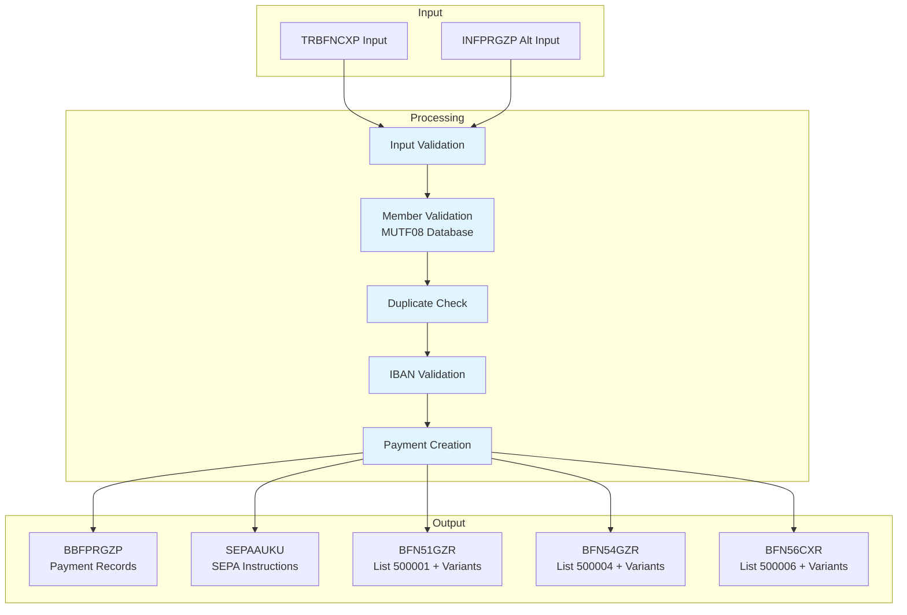

# MYFIN Documentation

**System**: GIRBET Manual Payment Processing  
**Module**: MYFIN  
**Last Updated**: 2026-01-29  
**Version**: 1.0

## Overview

MYFIN is a COBOL batch program that processes manual GIRBET payment inputs for Belgian mutual insurance members. The system validates payment data, creates bank payment instructions (BBF payment records and SEPA instructions), and generates detailed reporting lists for audit and reconciliation.

### Key Capabilities

- **Manual Payment Processing**: Process individual payment requests with comprehensive validation
- **Multi-Language Support**: Handle French, Dutch, and German language requirements (Bilingue)
- **SEPA Compliance**: Validate IBANs and generate SEPA-compliant payment instructions
- **Regional Accounting**: Support 6th State Reform regional accounting separation (Types 3-6)
- **Duplicate Detection**: Prevent duplicate payments through reference tracking
- **Error Management**: Comprehensive validation with detailed bilingual error reporting
- **Audit Trail**: Generate detailed lists (500001, 500004, 500006 and regional variants)

### Business Value

The system ensures payment accuracy, prevents financial losses from duplicates, maintains SEPA/IBAN compliance, supports Belgian multilingual requirements, and provides complete audit trails for financial oversight.

## Documentation Structure

This documentation is organized to serve different audiences:

- **Business Stakeholders**: Start with [Business Documentation](business/index.md)
- **Developers & Analysts**: See [Functional Documentation](functional/index.md)
- **Traceability & Requirements**: Review [Requirements Mapping](traceability/requirements-map.md)
- **Coordination & Catalogs**: Review [Requirement Matrix](traceability/requirement-matrix.md), [Flow-to-Component Map](traceability/flow-to-component-map.md), [ID Registry](traceability/id-registry.md), and [Domain Concepts Catalog](domain/domain-concepts-catalog.md)

## Quick Links

### Coordination Artifacts

- [Requirement Matrix](traceability/requirement-matrix.md)
- [Flow-to-Component Map](traceability/flow-to-component-map.md)
- [ID Registry](traceability/id-registry.md)
- [Domain Concepts Catalog](domain/domain-concepts-catalog.md)

### By Document Type

- **[Use Cases](business/use-cases/)** - Business scenarios and flows
  - [UC_MYFIN_001](business/use-cases/UC_MYFIN_001_process_manual_payment.md) - Process Manual GIRBET Payment
  - [UC_MYFIN_002](business/use-cases/UC_MYFIN_002_validate_payment_data.md) - Validate Payment Data
  - [UC_MYFIN_003](business/use-cases/UC_MYFIN_003_generate_payment_lists.md) - Generate Payment Lists

- **[Business Processes](business/processes/)** - End-to-end BPMN flows
  - [BP_MYFIN_manual_payment_processing](business/processes/BP_MYFIN_manual_payment_processing.md) - Complete payment processing workflow

- **[Functional Requirements](functional/requirements/)** - Technical specifications
  - [FUREQ_MYFIN_001](functional/requirements/FUREQ_MYFIN_001_input_validation.md) - Input Validation
  - [FUREQ_MYFIN_002](functional/requirements/FUREQ_MYFIN_002_duplicate_detection.md) - Duplicate Detection
  - [FUREQ_MYFIN_003](functional/requirements/FUREQ_MYFIN_003_bank_account_validation.md) - Bank Account Validation
  - [FUREQ_MYFIN_004](functional/requirements/FUREQ_MYFIN_004_payment_list_generation.md) - Payment List Generation
  - [FUREQ_MYFIN_005](functional/requirements/FUREQ_MYFIN_005_payment_record_creation.md) - Payment Record Creation

- **[Functional Flows](functional/flows/)** - Detailed technical flows
  - [FF_MYFIN_main_processing](functional/flows/FF_MYFIN_main_processing.md) - Main Processing Flow
  - [FF_MYFIN_error_handling](functional/flows/FF_MYFIN_error_handling.md) - Error Handling Flow

- **[Data Structures](functional/integration/)** - Data structure specifications
  - [data-structures.md](functional/integration/data-structures.md) - Overview and mappings
  - Input: [TRBFNCXP](functional/integration/DS_TRBFNCXP.md), [INFPRGZP](functional/integration/DS_INFPRGZP.md)
  - Processing: [BBFPRGZP](functional/integration/DS_BBFPRGZP.md), [SEPAAUKU](functional/integration/DS_SEPAAUKU.md), [Working Storage](functional/integration/DS_working_storage.md)
  - Output: [BFN51GZR](functional/integration/DS_BFN51GZR.md), [BFN54GZR](functional/integration/DS_BFN54GZR.md), [BFN56CXR](functional/integration/DS_BFN56CXR.md)

- **[Integration Points](functional/integration/)**
  - [INT_input_records](functional/integration/INT_input_records.md) - Input record specifications
  - [INT_output_lists](functional/integration/INT_output_lists.md) - Output list specifications

### By Component Area

#### Input Processing
- [TRBFNCXP Input Structure](functional/integration/DS_TRBFNCXP.md) - Primary input record
- [INFPRGZP Alternative Input](functional/integration/DS_INFPRGZP.md) - Alternative input format
- [Input Validation](functional/requirements/FUREQ_MYFIN_001_input_validation.md) - Validation requirements

#### Payment Processing
- [Payment Record Creation](functional/requirements/FUREQ_MYFIN_005_payment_record_creation.md) - BBF and SEPA record creation
- [Duplicate Detection](functional/requirements/FUREQ_MYFIN_002_duplicate_detection.md) - Duplicate prevention
- [Bank Account Validation](functional/requirements/FUREQ_MYFIN_003_bank_account_validation.md) - IBAN/account validation

#### Output Generation
- [Payment List Generation](functional/requirements/FUREQ_MYFIN_004_payment_list_generation.md) - List creation specifications
- [Output Lists](functional/integration/INT_output_lists.md) - Lists 500001, 500004, 500006 and variants

### By Regional Accounting Type

The system supports 6 accounting types for Belgian 6th State Reform compliance:

1. **Type 1 (General)**: Standard processing → Lists 500001/500004/500006
2. **Type 2 (AL)**: Alternative accounting → Same lists, different bank code
3. **Type 3 (Regional 1)**: Federation 167 → Lists 500071/500074/500076, forced to Belfius
4. **Type 4 (Regional 2)**: Federation 169 → Lists 500091/500094/500096, forced to Belfius
5. **Type 5 (Regional 3)**: Federation 166 → Lists 500061/500064/500066, forced to Belfius
6. **Type 6 (Regional 4)**: Federation 168 → Lists 500081/500084/500086, forced to Belfius

## Statistics

- **Use Cases**: 3
- **Functional Requirements**: 5
- **Business Processes**: 1
- **Data Structures Documented**: 8
- **Integration Points**: 2
- **Functional Flows**: 2
- **Discovery Documents**: 3

## System Architecture

## Data Flow Overview

1. **Input**: Payment requests via TRBFNCXP or INFPRGZP records
2. **Validation**: 
   - Field format validation
   - Member existence check (MUTF08 database)
   - Duplicate payment detection
   - IBAN/SEPA compliance validation
   - Bank account consistency check
3. **Processing**:
   - Create BBF payment module records
   - Create SEPA payment instructions
   - Route to appropriate accounting type (1-6)
4. **Output**:
   - Payment detail lists (500001 and regional variants)
   - Rejection/error lists (500004 and regional variants)
   - Bank account discrepancy lists (500006 and regional variants)
   - CSV export files (5DET01 for modern integration)

## Recent Updates

| Date | Document | Change |
|------|----------|--------|
| 2026-01-29 | Documentation Index | Initial creation - Batch 4.1 Coordination |
| 2026-01-29 | Data Structures | Completed all 8 data structure documents |
| 2026-01-29 | Integration Specs | Completed input and output integration documentation |
| 2026-01-28 | Functional Flows | Completed main processing and error handling flows |
| 2026-01-28 | Functional Requirements | Completed all 5 functional requirements |
| 2026-01-28 | Business Documentation | Completed use cases, business processes, overview |
| 2026-01-28 | Discovery Phase | Completed component, concept, and flow discovery |

## How to Navigate

1. **Understand Business Context**: Start with [Business Overview](business/overview/MYFIN-overview.md) and [Use Cases](business/use-cases/)
2. **Review Processes**: Study the [Business Process](business/processes/BP_MYFIN_manual_payment_processing.md) for end-to-end flow
3. **Dive into Technical Details**: Review [Functional Requirements](functional/requirements/) for implementation specifics
4. **Understand Data**: Study [Data Structures](functional/integration/data-structures.md) for complete data transformations
5. **Trace Requirements**: Use [Requirements Map](traceability/requirements-map.md) to see all connections

## Technology Stack

- **Language**: COBOL (IBM Enterprise COBOL)
- **Environment**: Batch Processing (CICS compatible)
- **Database**: DB2 (MUTF08 member database, UAREA database)
- **Standards**: SEPA/IBAN compliance, Belgian multilingual requirements
- **Integration**: BBF Payment Module, SEPA XML generation

## Key Business Rules

- Payment amounts must be positive and within valid ranges
- Member must exist in MUTF08 database with valid insurance section
- Bank accounts must pass IBAN validation (SEPA compliance)
- Duplicate payments (same reference) are rejected
- Regional payments (types 3-6) must use Belfius bank
- All output must support French/Dutch/German bilingual requirements
- Payment type must be valid (e.g., 11=circular cheque, 10=transfer)

## Special Considerations

- **Multi-language Support**: FR/NL/DE with Bilingue handling throughout
- **SEPA/IBAN Compliance**: IBAN10 modifications for SEPA validation
- **Payment Type Handling**: Multiple payment types (circular cheques, transfers, etc.)
- **Mutuality Codes**: Support for codes 109-169
- **Historical Modifications**: Tracking of MTU01, MIS01, IBAN10, JGO001, CDU001 changes
- **6th State Reform**: Regional accounting modifications (JGO001, CDU001)
- **Modern Integration**: JIRA-4224 CSV output, JIRA-4311 PAIFIN-Belfius adaptation

## Contact & Ownership

**Module**: MYFIN  
**System**: GIRBET  
**Domain**: Payment Processing  
**Documentation Phase**: Coordination (Batch 4.1)  
**Documentation Status**: In Progress

## Related Systems

- **BBF Payment Module**: Target for payment record creation
- **SEPA Payment System**: Target for SEPA instruction generation
- **MUTF08 Database**: Source for member validation
- **UAREA Database**: User area data
- **List Processing**: Output lists 500001, 500004, 500006 and regional variants

---

*This documentation was generated through systematic analysis of MYFIN COBOL source code and copybook structures. For questions or updates, refer to the planning documents in docs/planning/.*
