# MYFIN System Overview

**System**: GIRBET Manual Payment Processing  
**Module**: MYFIN  
**Last Updated**: 2026-01-29  
**Version**: 1.0

---

## Table of Contents

1. [Executive Summary](#executive-summary)
2. [System Architecture](#system-architecture)
3. [Component Architecture](#component-architecture)
4. [Data Flow Architecture](#data-flow-architecture)
5. [Integration Architecture](#integration-architecture)
6. [Technology Stack](#technology-stack)
7. [Deployment Architecture](#deployment-architecture)
8. [Performance Characteristics](#performance-characteristics)
9. [Security Architecture](#security-architecture)
10. [Scalability & Reliability](#scalability--reliability)

---

## Executive Summary

MYFIN is a COBOL batch processing system that handles manual payment requests for Belgian mutual insurance members through the GIRBET interface. The system validates payment data, prevents duplicate payments, ensures SEPA/IBAN compliance, creates BBF payment module records and SEPA instructions, and generates comprehensive audit and reporting lists.

### Key Capabilities

- **Manual Payment Processing**: Processes individual payment requests with comprehensive validation
- **Multi-Language Support**: Handles French, Dutch, and German (Bilingue) throughout the system
- **SEPA Compliance**: Validates IBANs and generates SEPA-compliant payment instructions
- **Regional Accounting**: Supports Belgian 6th State Reform with 6 accounting types and regional routing
- **Duplicate Prevention**: Detects and prevents duplicate payments through reference tracking
- **Comprehensive Audit**: Generates multiple audit lists (500001, 500004, 500006 with regional variants)

### Business Value

- Ensures payment accuracy through multi-layer validation
- Prevents financial losses from duplicate payments
- Maintains SEPA banking compliance
- Supports Belgian multilingual legal requirements
- Enables regional accounting per Belgian federalization law
- Provides complete audit trail for financial oversight

---

## System Architecture

### High-Level Architecture

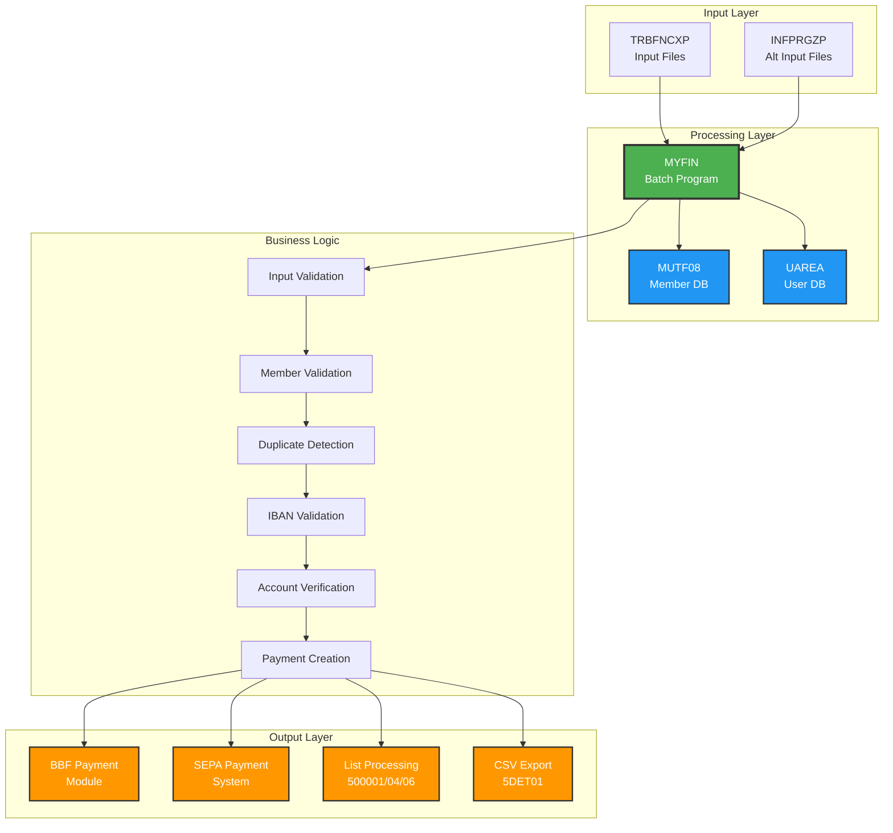

### Layered Architecture

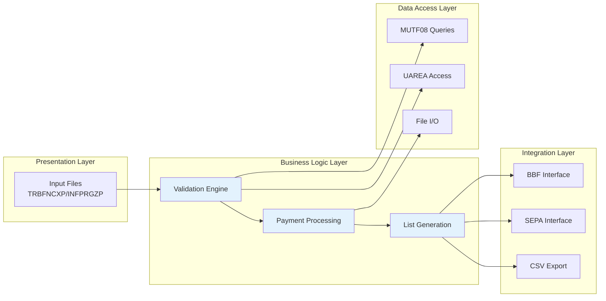

---

## Component Architecture

### Core Components

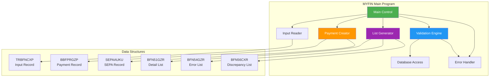

### Component Responsibilities

| Component | Responsibility | Input | Output |
|-----------|---------------|-------|--------|
| **Main Control** | Orchestrate overall processing flow | - | - |
| **Input Reader** | Read and parse input records | TRBFNCXP/INFPRGZP files | Parsed input structures |
| **Validation Engine** | Validate all payment data | Input records | Validation results |
| **Database Access** | Query MUTF08 and UAREA | Member number, queries | Member data |
| **Payment Creator** | Create BBF and SEPA records | Validated data | BBFPRGZP, SEPAAUKU |
| **List Generator** | Generate audit/report lists | Payment data, errors | BFN51GZR, BFN54GZR, BFN56CXR |
| **Error Handler** | Handle errors and rejections | Error conditions | Error messages, rejection lists |

---

## Data Flow Architecture

### End-to-End Data Flow

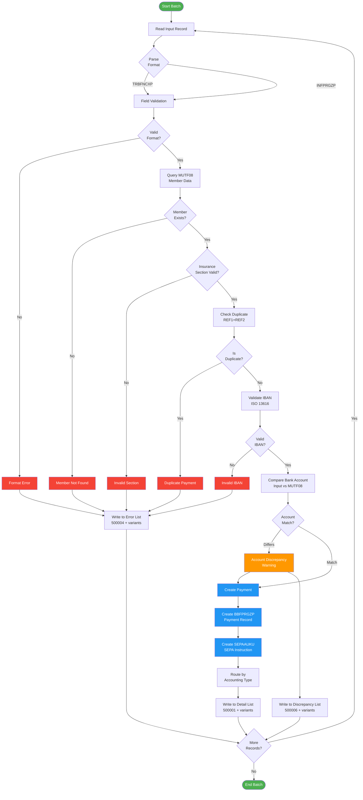

### Regional Accounting Routing

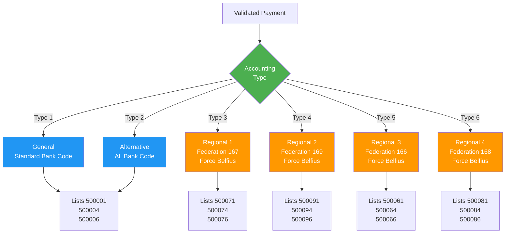

### Data Transformation Flow

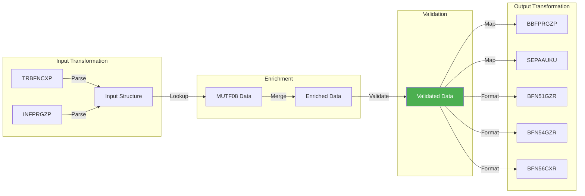

---

## Integration Architecture

### External System Integration

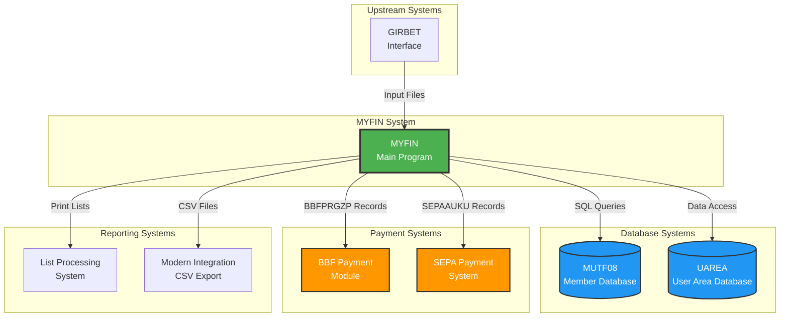

### Integration Points Detail

| Integration Point | Type | Protocol | Data Format | Frequency |
|------------------|------|----------|-------------|-----------|
| **GIRBET Interface** | Input | File Transfer | EBCDIC Fixed-width | Daily batch |
| **MUTF08 Database** | Query | DB2 SQL | Relational | Per payment |
| **UAREA Database** | Query | DB2 SQL | Relational | As needed |
| **BBF Payment Module** | Output | File/Queue | BBFPRGZP Copybook | Per payment |
| **SEPA Payment System** | Output | File/Queue | SEPAAUKU Copybook | Per payment |
| **List Processing** | Output | Print/File | Fixed-width Report | End of batch |
| **CSV Export (5DET01)** | Output | File | CSV | End of batch |

### Data Exchange Patterns

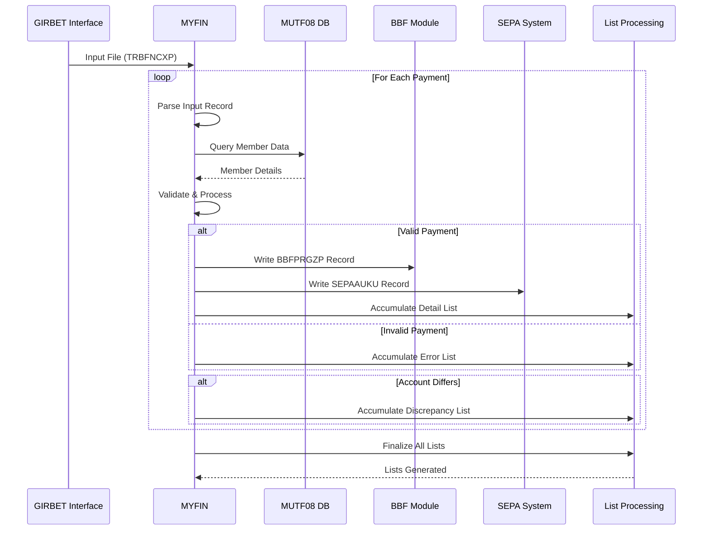

---

## Technology Stack

### Core Technologies

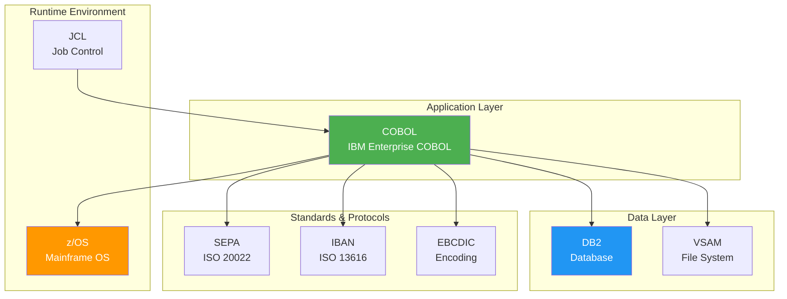

### Technology Details

| Component | Technology | Version | Purpose |
|-----------|-----------|---------|---------|
| **Programming Language** | COBOL | IBM Enterprise COBOL | Main application logic |
| **Database** | DB2 | z/OS DB2 | Member data (MUTF08, UAREA) |
| **File System** | VSAM | z/OS | Sequential file processing |
| **Operating System** | z/OS | Mainframe | Batch execution environment |
| **Job Control** | JCL | z/OS | Batch job scheduling |
| **Encoding** | EBCDIC | Mainframe | Character encoding |
| **Banking Standard** | SEPA | ISO 20022 | Payment instructions |
| **Account Standard** | IBAN | ISO 13616 | Bank account validation |

### Copybook Dependencies

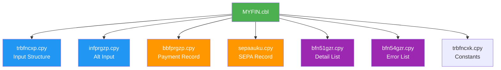

---

## Deployment Architecture

### Batch Processing Environment

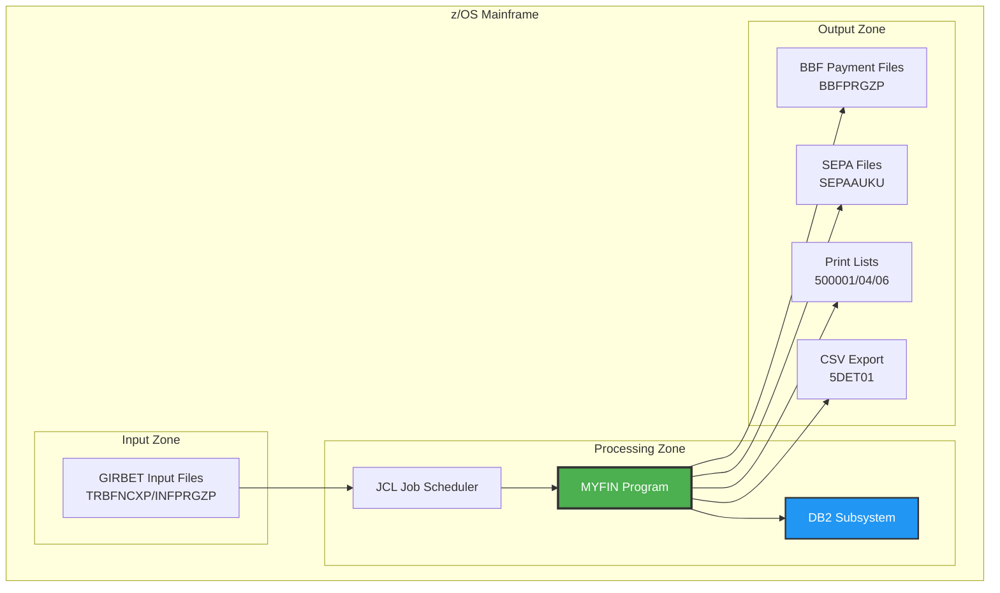

### Execution Flow

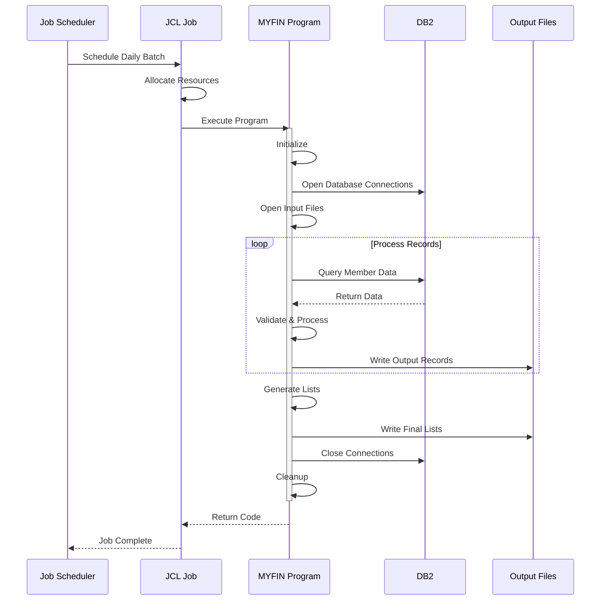

---

## Performance Characteristics

### Processing Metrics

| Metric | Typical Value | Peak Value | Notes |
|--------|--------------|------------|-------|
| **Throughput** | 5,000-10,000 payments/hour | 20,000 payments/hour | Depends on DB performance |
| **Response Time** | 0.1-0.5 sec/payment | 1.0 sec/payment | Including DB lookup |
| **Batch Duration** | 30-60 minutes | 2-3 hours | For typical daily volume |
| **Database Queries** | 1 per payment | - | MUTF08 member lookup |
| **Memory Usage** | 10-20 MB | 50 MB | Working storage |
| **File I/O** | Sequential | - | Input and output files |

### Performance Optimization

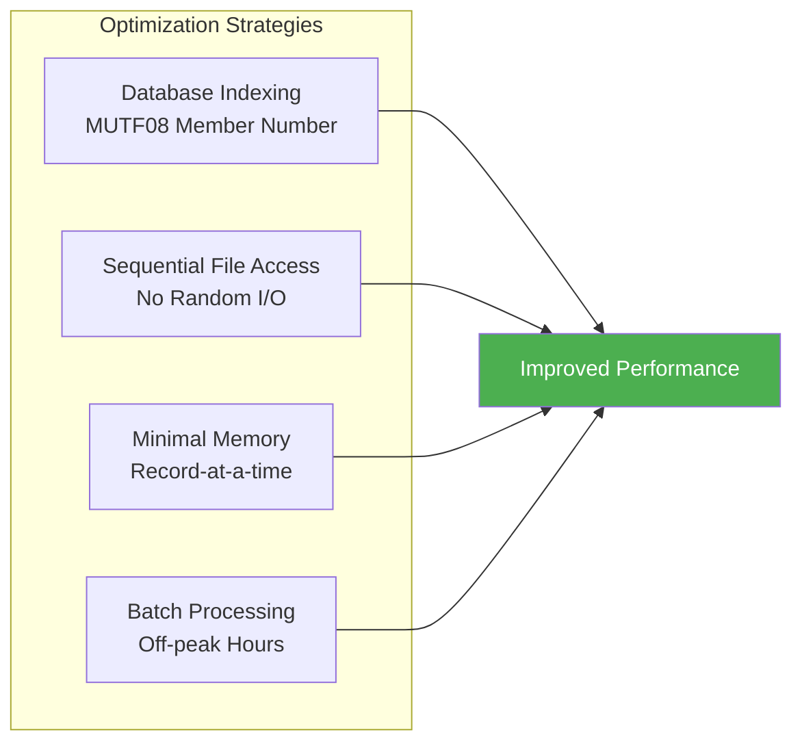

### Bottleneck Analysis

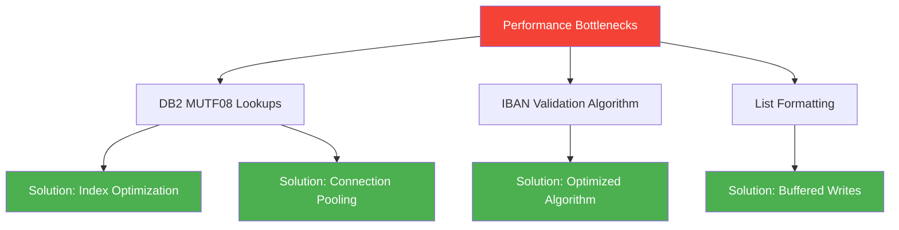

---

## Security Architecture

### Security Layers

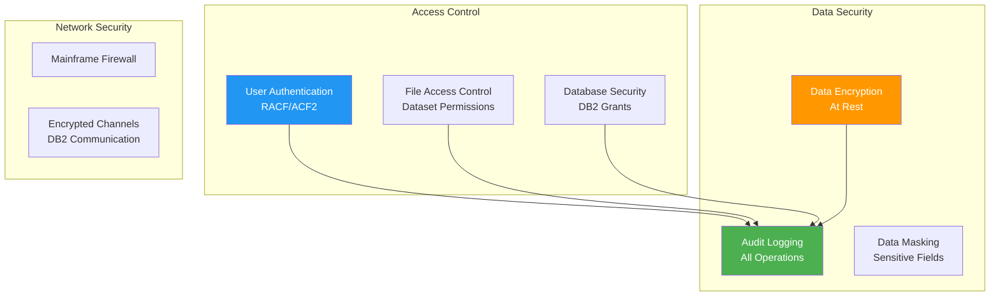

### Security Controls

| Control Type | Implementation | Purpose |
|-------------|----------------|---------|
| **Authentication** | RACF/ACF2 | User identity verification |
| **Authorization** | Dataset permissions | File access control |
| **Database Security** | DB2 grants | MUTF08/UAREA access control |
| **Audit Logging** | System logs | Track all operations |
| **Data Protection** | IBAN partial masking | Protect sensitive account data |
| **Segregation of Duties** | Role-based access | Prevent unauthorized changes |

### Sensitive Data Handling

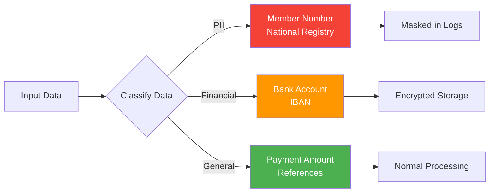

---

## Scalability & Reliability

### Scalability Characteristics

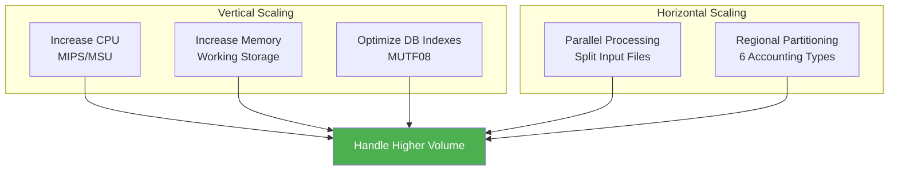

### Reliability Features

| Feature | Implementation | Benefit |
|---------|----------------|---------|
| **Error Handling** | Comprehensive validation | Prevent bad data propagation |
| **Checkpoint/Restart** | JCL checkpoints | Resume after failure |
| **Transaction Integrity** | Atomic DB operations | Data consistency |
| **Duplicate Detection** | Reference tracking | Prevent double payments |
| **Audit Trail** | Complete logging | Traceability |
| **Bilingual Errors** | FR/NL/DE messages | Clear error communication |

### Fault Tolerance

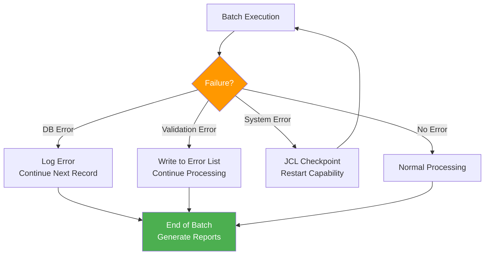

### Disaster Recovery

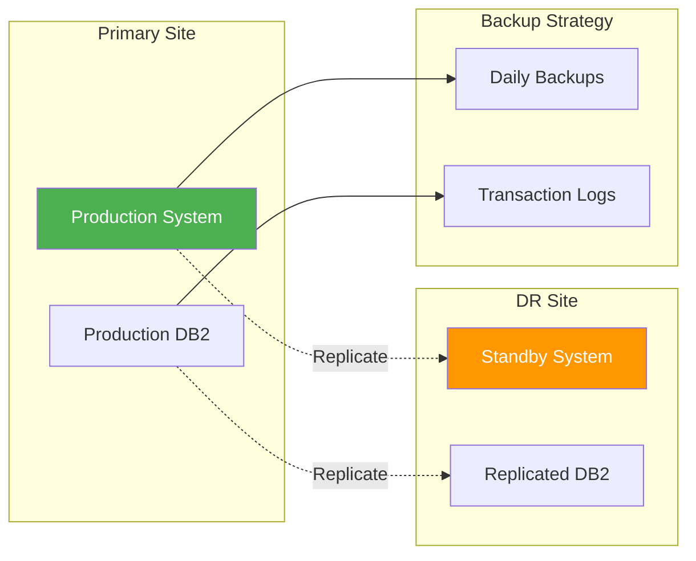

---

## System Constraints & Limitations

### Current Limitations

| Limitation | Description | Impact | Mitigation |
|-----------|-------------|--------|------------|
| **Batch-Only Processing** | No real-time capability | Delayed processing | Schedule frequent batches |
| **Sequential Processing** | One record at a time | Limited throughput | Optimize algorithms |
| **Database Dependency** | Requires MUTF08 availability | Single point of failure | DB replication |
| **Mainframe Platform** | z/OS dependency | Platform lock-in | Document for migration |
| **Fixed Accounting Types** | 6 types hardcoded | Inflexible | Configuration externalization |

### Technical Debt

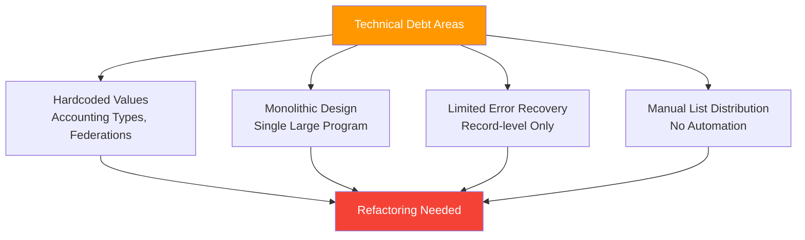

---

## Modernization Opportunities

### Potential Improvements

```mermaid
graph TB
    subgraph "Architecture Modernization"
        A[Microservices<br/>Decomposition]
        B[API Layer<br/>REST/GraphQL]
        C[Event-Driven<br/>Real-time Processing]
    end
    
    subgraph "Technology Modernization"
        D[Cloud Migration<br/>Azure/AWS]
        E[Container Deployment<br/>Kubernetes]
        F[Modern DB<br/>PostgreSQL/SQL Server]
    end
    
    subgraph "Process Modernization"
        G[CI/CD Pipeline<br/>Automated Deployment]
        H[Monitoring<br/>Observability]
        I[Self-Service<br/>Portal]
    end
    
    style A fill:#4CAF50,color:#fff
    style D fill:#2196F3,color:#fff
    style G fill:#FF9800,color:#fff
```

### Migration Path

```mermaid
graph LR
    A[Current COBOL<br/>Mainframe] --> B[Phase 1:<br/>Extract Services]
    B --> C[Phase 2:<br/>API Wrapper]
    C --> D[Phase 3:<br/>Rewrite Core Logic]
    D --> E[Phase 4:<br/>Cloud Native]
    
    style A fill:#f44336,color:#fff
    style E fill:#4CAF50,color:#fff
```

---

## Related Documentation

- **[Main Documentation Index](index.md)** - Complete documentation overview
- **[Business Documentation](business/index.md)** - Use cases and business processes
- **[Functional Documentation](functional/index.md)** - Technical specifications
- **[Traceability Matrix](traceability/requirements-map.md)** - Requirements mapping
- **[Requirement Matrix (Coordination)](traceability/requirement-matrix.md)** - Consolidated BUREQ -> UC -> FUREQ mapping
- **[Flow-to-Component Map](traceability/flow-to-component-map.md)** - Technical flow/component traceability
- **[ID Registry](traceability/id-registry.md)** - Unique identifier registry across artifacts
- **[Domain Concepts Catalog](domain/domain-concepts-catalog.md)** - Consolidated domain concept definitions
- **[Data Structures](functional/integration/data-structures.md)** - Complete data catalog

---

## Appendix

### Glossary

| Term | Definition |
|------|------------|
| **BBF** | Belgian payment module system |
| **GIRBET** | Manual payment interface system |
| **IBAN** | International Bank Account Number (ISO 13616) |
| **MUTF08** | Member database containing insurance member data |
| **SEPA** | Single Euro Payments Area (ISO 20022) |
| **6th State Reform** | Belgian federal reform requiring regional accounting separation |
| **Bilingue** | Bilingual (French/Dutch) support throughout Belgium |

### Acronyms

| Acronym | Expansion |
|---------|-----------|
| **COBOL** | Common Business-Oriented Language |
| **DB2** | Database 2 (IBM relational database) |
| **EBCDIC** | Extended Binary Coded Decimal Interchange Code |
| **JCL** | Job Control Language |
| **VSAM** | Virtual Storage Access Method |
| **z/OS** | Zero downtime Operating System (IBM mainframe OS) |

---

*This system overview was created through comprehensive analysis of the MYFIN COBOL program, copybooks, and business requirements. Last updated: 2026-01-29.*
