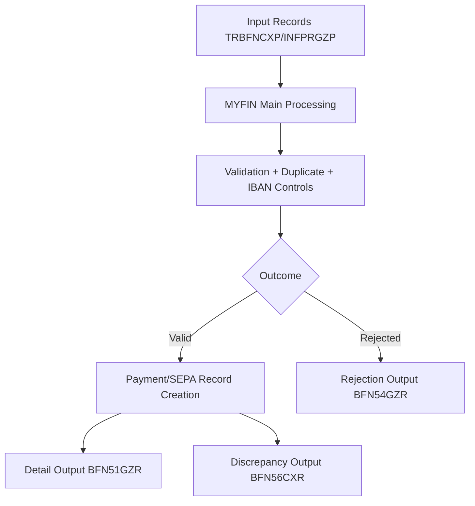

# MYFIN Flow to Component Map

**Module**: MYFIN  
**Last Updated**: 2026-03-25

## Mapping Table

| Flow ID | Flow Name | Primary Components | Data Structures |
|---|---|---|---|
| FLOW_MYFIN_MAIN_001 | Manual GIRBET Payment Processing | MYFIN, validation routines, list generation routines, database access routines | TRBFNCXP, BBFPRGZP, SEPAAUKU, BFN51GZR, BFN54GZR, BFN56CXR |
| FF_MYFIN_001 | Main Processing Flow | TRAITEMENT-BTM, VOIR-DOUBLES, VOIR-BANQUE-DEBIT, CREER-BBF, CREER-REMOTE-500001 | TRBFNCXP, BFN51GZR, SEPAAUKU |
| FF_MYFIN_002 | Error Handling Flow | CREER-REMOTE-500004, diagnostic routing, validation failure exits | BFN54GZR |

## Cross-Domain Flow View

