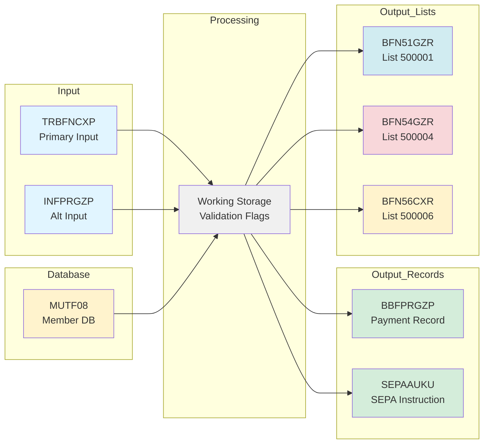

# MYFIN Requirements Traceability Matrix

**Module**: MYFIN  
**Last Updated**: 2026-01-29  
**Version**: 1.0

## Purpose

This matrix provides complete traceability between use cases, functional requirements, data structures, and code components for the MYFIN manual payment processing system. It ensures all business requirements are covered by functional specifications and can be traced to implementation.

For coordination-level consolidated artifacts, see:
- [requirement-matrix.md](requirement-matrix.md)
- [flow-to-component-map.md](flow-to-component-map.md)
- [id-registry.md](id-registry.md)

---

## Use Case to Functional Requirements Map

### UC_MYFIN_001 → Functional Requirements

**[UC_MYFIN_001 - Process Manual GIRBET Payment](../business/use-cases/UC_MYFIN_001_process_manual_payment.md)**

| Functional Requirement | Coverage | Status |
|------------------------|----------|--------|
| [FUREQ_MYFIN_001](../functional/requirements/FUREQ_MYFIN_001_input_validation.md) - Input Validation | ✅ Complete | Approved |
| [FUREQ_MYFIN_002](../functional/requirements/FUREQ_MYFIN_002_duplicate_detection.md) - Duplicate Detection | ✅ Complete | Approved |
| [FUREQ_MYFIN_003](../functional/requirements/FUREQ_MYFIN_003_bank_account_validation.md) - Bank Account Validation | ✅ Complete | Approved |
| [FUREQ_MYFIN_005](../functional/requirements/FUREQ_MYFIN_005_payment_record_creation.md) - Payment Record Creation | ✅ Complete | Approved |
| [FUREQ_MYFIN_004](../functional/requirements/FUREQ_MYFIN_004_payment_list_generation.md) - Payment List Generation | ✅ Complete | Approved |

**Coverage Status**: ✅ 100% - All aspects of manual payment processing are covered

---

### UC_MYFIN_002 → Functional Requirements

**[UC_MYFIN_002 - Validate Payment Data](../business/use-cases/UC_MYFIN_002_validate_payment_data.md)**

| Functional Requirement | Coverage | Status |
|------------------------|----------|--------|
| [FUREQ_MYFIN_001](../functional/requirements/FUREQ_MYFIN_001_input_validation.md) - Input Validation | ✅ Complete | Approved |
| [FUREQ_MYFIN_002](../functional/requirements/FUREQ_MYFIN_002_duplicate_detection.md) - Duplicate Detection | ✅ Complete | Approved |
| [FUREQ_MYFIN_003](../functional/requirements/FUREQ_MYFIN_003_bank_account_validation.md) - Bank Account Validation | ✅ Complete | Approved |

**Coverage Status**: ✅ 100% - All validation requirements are covered

---

### UC_MYFIN_003 → Functional Requirements

**[UC_MYFIN_003 - Generate Payment Lists](../business/use-cases/UC_MYFIN_003_generate_payment_lists.md)**

| Functional Requirement | Coverage | Status |
|------------------------|----------|--------|
| [FUREQ_MYFIN_004](../functional/requirements/FUREQ_MYFIN_004_payment_list_generation.md) - Payment List Generation | ✅ Complete | Approved |

**Coverage Status**: ✅ 100% - List generation fully specified

---

## Functional Requirements to Data Structures Map

### FUREQ_MYFIN_001 - Input Validation

**Input Data Structures**:
- [DS_TRBFNCXP](../functional/integration/DS_TRBFNCXP.md) - Primary input record (50+ fields)
- [DS_INFPRGZP](../functional/integration/DS_INFPRGZP.md) - Alternative input format

**Processing Data Structures**:
- [DS_working_storage](../functional/integration/DS_working_storage.md) - Validation flags and error codes

**External References**:
- MUTF08 Database - Member validation

**Key Validations**:
| Field | Validation Rule | Structure | Field Name |
|-------|----------------|-----------|------------|
| Member Number | Must exist in MUTF08 | TRBFNCXP | TRBFNCXP-MEMBER-NUMBER |
| Payment Amount | Numeric, positive | TRBFNCXP | TRBFNCXP-AMOUNT |
| Payment Type | Valid code (10, 11, etc.) | TRBFNCXP | TRBFNCXP-PAYMENT-TYPE |
| Accounting Type | 1-6 only | TRBFNCXP | TRBFNCXP-ACCOUNTING-TYPE |
| Bank Account | Format validation | TRBFNCXP | TRBFNCXP-BANK-ACCOUNT |

---

### FUREQ_MYFIN_002 - Duplicate Detection

**Input Data Structures**:
- [DS_TRBFNCXP](../functional/integration/DS_TRBFNCXP.md) - Payment references (REF1, REF2)

**Processing Data Structures**:
- [DS_working_storage](../functional/integration/DS_working_storage.md) - Duplicate tracking arrays/tables

**Key Fields**:
| Field | Purpose | Structure | Field Name |
|-------|---------|-----------|------------|
| Reference 1 | Primary payment reference | TRBFNCXP | TRBFNCXP-REF1 |
| Reference 2 | Secondary payment reference | TRBFNCXP | TRBFNCXP-REF2 |
| Member Number | Part of duplicate key | TRBFNCXP | TRBFNCXP-MEMBER-NUMBER |
| Mutuality Code | Part of duplicate key | TRBFNCXP | TRBFNCXP-MUTUALITY |

---

### FUREQ_MYFIN_003 - Bank Account Validation

**Input Data Structures**:
- [DS_TRBFNCXP](../functional/integration/DS_TRBFNCXP.md) - Bank account fields

**Processing Data Structures**:
- [DS_working_storage](../functional/integration/DS_working_storage.md) - IBAN validation working fields

**External References**:
- MUTF08 Database - Member bank account for comparison

**Key Validations**:
| Field | Validation Rule | Structure | Field Name |
|-------|----------------|-----------|------------|
| Bank Account | IBAN format (ISO 13616) | TRBFNCXP | TRBFNCXP-BANK-ACCOUNT |
| IBAN Check Digits | Algorithm validation | TRBFNCXP | Part of BANK-ACCOUNT |
| BIC Code | Optional validation | TRBFNCXP | TRBFNCXP-BIC |
| Account Consistency | Match MUTF08 account | TRBFNCXP | TRBFNCXP-BANK-ACCOUNT |

**Output for Discrepancies**:
- [DS_BFN56CXR](../functional/integration/DS_BFN56CXR.md) - Discrepancy report (list 500006)

---

### FUREQ_MYFIN_004 - Payment List Generation

**Output Data Structures**:
- [DS_BFN51GZR](../functional/integration/DS_BFN51GZR.md) - Payment detail list (500001 + variants)
- [DS_BFN54GZR](../functional/integration/DS_BFN54GZR.md) - Rejection/error list (500004 + variants)
- [DS_BFN56CXR](../functional/integration/DS_BFN56CXR.md) - Discrepancy list (500006 + variants)

**List Mapping by Accounting Type**:

| Accounting Type | Detail List | Error List | Discrepancy List | Federation |
|----------------|-------------|------------|------------------|------------|
| 1 (General) | 500001 | 500004 | 500006 | N/A |
| 2 (AL) | 500001 | 500004 | 500006 | N/A |
| 3 (Regional 1) | 500071 | 500074 | 500076 | 167 |
| 4 (Regional 2) | 500091 | 500094 | 500096 | 169 |
| 5 (Regional 3) | 500061 | 500064 | 500066 | 166 |
| 6 (Regional 4) | 500081 | 500084 | 500086 | 168 |

**CSV Export**:
- 5DET01 - Modern CSV format (JIRA-4224)

---

### FUREQ_MYFIN_005 - Payment Record Creation

**Input Data Structures**:
- [DS_TRBFNCXP](../functional/integration/DS_TRBFNCXP.md) - Source payment data

**Output Data Structures**:
- [DS_BBFPRGZP](../functional/integration/DS_BBFPRGZP.md) - BBF payment module record
- [DS_SEPAAUKU](../functional/integration/DS_SEPAAUKU.md) - SEPA instruction record

**Field Mappings**:

#### TRBFNCXP → BBFPRGZP
| Source Field | Target Field | Transformation |
|--------------|--------------|----------------|
| TRBFNCXP-MEMBER-NUMBER | BBFPRGZP-MEMBER-NUMBER | Direct copy |
| TRBFNCXP-AMOUNT | BBFPRGZP-PAYMENT-AMOUNT | Direct copy |
| TRBFNCXP-BANK-ACCOUNT | BBFPRGZP-BANK-ACCOUNT | Direct copy |
| TRBFNCXP-REF1 + REF2 | BBFPRGZP-PAYMENT-REFERENCE | Concatenate |
| TRBFNCXP-PAYMENT-TYPE | BBFPRGZP-PAYMENT-METHOD | Code mapping |
| TRBFNCXP-ACCOUNTING-TYPE | BBFPRGZP-BANK-ACCOUNT-CODE | Routing logic (1-6) |

#### TRBFNCXP → SEPAAUKU
| Source Field | Target Field | Transformation |
|--------------|--------------|----------------|
| TRBFNCXP-BANK-ACCOUNT | SEPAAUKU-IBAN | IBAN format |
| TRBFNCXP-BIC | SEPAAUKU-BIC | Direct copy |
| TRBFNCXP-AMOUNT | SEPAAUKU-AMOUNT | Format for SEPA |
| TRBFNCXP-REF1 + REF2 | SEPAAUKU-REMITTANCE-INFO | Remittance reference |

---

## Functional Requirements to Flows Map

### Flow Coverage Matrix

| Functional Requirement | Main Processing Flow | Error Handling Flow | Coverage |
|------------------------|---------------------|---------------------|----------|
| FUREQ_MYFIN_001 | ✅ Input validation steps | ✅ Field format errors | Complete |
| FUREQ_MYFIN_002 | ✅ Duplicate check step | ✅ Duplicate rejection | Complete |
| FUREQ_MYFIN_003 | ✅ IBAN validation step | ✅ IBAN errors + discrepancies | Complete |
| FUREQ_MYFIN_004 | ✅ List generation steps | ✅ Error list routing | Complete |
| FUREQ_MYFIN_005 | ✅ Record creation steps | ✅ Creation failures | Complete |

**Flows**:
- [FF_MYFIN_main_processing](../functional/flows/FF_MYFIN_main_processing.md)
- [FF_MYFIN_error_handling](../functional/flows/FF_MYFIN_error_handling.md)

---

## Data Structure Dependency Map

### Input → Processing → Output Flow

### Structure Dependencies

**Input Dependencies**:
- TRBFNCXP requires: None (primary input)
- INFPRGZP requires: None (alternative input)

**Processing Dependencies**:
- Working Storage requires: TRBFNCXP/INFPRGZP fields
- Validation requires: MUTF08 database access

**Output Dependencies**:
- BBFPRGZP requires: Validated TRBFNCXP data
- SEPAAUKU requires: Validated TRBFNCXP data, IBAN validation
- BFN51GZR requires: Successfully created payment records
- BFN54GZR requires: Validation error information
- BFN56CXR requires: Account discrepancy detection

---

## Component to Code Map

### Source Files

**Main Program**:
- [cbl/MYFIN.cbl](../../cbl/MYFIN.cbl) - Main processing logic

**Copybooks**:
- [copy/trbfncxp.cpy](../../copy/trbfncxp.cpy) - Primary input structure
- [copy/infprgzp.cpy](../../copy/infprgzp.cpy) - Alternative input structure
- [copy/bbfprgzp.cpy](../../copy/bbfprgzp.cpy) - BBF payment record structure
- [copy/sepaauku.cpy](../../copy/sepaauku.cpy) - SEPA instruction structure
- [copy/bfn51gzr.cpy](../../copy/bfn51gzr.cpy) - Payment detail list structure
- [copy/bfn54gzr.cpy](../../copy/bfn54gzr.cpy) - Error list structure
- [copy/trbfncxk.cpy](../../copy/trbfncxk.cpy) - Constants and codes

### Code Sections by Functional Requirement

| Functional Requirement | Code Sections | Copybooks |
|------------------------|---------------|-----------|
| FUREQ_MYFIN_001 | Input validation paragraphs, MUTF08 SQL | trbfncxp.cpy, infprgzp.cpy, trbfncxk.cpy |
| FUREQ_MYFIN_002 | Duplicate check paragraphs, tracking tables | trbfncxp.cpy |
| FUREQ_MYFIN_003 | IBAN validation paragraphs, account comparison | trbfncxp.cpy |
| FUREQ_MYFIN_004 | List generation paragraphs, print routines | bfn51gzr.cpy, bfn54gzr.cpy, bfn56cxr.cpy |
| FUREQ_MYFIN_005 | Payment creation paragraphs, record write | bbfprgzp.cpy, sepaauku.cpy |

---

## Coverage Analysis

### Use Case Coverage

| Use Case | Total FUREQs | Covered FUREQs | Coverage % | Status |
|----------|--------------|----------------|------------|--------|
| UC_MYFIN_001 | 5 | 5 | 100% | ✅ Complete |
| UC_MYFIN_002 | 3 | 3 | 100% | ✅ Complete |
| UC_MYFIN_003 | 1 | 1 | 100% | ✅ Complete |
| **Total** | **5** | **5** | **100%** | ✅ Complete |

### Functional Requirement Coverage

| Functional Requirement | Data Structures | Flows | Code Sections | Status |
|------------------------|----------------|-------|---------------|--------|
| FUREQ_MYFIN_001 | ✅ 3 structures | ✅ 2 flows | ✅ Mapped | Complete |
| FUREQ_MYFIN_002 | ✅ 2 structures | ✅ 2 flows | ✅ Mapped | Complete |
| FUREQ_MYFIN_003 | ✅ 3 structures | ✅ 2 flows | ✅ Mapped | Complete |
| FUREQ_MYFIN_004 | ✅ 3 structures | ✅ 2 flows | ✅ Mapped | Complete |
| FUREQ_MYFIN_005 | ✅ 3 structures | ✅ 2 flows | ✅ Mapped | Complete |

### Data Structure Coverage

| Data Structure | Referenced By FUREQs | Used In Flows | Documented | Status |
|----------------|---------------------|---------------|------------|--------|
| DS_TRBFNCXP | 5 | 2 | ✅ Yes | Complete |
| DS_INFPRGZP | 1 | 1 | ✅ Yes | Complete |
| DS_BBFPRGZP | 1 | 1 | ✅ Yes | Complete |
| DS_SEPAAUKU | 1 | 1 | ✅ Yes | Complete |
| DS_BFN51GZR | 1 | 1 | ✅ Yes | Complete |
| DS_BFN54GZR | 1 | 1 | ✅ Yes | Complete |
| DS_BFN56CXR | 1 | 1 | ✅ Yes | Complete |
| DS_working_storage | 5 | 2 | ✅ Yes | Complete |

---

## Integration Points Traceability

### Database Integration

| Integration Point | Purpose | Referenced By FUREQs | Flows |
|------------------|---------|---------------------|-------|
| MUTF08 Database | Member validation | FUREQ_MYFIN_001, FUREQ_MYFIN_003 | Main Processing, Error Handling |
| UAREA Database | User area data | FUREQ_MYFIN_001 | Main Processing |

### External System Integration

| System | Purpose | Output Structures | Referenced By FUREQs |
|--------|---------|------------------|---------------------|
| BBF Payment Module | Payment processing | BBFPRGZP | FUREQ_MYFIN_005 |
| SEPA Payment System | SEPA instructions | SEPAAUKU | FUREQ_MYFIN_005 |
| List Processing | Report generation | BFN51GZR, BFN54GZR, BFN56CXR | FUREQ_MYFIN_004 |
| CSV Export | Modern integration | 5DET01 | FUREQ_MYFIN_004 |

---

## Business Process Traceability

### BP_MYFIN_manual_payment_processing

**[Business Process Document](../business/processes/BP_MYFIN_manual_payment_processing.md)**

**Related Use Cases**:
- UC_MYFIN_001 - Process Manual GIRBET Payment
- UC_MYFIN_002 - Validate Payment Data
- UC_MYFIN_003 - Generate Payment Lists

**Functional Requirements Coverage**:
- FUREQ_MYFIN_001 - Input Validation (validation steps)
- FUREQ_MYFIN_002 - Duplicate Detection (duplicate check step)
- FUREQ_MYFIN_003 - Bank Account Validation (IBAN validation step)
- FUREQ_MYFIN_004 - Payment List Generation (list generation steps)
- FUREQ_MYFIN_005 - Payment Record Creation (payment creation steps)

**Process Steps**:
1. Read Payment Input → FUREQ_MYFIN_001
2. Validate Fields → FUREQ_MYFIN_001
3. Check Member → FUREQ_MYFIN_001
4. Check Duplicate → FUREQ_MYFIN_002
5. Validate IBAN → FUREQ_MYFIN_003
6. Check Account Consistency → FUREQ_MYFIN_003
7. Create Payment Records → FUREQ_MYFIN_005
8. Generate Lists → FUREQ_MYFIN_004

---

## Requirements Status Summary

### Overall Status

- **Total Use Cases**: 3
- **Total Functional Requirements**: 5
- **Total Data Structures**: 8
- **Total Flows**: 2
- **Total Integration Points**: 6

### Status Breakdown

| Artifact Type | Total | Documented | Coverage % |
|--------------|-------|------------|------------|
| Use Cases | 3 | 3 | 100% |
| Functional Requirements | 5 | 5 | 100% |
| Data Structures | 8 | 8 | 100% |
| Flows | 2 | 2 | 100% |
| Business Processes | 1 | 1 | 100% |
| Integration Points | 6 | 6 | 100% |

### Validation Results

✅ **All use cases have corresponding functional requirements**  
✅ **All functional requirements reference data structures**  
✅ **All functional requirements covered by flows**  
✅ **All data structures documented**  
✅ **All integration points identified**  
✅ **No orphaned requirements**  
✅ **No missing traceability links**

---

## Uncovered Areas

**None identified** - All aspects of MYFIN manual payment processing are covered by current documentation.

### Potential Future Enhancements

While current functionality is fully documented, potential future enhancements (not currently in scope):
- Real-time payment processing (currently batch only)
- Enhanced duplicate detection across multiple batch runs
- Extended SEPA validation features
- Integration with additional payment methods
- Advanced reporting and analytics

---

## Maintenance Notes

**Last Validation**: 2026-01-29  
**Next Review**: To be scheduled

**Validation Checklist**:
- [x] All use cases mapped to functional requirements
- [x] All functional requirements mapped to data structures
- [x] All functional requirements covered by flows
- [x] All data structures documented
- [x] All integration points identified
- [x] All code sections mapped to requirements
- [x] No orphaned artifacts

**Change Management**:
When adding new requirements:
1. Create/update use case document
2. Create/update functional requirement document
3. Update this traceability matrix
4. Update relevant data structure documentation
5. Update flow diagrams if needed
6. Update main index and functional index

---

## Related Documentation

- [Main Documentation Index](../index.md)
- [Business Documentation Index](../business/index.md)
- [Functional Documentation Index](../functional/index.md)
- [Discovery Documents](../discovery/MYFIN/)

---

*This traceability matrix was generated as part of Batch 4.1 Coordination phase. It provides complete end-to-end traceability for the MYFIN system.*
